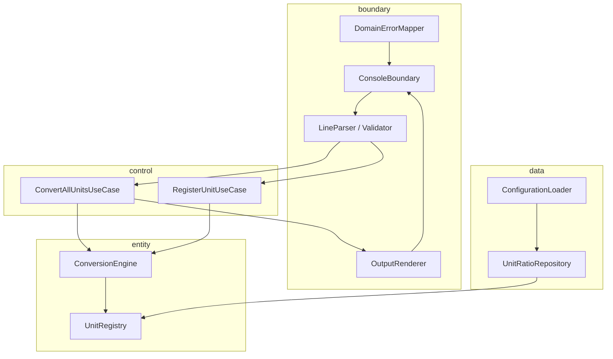

# Unit Converter (Java)

**`단위:값` 길이 입력을 등록된 모든 단위로 변환·출력하는 CLI** — Java·클린 아키텍처·TDD 실습자가 **계약 → 테스트 → BCE 레이어 → 회귀 보호**를 학습하기 위한 프로젝트입니다.


---

## 목차

- [개요 (Overview)](#개요-overview)
- [빠른 시작 (Quick Start)](#빠른-시작-quick-start)
- [지원 단위 및 비율](#지원-단위-및-비율)
- [입력 형식 계약](#입력-형식-계약)
- [아키텍처](#아키텍처)
- [테스트 실행](#테스트-실행)
- [설정 파일 (JSON/YAML)](#설정-파일-jsonyaml)
- [출력 포맷](#출력-포맷)
- [기여 가이드 (Contributing)](#기여-가이드-contributing)
- [라이선스](#라이선스)

---

## 개요 (Overview)

### 해결하는 문제

레거시 CLI에는 **입력 파싱·단위 분기·미터 환산·다단위 출력**이 한 진입점에 묶여 있습니다. 단위를 추가할 때마다 변경 범위를 예측하기 어렵고, **오류 1줄 규칙·반올림·좌변 원입력 보존·설정 실패 시 동작**이 문서와 코드에 계약으로 고정되어 있지 않았습니다.

본 프로젝트는 동일 기능을 **측정 가능한 문자열 계약**과 **BCE(boundary / control / entity / data)** 구조로 재구성하는 **학습용** 저장소입니다.

### 주요 학습 목표

| 목표 | 내용 |
|------|------|
| **OCP** | 새 단위·출력 포맷은 확장점(register, Renderer)으로만 추가 |
| **SRP** | 파싱·검증·환산·출력·설정 로드 역할 분리 |
| **BCE** | boundary → control → entity, boundary → data → entity |
| **TDD** | Domain RED→GREEN 후 Boundary/Data 계약 테스트; 회귀 게이트 |

> 환산 **알고리즘 숙달이 아니라**, 계약·테스트·레이어 분리가 평가 축입니다.

### PRD와의 연결

요구·입출력·ERR 코드·커버리지·회귀 규칙의 **단일 진실원**은 [docs/PRD.md](docs/PRD.md)입니다. README는 실습자용 요약이며, 계약 변경 시 **PRD → README → Gherkin/TC** 순으로 동기화합니다.

### 범위 밖 (Non-Goal)

- Web UI / REST API
- 비길이 단위(온도·무게 등)
- 프로덕션 배포·성능 벤치마크

### 워크숍 (6시간 Activities)

| 단계 | 시간 | 내용 |
|------|------|------|
| 1 | 0.5h | 레거시·요구·계약 분석 |
| 2 | 2h | 기본·품질 요구(OCP/SRP/검증) |
| 3 | 0.5h | TC(DT/BT) |
| 4 | 2h | 추가 요구(설정·등록·포맷) |
| 5 | 1h | 회고·발표 |

---

## 빠른 시작 (Quick Start)

### 사전 조건

| 항목 | 버전 |
|------|------|
| Java | **17 이상** |
| 빌드 | **Maven 3.8+** 또는 **Gradle 8+** (BCE 구조 완성 후) |
| 테스트 | JUnit 5 (Jupiter) |

### 레거시 CLI (현재 저장소)

루트 `UnitConverter.java`만 있는 경우:

```bash
javac UnitConverter.java
java UnitConverter
```

프롬프트에 예: `meter:2.5` 입력.

### BCE 구조 (Maven / Gradle 적용 후)

```bash
# Maven
mvn -q compile exec:java -Dexec.mainClass="com.unitconverter.App"

# Gradle
./gradlew run

# 테스트
mvn test
# 또는
./gradlew test
```

### 예시 입출력 (`meter:5.0`)

**입력**

```text
meter:5.0
```

**출력 (PLAIN, 소수 1자리 half-up)**

```text
5.0 meter = 5.0 meter
5.0 meter = 16.4 feet
5.0 meter = 5.5 yard
```

- 계산: 5.0 × 3.28084 = 16.4042 → **16.4** · 5.0 × 1.09361 = 5.46805 → **5.5**
- **표현 계약:** 모든 줄 좌변은 `5.0 meter`(원입력) 유지

---

## 지원 단위 및 비율

모든 환산은 **meter 허브**를 거칩니다. feet ↔ yard 직접 상수는 사용하지 않습니다.

| 단위명 | 식별자 | metersPerOneUnit (1 단위 = X meter) | 출처 |
|--------|--------|-------------------------------------|------|
| 미터 | `meter` | `1.0` | 기준 단위 |
| 피트 | `feet` | `1 / 3.28084` ≈ `0.3048` | PRD §5.1 · 1 m = 3.28084 ft |
| 야드 | `yard` | `1 / 1.09361` ≈ `0.9144` | PRD §5.1 · 1 m = 1.09361 yd |

**환산 공식 (테스트 가능)**

1. `amountInMeters = sourceAmount × metersPerOneUnit(sourceUnit)`
2. `targetAmount = amountInMeters / metersPerOneUnit(targetUnit)` → 출력 **1자리 half-up**

---

## 입력 형식 계약

### 표현 계약 (출력)

성공 시 각 줄:

```text
{sourceAmount} {sourceUnit} = {targetAmount} {targetUnit}
```

- `sourceAmount` · `sourceUnit` = **사용자가 입력한 원문** (환산 결과로 좌변 대체 금지)

### 음수 정책 (NEG)

| ID | 규칙 |
|----|------|
| NEG-01 | 길이 값은 **유한 수이며 ≥ 0** |
| NEG-02 | `amount < 0` → ERR-VAL-002 1줄, **변환 0줄** |
| NEG-03 | `amount = 0` → 유효 (모든 target `0`) |

### 정상 입력 예시 (3)

| 입력 | 설명 |
|------|------|
| `meter:2.5` | 기본 미터 입력 |
| `feet:3.28084` | 피트 → 미터 약 1.0 |
| `1 cubit = 0.4572 meter` | 동적 등록 (권장 기능) |

### 비정상 입력 예시 (3) + 에러 패턴

| 입력 | 코드 | 메시지 패턴 (1줄) |
|------|------|-------------------|
| `meter2.5` | ERR-FMT-001 | `ERROR [ERR-FMT-001]: Invalid input format. Expected "unit:value" or "1 unit = X meter". Input="meter2.5"` |
| `meter:-1` | ERR-VAL-002 | `ERROR [ERR-VAL-002]: Length must be non-negative. Got -1.` |
| `furlong:1` | ERR-DOM-003 | `ERROR [ERR-DOM-003]: Unknown unit "furlong".` |

**공통 실패 규칙:** 변환 결과 줄 **0줄**, 오류 줄 **정확히 1줄**.

### 기타 ERR 코드

| 조건 | 코드 |
|------|------|
| `meter:2.5.3`, `meter:abc` | ERR-VAL-001 |
| 잘못된 `--format=` | ERR-FMT-002 |
| 설정 JSON 오류 | ERR-DATA-007 |
| 단위 중복 등록 | ERR-DOM-004 |

전체 목록: [docs/PRD.md](docs/PRD.md) §3.2

---

## 아키텍처

### BCE 레이어 (Mermaid)



### 의존성 방향

| 허용 | 금지 |
|------|------|
| boundary → control → entity | entity → boundary |
| boundary → data → entity | control → boundary |
| | boundary에 환산 상수(3.28084 등) |

### 패키지 구조 (목표)

```text
src/main/java/com/unitconverter/
├── boundary/    # CLI, 파싱, 렌더, ERR 매핑
├── control/     # UseCase
├── entity/      # Registry, Engine, Domain 예외
├── data/        # JSON/YAML 로드
└── App.java     # wiring only
```

### 새 단위 추가 (코드 변경 최소화)

| 단계 | 작업 | 수정 범위 |
|------|------|-----------|
| 1 | `UnitRegistry.register(LengthUnit, MetersPerUnit)` 호출 | 등록 1곳 |
| 2 | (선택) `units.json`에 항목 추가 | 설정 파일만 |
| 3 | DT 1건: 새 단위 환산 assert | `src/test/.../entity/` |
| 4 | (필요 시) BT 1건: 파싱·출력 | `src/test/.../boundary/` |
| — | **금지** | `ConversionEngine`·`ConvertAll` 시그니처 변경, main/boundary에 if-else 분기 |

**동적 등록:** 런타임 입력 `1 cubit = 0.4572 meter` → 즉시 registry 반영 → `cubit:2` 변환 가능.

---

## 테스트 실행

### 프레임워크

- **JUnit 5** (Jupiter)
- 구조: **AAA** (Arrange · Act · Assert)
- Domain(DT): Mock 없음 · Boundary(BT): UseCase Mock · 통합(IT): E2E

### 명령

```bash
# Maven — 전체 테스트
mvn test

# Maven — JaCoCo 리포트 (플러그인 설정 후)
mvn verify

# Gradle
./gradlew test
./gradlew jacocoTestReport
```

### 커버리지 목표 (PRD §4.3)

| 레이어 | Line | Branch |
|--------|------|--------|
| entity + control | ≥ 95% | ≥ 90% |
| boundary | ≥ 85% | ≥ 80% |
| data | ≥ 80% | ≥ 75% |
| **전체** | ≥ 85% | — |

### 회귀 게이트 (필수 PASS)

- DT-02 ~ DT-05 (비율·미터 경유)
- IT-OK-01 (`meter:2.5` E2E)
- Gherkin #1 ~ #8 시나리오 대응 IT

규칙 상세: [docs/PRD.md](docs/PRD.md) §7.2 (RG-01 ~ RG-06)

---

## 설정 파일 (JSON/YAML)

### 위치

| 용도 | 경로 |
|------|------|
| 런타임 설정 | `config/units.json` (또는 classpath) |
| 테스트 fixture | `src/test/resources/units-valid.json`, `units-invalid.json` |

YAML은 선택(파서 추가 시). **권장 기본 형식은 JSON.**

### JSON 형식 예시

```json
{
  "baseUnit": "meter",
  "units": [
    { "name": "feet", "metersPerOneUnit": 0.3048 },
    { "name": "yard", "metersPerOneUnit": 0.9144 }
  ]
}
```

| 규칙 | 내용 |
|------|------|
| `baseUnit` | `"meter"`만 허용 |
| `metersPerOneUnit` | `0 < value ≤ 1_000_000` |
| 로드 실패 | `ERR-DATA-007` 1줄 + stderr `WARN: using default unit registry` + **시드 3단위 fallback** |
| 이름 충돌 | 파일 항목이 시드보다 **우선** |

### 동적 단위 등록 (PRD §5.3)

**입력**

```text
1 cubit = 0.4572 meter
```

**성공 응답**

```text
REGISTERED: cubit (1 cubit = 0.4572 meter)
```

**이후 변환**

```text
cubit:2
```

```text
2 cubit = 0.9 meter
2 cubit = 3.0 feet
2 cubit = 1.0 yard
```

(소수 1자리 half-up; 2 × 0.4572 = 0.9144 → **0.9**)

---

## 출력 포맷

기본: **PLAIN**. 선택: `--format=JSON|CSV|TABLE`.

### 콘솔 (PLAIN) — PRD §6.1

```text
2.5 meter = 2.5 meter
2.5 meter = 8.2 feet
2.5 meter = 2.7 yard
```

### JSON — PRD §6.2

`--format=JSON` 예시 (`meter:2.5`):

```json
{
  "source": { "unit": "meter", "amount": 2.5 },
  "conversions": [
    { "unit": "meter", "amount": 2.5 },
    { "unit": "feet", "amount": 8.2 },
    { "unit": "yard", "amount": 2.7 }
  ]
}
```

### CSV — PRD §6.3

```csv
source_unit,source_amount,target_unit,target_amount
meter,2.5,meter,2.5
meter,2.5,feet,8.2
meter,2.5,yard,2.7
```

### TABLE — PRD §6.4

```text
Source         Target Unit    Value
-------------  -------------  -----
2.5 meter      meter          2.5
2.5 meter      feet           8.2
2.5 meter      yard           2.7
```

(열 최소 너비 12자 — 구현 시 고정폭 적용)

---

## 기여 가이드 (Contributing)

### 계약 변경 금지 원칙

| 규칙 ID | 내용 |
|---------|------|
| RG-01 | 비율(3.28084, 1.09361) 변경 시 DT·Gherkin **동시** 갱신 |
| RG-02 | ERR-* 메시지 패턴 변경 시 BT golden **동시** 갱신 |
| RG-03 | 표현 계약(좌변=원입력) 변경 시 GH-08·AC **동시** 갱신 |
| RG-04 | NEG 정책 변경 시 GH-07·US-01 **동시** 갱신 |
| RG-05 | assert 삭제·`@Disabled`로 통과 **금지** |
| RG-06 | REFACTOR는 **전체 TC GREEN** 후만 |

계약 변경은 [docs/PRD.md](docs/PRD.md) 먼저 수정한 뒤 README·테스트를 따릅니다.

### 테스트 없는 PR

다음은 **리뷰 없이 거부**합니다.

- entity/control 프로덕션 로직 변경에 **DT/IT 없음**
- boundary 파싱·ERR·출력 변경에 **BT/IT 없음**
- 설정·등록 변경에 **DATA/IT 없음**
- 커버리지 목표(§테스트 실행) **미달**

### 커밋 메시지 컨벤션

```text
<type>(<scope>): <TC-ID or summary>

type   : feat | test | refactor | docs | fix
scope  : entity | control | boundary | data | integration
body   : RED/GREEN/REFACTOR 단계, 계약 ID (ERR-*, DT-*, GH-*)
```

**예시**

```text
test(entity): DT-02 meter to feet ratio 3.28084
feat(boundary): BT-06 ERR-FMT-001 on missing colon
docs: sync README with PRD §3.3 NEG policy
```

### 개발 규칙 요약

- [.cursorrules](.cursorrules) — TDD·레이어·금지 패턴
- [docs/UnitConverterRequirements.txt](docs/UnitConverterRequirements.txt) — FR/BR/QR/AR ID

---

## 라이선스

MIT License — **학습용** 프로젝트입니다. 자유롭게 fork·수정·배포할 수 있으나, 계약·테스트 정합성은 기여 가이드를 따릅니다.

---

## 관련 문서

| 문서 | 설명 |
|------|------|
| [docs/PRD.md](docs/PRD.md) | 제품 요구사항 (Phase 5, 계약·AC·회귀) |
| [docs/요구사항.md](docs/요구사항.md) | 초기 README 요구사항 (실습 Activities 원문) |
| [docs/UnitConverterRequirements.txt](docs/UnitConverterRequirements.txt) | 요구 ID 추적 |
| [.cursorrules](.cursorrules) | AI·TDD·아키텍처 규칙 |
