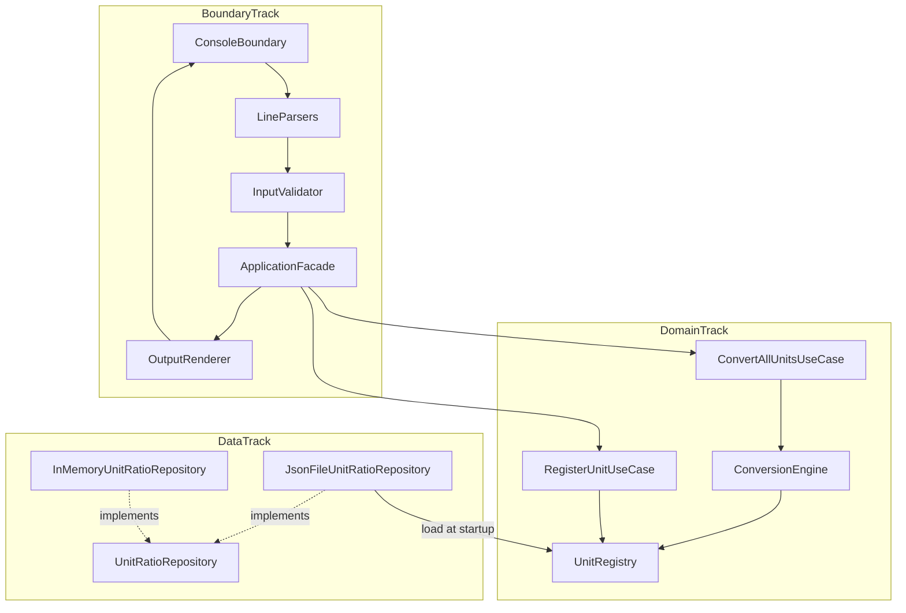

# Agent 대화 전체 기록 (SPEC_PROMPT)

- 저장일: 2026-05-21
- 총 메시지 블록: 161
- 출처: Cursor agent-transcripts (f335e417 + edbcd326)

---

## Turn 1 — 사용자

https://github.com/antihu99/UnitConverter_01.git  와 local 을 연결해줘

---

## Turn 2 — 에이전트(Assistant)

로컬 프로젝트와 GitHub 저장소 연결 상태를 확인 중입니다.

[REDACTED]

**도구 사용:**
- `Shell`: `cd "d:\Vs_workplace\Java_project\UnitConverter_01" && git status 2>&1; git remote -v 2>&1`
- `Glob`: **/*

---

## Turn 3 — 에이전트(Assistant)

[REDACTED]

**도구 사용:**
- `Shell`: `Set-Location "d:\Vs_workplace\Java_project\UnitConverter_01"; git status 2>&1; git remote -v 2>&1; Get-ChildItem`

---

## Turn 4 — 에이전트(Assistant)

[REDACTED]

**도구 사용:**
- `Shell`: `Set-Location "d:\Vs_workplace\Java_project\UnitConverter_01"; Get-ChildItem -Force`

---

## Turn 5 — 에이전트(Assistant)

로컬 폴더가 비어 있고 Git 저장소가 아니므로, 원격 저장소를 클론해 연결합니다.

[REDACTED]

**도구 사용:**
- `Shell`: `Set-Location "d:\Vs_workplace\Java_project\UnitConverter_01"; git clone https://github.com/antihu99/UnitConverter_01.git...`

---

## Turn 6 — 에이전트(Assistant)

[REDACTED]

**도구 사용:**
- `Shell`: `Set-Location "d:\Vs_workplace\Java_project\UnitConverter_01"; git remote -v; git branch -vv; git log --oneline -3; Get-C...`

---

## Turn 7 — 에이전트(Assistant)

로컬 폴더와 GitHub 저장소 연결을 완료했습니다.

**작업 내용**
- `d:\Vs_workplace\Java_project\UnitConverter_01` 폴더는 비어 있고 Git 저장소가 아니었습니다.
- [https://github.com/antihu99/UnitConverter_01.git](https://github.com/antihu99/UnitConverter_01.git) 를 해당 폴더에 클론했습니다.

**현재 상태**
| 항목 | 값 |
|------|-----|
| 원격(remote) | `origin` → `https://github.com/antihu99/UnitConverter_01.git` |
| 브랜치 | `main` (원격 `origin/main` 추적 중) |
| 최신 커밋 | `1aab698` — #0_Main Branch 초기화 |

**로컬 파일**
- `README.md`
- `UnitConverter.java`
- `unit-converter.jpg`

이후 일반적인 Git 흐름으로 사용하면 됩니다.

```powershell
git pull          # 원격 변경사항 받기
git add .
git commit -m "메시지"
git push          # 원격에 올리기
```

`git push` 시 GitHub 인증(토큰 또는 SSH)이 필요할 수 있습니다. 인증 설정이 필요하면 알려주세요.

[REDACTED]

---

## Turn 8 — 사용자

terminal 에서 대화한 내용을 작업시나리오 폴더에 00 으로 시작하는 파일로 저장해줘

---

## Turn 9 — 에이전트(Assistant)

작업시나리오 폴더 구조와 기존 파일 명명 규칙을 확인한 뒤 대화 내용을 저장합니다.

[REDACTED]

**도구 사용:**
- `Glob`: **/*
- `Grep`: d:\Vs_workplace\Java_project\UnitConverter_01

---

## Turn 10 — 에이전트(Assistant)

[REDACTED]

**도구 사용:**
- `Glob`: **/*
- `Glob`: **/작업시나리오/**

---

## Turn 11 — 에이전트(Assistant)

[REDACTED]

**도구 사용:**
- `Read`: C:\Users\user\.cursor\projects\d-Vs-workplace-Java-project-UnitConverter-01\agent-transcripts\f335e417-e0de-492f-b067-30d18f4e9182\f335e417-e0de-492f-b067-30d18f4e9182.jsonl

---

## Turn 12 — 에이전트(Assistant)

대화와 터미널 작업 내용을 `작업시나리오` 폴더에 정리해 저장합니다.

[REDACTED]

**도구 사용:**
- `Write`: d:\Vs_workplace\Java_project\UnitConverter_01\작업시나리오\00_git-github-로컬연결.md

---

## Turn 13 — 에이전트(Assistant)

터미널(Cursor Agent) 대화와 실행한 Git 명령을 작업시나리오 폴더에 저장했습니다.

**저장 위치**

`d:\Vs_workplace\Java_project\UnitConverter_01\작업시나리오\00_git-github-로컬연결.md`

**포함 내용**
- 사용자 요청 (GitHub 연결, 시나리오 저장)
- 사전 상태 확인 (`git status`, 폴더 비어 있음)
- 실행 명령 및 터미널 출력 (`git clone`, `git remote -v` 등)
- 연결 결과 (remote, 브랜치, 커밋, 파일 목록)
- 이후 사용할 Git 명령 참고
- Turn별 대화 요약

추가 작업도 같은 폴더에 `01_...`, `02_...` 형식으로 이어서 저장할 수 있습니다.

[REDACTED]

---

## Turn 14 — 사용자

@UnitConverter.java 
🔲 문제 정의 전문가 — Java
당신은 문제 정의 전문가입니다.
워크스페이스: unitconverter_java
⚠️ 코드 작성·클래스 설계·알고리즘·빌드 스크립트는 하지 마십시오.

STEP 1 — Observation
1) 지금 우리가 해결하려는 "상황"을 한 문단으로 관찰 관점에서 서술하라.
2) 왜 길이(meter/feet/yard) 변환 문제를 다루는가?
3) OCP/SRP, 입력 검증, 설정 외부화, 동적 단위 등록, 출력 포맷과 연결해
   이 문제가 어떤 학습 맥락에서 등장하는가?

STEP 2 — Why #1: 정확한 변환 결과가 왜 중요한가?
STEP 3 — Why #2: 수동 계산이 아닌 프로그램(+테스트)인 이유?
STEP 4 — Why #3: 계약을 먼저 고정하려는 이유?

STEP 5 — 문제 정의
1) 표면 문제 1~2문장
2) 개선된 정의 3~7문장
3) 핵심 Invariant 5개 이내 (측정·검증 가능한 문장)
4) 훈련하려는 사고 능력 3개

출력: 구조화된 Markdown만. 코드·파일 경로 금지.

---

## Turn 15 — 에이전트(Assistant)

UnitConverter.java와 README를 읽고 문제 정의 관점에서 정리합니다.

[REDACTED]

**도구 사용:**
- `Read`: d:\Vs_workplace\Java_project\UnitConverter_01\UnitConverter.java
- `Read`: d:\Vs_workplace\Java_project\UnitConverter_01\README.md

---

## Turn 16 — 에이전트(Assistant)

# Unit Converter — 문제 정의

---

## STEP 1 — Observation

### 1) 상황 관찰

팀은 길이 단위 변환을 수행하는 콘솔 프로그램을 갖고 있다. 사용자는 `단위:숫자` 형태로 값을 넣고, 프로그램은 meter·feet·yard로 환산한 결과를 줄 단위로 출력한다. 현재 구현은 변환 비율과 단위 분기가 한곳에 묶여 있고, 잘못된 입력·미지원 단위·출력 형식 변경에 대한 대응이 약하다. 실습 목표는 “동작하는 변환기”를 넘어, **확장·검증·설정 분리가 가능한 소프트웨어**로 바꾸는 것이다.

### 2) 왜 길이(meter/feet/yard) 변환 문제인가?

- **도메인이 직관적**이다. 일상에서 쓰는 단위라 요구사항·기대 출력을 말로 바로 검증할 수 있다.
- **비율이 명확**하다. meter를 기준 단위로 두면 feet·yard 관계를 일관되게 정의할 수 있다.
- **확장 연습에 적합**하다. 단위 추가, 비율 변경, 동적 등록, 출력 포맷 변경을 “작은 기능 추가”로 단계적으로 쌓을 수 있다.
- **오류가 눈에 보인다**. 반올림·잘못된 분기·미검증 입력이 곧바로 잘못된 수치로 드러난다.

### 3) 학습 맥락과의 연결

| 요구·개념 | 이 문제에서의 역할 |
|-----------|-------------------|
| **OCP** | 새 단위(cubit 등) 추가 시 기존 변환·출력 로직을 최소 수정 |
| **SRP** | 입력 파싱, 검증, 변환 계산, 결과 포맷을 각각 다른 책임으로 분리 |
| **입력 검증** | `단위:값` 계약을 지키지 않는 입력이 시스템을 깨지 않게 함 |
| **설정 외부화** | 비율을 코드 밖(JSON/YAML)으로 빼 재배포 없이 조정 |
| **동적 단위 등록** | 런타임에 `1 cubit = 0.4572 meter` 같은 규칙을 추가 |
| **출력 포맷** | 동일 변환 결과를 사람용 표·기계용 JSON/CSV로 제공 |

이 과제는 **6시간 생성형 AI 실습**의 일환으로, “요구 분석 → 설계 원칙 적용 → 테스트 → 확장 요구” 흐름을 한 도메인에서 반복 훈련하기 위해 선택되었다.

---

## STEP 2 — Why #1: 정확한 변환 결과가 왜 중요한가?

길이 변환은 **수치가 곧 의미**다. 2.5 meter를 feet로 바꿀 때 8.2와 8.0의 차이는 사용자 신뢰를 바로 흔든다. 비율은 meter 기준으로 고정되어 있으므로, **모든 경로가 같은 기준(meter)을 거쳐야** feet↔yard 간 결과도 일관된다. 반올림·부동소수점 표현은 허용되지만, **정의된 비율에서 벗어난 계산**은 버그가 아니라 “잘못된 제품”이다. 따라서 “대략 맞음”이 아니라 **명시된 비율로 재현 가능한 결과**가 요구된다.

---

## STEP 3 — Why #2: 수동 계산이 아닌 프로그램(+테스트)인 이유?

손계산·계산기는 단위가 늘거나 비율이 바뀌면 **반복·실수·검증 비용**이 커진다. 프로그램은 동일 규칙을 매번 같은 방식으로 적용한다. 여기에 **테스트**를 더하면, “2.5 meter → 8.2 feet” 같은 기대를 코드 변경마다 자동으로 확인할 수 있다. 단위 추가·설정 파일 로드·동적 등록 같은 확장이 쌓일수록, 수동 확인만으로는 회귀를 막기 어렵다. 즉 프로그램은 **자동화**, 테스트는 **회귀 방지와 계약 고정**을 담당한다.

---

## STEP 4 — Why #3: 계약을 먼저 고정하려는 이유?

입력 형식(`단위:값`), 지원 단위 집합, 기준 단위(meter), 비율, 출력 형식은 모두 **암묵적 약속**이다. 약속이 문서·테스트·검증 로직으로 고정되지 않으면, 구현자마다 “feet만 따로 처리”, “콜론 없어도 됨”, “yard는 소수 둘째 자리”처럼 해석이 갈라진다. 계약을 먼저 정의하면 **무엇이 유효 입력인지, 무엇이 오류인지, 어떤 수치가 통과인지**가 측정 가능해지고, OCP/SRP 적용 시에도 “변환 엔진”과 “입력 경계”, “출력 어댑터”의 경계를 명확히 그을 수 있다. 설계·테스트·리팩토링은 모두 이 계약 위에서 진행된다.

---

## STEP 5 — 문제 정의

### 1) 표면 문제 (1~2문장)

사용자가 `단위:값`을 입력하면 meter·feet·yard로 변환해 출력하는 프로그램이 필요하다. 새 단위와 출력 형식을 넣어도 기존 로직을 거의 건드리지 않아야 한다.

### 2) 개선된 정의 (3~7문장)

이 시스템은 **길이 단위 간 변환을 수행하는 신뢰 가능한 계산 서비스**이다. 사용자는 `단위:숫자` 형태로 한 값을 제시하고, 시스템은 등록된 모든 길이 단위에 대한 동등 값을 반환한다. 변환 비율은 meter를 **기준 단위(hub)** 로 두고 정의되며, feet·yard 및 추후 추가 단위는 이 기준에 대한 비율로 일관되게 계산된다. 입력은 형식·단위 존재·값 범위(예: 음수 불가)를 검증한 뒤에만 변환에 들어간다. 비율은 코드에 박지 않고 외부 설정에서 읽을 수 있어야 하며, 런타임에 새 단위·비율을 등록할 수 있어야 한다. 동일한 변환 결과는 사람이 읽기 쉬운 줄 단위, 표, JSON, CSV 등 **선택 가능한 출력 계약**으로 제공된다. 모든 핵심 변환 규칙과 오류 조건은 자동화된 테스트로 검증 가능해야 한다.

### 3) 핵심 Invariant (5개 이내, 측정·검증 가능)

1. **기준 단위 일관성**: 임의의 등록 단위 A, B에 대해, A→meter→B 경로의 결과는 정의된 A/B 비율과 허용 오차 내에서 일치한다.
2. **왕복 보존**: 동일 값을 A→B→A로 변환하면 원래 값과 허용 오차 내에서 일치한다(동일 비율·동일 정밀도 정책 하).
3. **입력 계약**: `단위:숫자` 형식이 아니거나, 미등록 단위이거나, 음수(또는 정책상 금지된 값)인 경우 변환은 수행되지 않고 명시적 오류로 처리된다.
4. **단위 폐쇄성**: 출력에 등장하는 모든 단위는 변환 시점에 **등록된 단위 집합**에만 속한다.
5. **설정·동적 등록 반영**: 외부 설정 또는 런타임 등록으로 추가·변경된 비율은 재시작 없이(또는 정책에 정의된 시점에) 다음 변환 요청부터 적용된다.

### 4) 훈련하려는 사고 능력 (3개)

1. **계약 우선 사고**: 기능 목록보다 입력·출력·오류·비율의 경계를 먼저 정의하고, 구현·테스트를 그에 맞춘다.
2. **변경 비용 예측**: 단위·비율·포맷 추가 시 어떤 모듈이 열려야 하는지(OCP)와 책임이 섞이지 않게 나누는지(SRP)를 판단한다.
3. **검증 가능성 설계**: “맞을 것 같다”가 아니라 invariant와 테스트 케이스로 **언제 실패하는지**를 말할 수 있게 만든다.

---

[REDACTED]

---

## Turn 17 — 사용자

@README.md 파일을 읽어서, 요구사항정의서를 UnitConverterRequirements.txt 파일명으로 docs 폴더에 만들어줘

---

## Turn 18 — 에이전트(Assistant)

README를 바탕으로 요구사항정의서를 작성합니다. 프로젝트 구조와 기존 문서 형식을 확인합니다.

[REDACTED]

**도구 사용:**
- `Read`: d:\Vs_workplace\Java_project\UnitConverter_01\README.md
- `Read`: d:\Vs_workplace\Java_project\UnitConverter_01\작업시나리오\전체 작업 시나리오.md
- `Glob`: **/*

---

## Turn 19 — 에이전트(Assistant)

README 내용을 요구사항정의서 형식으로 정리해 `docs` 폴더에 저장합니다.

[REDACTED]

**도구 사용:**
- `Write`: d:\Vs_workplace\Java_project\UnitConverter_01\docs\UnitConverterRequirements.txt

---

## Turn 20 — 에이전트(Assistant)

`README.md`를 바탕으로 요구사항정의서를 작성해 두었습니다.

**저장 위치:** `docs/UnitConverterRequirements.txt`

**문서 구성**
| 섹션 | 내용 |
|------|------|
| 1. 개요 | 시스템 목적, 설계 목표 |
| 2. 기능 요구사항 | FR-001~005 (입력/출력, 지원 단위, 확장성, 테스트) |
| 3. 비즈니스 로직 | BR-001~003 (meter/feet/yard 변환 비율) |
| 4. 품질 요구사항 | QR-001~003 (OCP, SRP, 입력 검증) |
| 5. 추가 요구사항 | AR-001~003 (설정 외부화, 동적 등록, 출력 포맷) |
| 6. 실습 활동 계획 | 6시간 Activities (참고) |
| 7. 추적 매트릭스 | 요구사항 ID별 요약 표 |

각 요구사항에는 ID, 설명, 우선순위(필수/추가)를 붙여 추적·구현·테스트에 쓸 수 있게 정리했습니다.

[REDACTED]

---

## Turn 21 — 사용자

@작업시나리오/전체 작업 시나리오.md @docs/UnitConverterRequirements.txt 를 참고하여, 프로젝트 루트의 .cursorrules로 작성해줘

---

## Turn 22 — 에이전트(Assistant)

참고 문서와 Cursor 규칙 작성 가이드를 확인한 뒤 `.cursorrules`를 작성합니다.

[REDACTED]

**도구 사용:**
- `Read`: d:\Vs_workplace\Java_project\UnitConverter_01\작업시나리오\전체 작업 시나리오.md
- `Read`: d:\Vs_workplace\Java_project\UnitConverter_01\docs\UnitConverterRequirements.txt
- `Read`: C:\Users\user\.cursor\skills-cursor\create-rule\SKILL.md
- `Glob`: **/.cursorrules*

---

## Turn 23 — 에이전트(Assistant)

[REDACTED]

**도구 사용:**
- `Read`: d:\Vs_workplace\Java_project\UnitConverter_01\UnitConverter.java

---

## Turn 24 — 에이전트(Assistant)

[REDACTED]

**도구 사용:**
- `Write`: d:\Vs_workplace\Java_project\UnitConverter_01\.cursorrules

---

## Turn 25 — 에이전트(Assistant)

프로젝트 루트에 `.cursorrules`를 작성했습니다.

**파일:** `d:\Vs_workplace\Java_project\UnitConverter_01\.cursorrules`

**반영 내용**

| 출처 | `.cursorrules`에 반영한 내용 |
|------|------------------------------|
| `작업시나리오/전체 작업 시나리오.md` | 6시간 5단계 순서, 단계별 목표·산출물, 단계 4 전 AR 구현 금지 |
| `docs/UnitConverterRequirements.txt` | FR/BR/QR/AR ID별 요구사항, meter 허브 규칙, 추적 매트릭스 |

**추가로 넣은 AI 작업 지침**
- 권위 문서 우선순위 (`UnitConverterRequirements.txt` → 작업 시나리오 → README)
- OCP/SRP·역할 분리·테스트·최소 diff 원칙
- `작업시나리오/00_` 문서화, git은 요청 시에만
- BR 비율·meter 우회 금지 등 주의사항

이후 Cursor에서 이 프로젝트를 열면 위 규칙이 기본 컨텍스트로 적용됩니다.

[REDACTED]

---

## Turn 26 — 사용자

🔲 문제 정의 전문가 — Java
당신은 문제 정의 전문가입니다.
워크스페이스: @UnitConverter.java 
⚠️ 코드 작성·클래스 설계·알고리즘·빌드 스크립트는 하지 마십시오.

STEP 1 — Observation
1) 지금 우리가 해결하려는 "상황"을 한 문단으로 관찰 관점에서 서술하라.
2) 왜 길이(meter/feet/yard) 변환 문제를 다루는가?
3) OCP/SRP, 입력 검증, 설정 외부화, 동적 단위 등록, 출력 포맷과 연결해
   이 문제가 어떤 학습 맥락에서 등장하는가?

STEP 2 — Why #1: 정확한 변환 결과가 왜 중요한가?
STEP 3 — Why #2: 수동 계산이 아닌 프로그램(+테스트)인 이유?
STEP 4 — Why #3: 계약을 먼저 고정하려는 이유?

STEP 5 — 문제 정의
1) 표면 문제 1~2문장
2) 개선된 정의 3~7문장
3) 핵심 Invariant 5개 이내 (측정·검증 가능한 문장)
4) 훈련하려는 사고 능력 3개

출력: 구조화된 Markdown만. 코드·파일 경로 금지.

---

## Turn 27 — 에이전트(Assistant)

UnitConverter.java와 프로젝트 맥락을 읽어 문제 정의에 반영합니다.

[REDACTED]

**도구 사용:**
- `Glob`: **/*UnitConverter*
- `Read`: d:\Vs_workplace\Java_project\UnitConverter_01\작업시나리오\전체 작업 시나리오.md
- `Read`: d:\Vs_workplace\Java_project\UnitConverter_01\README.md

---

## Turn 28 — 에이전트(Assistant)

[REDACTED]

**도구 사용:**
- `Read`: d:\Vs_workplace\Java_project\UnitConverter_01\UnitConverter.java
- `Read`: d:\Vs_workplace\Java_project\UnitConverter_01\docs\UnitConverterRequirements.txt

---

## Turn 29 — 에이전트(Assistant)

# 문제 정의: 길이 단위 변환기 (Java)

---

## STEP 1 — Observation

### 1) 상황 관찰

학습자에게는 이미 동작하는 단일 진입점 프로그램이 주어져 있다. 사용자가 `단위:숫자` 형태로 길이를 입력하면, 미터·피트·야드로 각각 변환해 줄 단위마다 한 줄씩 출력한다. 변환 비율은 코드 안에 고정되어 있고, 단위별 분기와 출력이 한 흐름에 묶여 있다. 이후 단계에서는 같은 기능을 유지하면서 설계 원칙(OCP/SRP), 입력 검증, 테스트, 설정 외부화, 동적 단위 등록, 출력 포맷 선택까지 점진적으로 요구된다. 즉 “계산기 하나 만들기”가 아니라, **작은 요구 변화에도 견디는 구조**를 익히는 실습 맥락이다.

### 2) 왜 길이(meter/feet/yard) 변환인가?

- **도메인이 단순하고 직관적**이라 변환 규칙(고정 비율, 미터 기준 환산)에 집중할 수 있다.
- **단위가 3개에서 늘어나는 확장 시나리오**가 자연스럽다(새 단위 추가, 동적 등록).
- **입력·출력·검증·포맷**을 분리해 SRP를 설명하기 좋다.
- **정답이 수치로 검증 가능**해 테스트와 invariant 작성이 쉽다.

### 3) 학습 맥락에서의 연결

| 요구 축 | 이 문제에서 드러나는 이유 |
|--------|---------------------------|
| **OCP / SRP** | 단위·비율·출력 형식이 늘 때마다 분기와 출력문을 늘리는 방식의 한계를 체험 |
| **입력 검증** | 잘못된 형식·음수·미지원 단위가 곧바로 런타임 오류로 이어지는 현재 구조 |
| **설정 외부화** | 비율이 코드에 박혀 있어 변경·배포·환경별 설정이 어려움 |
| **동적 단위 등록** | 고정 if-else 목록으로는 런타임에 단위를 추가할 수 없음 |
| **출력 포맷** | 콘솔 한 줄 출력만으로는 JSON/CSV/표 등 소비자별 계약을 만족하기 어려움 |

6시간 실습은 **기능 구현 → 품질·테스트 → 확장 요구** 순으로, “요구가 바뀔 때 어디를 고치는가”를 반복해 보는 구조다.

---

## STEP 2 — Why #1: 정확한 변환 결과가 왜 중요한가?

길이 변환은 **측정값의 신뢰**에 직결된다. 비율 오차·단위 혼동·기준 단위 불일치(예: feet↔yard를 서로 다른 기준으로 계산)는 사용자가 “맞는 것 같다”고 믿는 숫자를 틀리게 만든다. 실무에서는 도면, 물류, 건축, 해외 스펙 비교처럼 **작은 오차도 누적**된다. 따라서 “대략 맞음”이 아니라, **정의된 비율과 단일 기준(미터)을 통한 일관된 환산**이 문제의 핵심 가치다. 이는 테스트로 검증 가능한 **측정 가능한 정확성** 요구로 이어진다.

---

## STEP 3 — Why #2: 수동 계산이 아닌 프로그램(+테스트)인 이유?

- **반복·다단위 출력**: 한 입력에 대해 모든 지원 단위로 변환·표시하는 작업은 사람이 매번 하기에 비효율적이고 실수하기 쉽다.
- **규칙의 고정·재현**: 동일 입력·동일 설정이면 항상 동일 결과가 나와야 한다. 프로그램은 그 **재현성**을 제공한다.
- **요구 변경의 비용**: 단위 추가, 비율 변경, 출력 형식 변경은 수동 계산으로는 “절차만 바꾸면 되지만”, 코드가 뭉쳐 있으면 **매번 전체를 다시 검토**해야 한다.
- **테스트의 역할**: 변환은 수식으로 기대값을 만들 수 있어, **회귀 없이 리팩터링**할 수 있는 안전망이 된다. 실습 목표인 OCP/SRP는 “테스트 없이는 감으로만 확인하는 설계”가 되기 쉽기 때문에, 테스트는 학습 목표의 일부다.

---

## STEP 4 — Why #3: 계약을 먼저 고정하려는 이유?

여기서 계약이란 **입력 형식, 허용 단위, 기준 환산 방식, 출력 구조, 오류 시 동작**을 명시한 것이다.

- **모호함 제거**: “2.5 meter = 8.2 feet”처럼 반올림·표시 자릿수, 미지원 단위, 음수 입력 시 무엇을 할지가 정해지지 않으면 구현자마다 다르게 해석한다.
- **테스트·요구 추적**: FR/BR/QR/AR 같은 요구 ID는 곧 계약 조각이다. 계약이 먼저면 테스트 케이스와 invariant가 **같은 언어**로 쓰인다.
- **확장 시 충돌 방지**: 동적 등록·JSON 출력 등이 붙을 때, “기존 입력 한 줄”과 “새 등록 문법”이 **같은 파싱·검증 규칙**을 공유하는지 미리 정해야 한다.
- **AI·협업 실습**: 생성형 AI에 구현을 맡기더라도, **무엇이 맞는지 판단할 기준**은 사람이 가져야 한다. 계약·invariant가 그 기준이다.

---

## STEP 5 — 문제 정의

### 1) 표면 문제 (1~2문장)

사용자가 `단위:값`으로 길이를 입력하면, 지원하는 모든 길이 단위로 변환한 결과를 출력하는 콘솔 프로그램을 만든다.

### 2) 개선된 정의 (3~7문장)

이 시스템은 **길이 단위 간 변환을 일관되게 수행하는 계산 서비스**이며, 최소한 미터·피트·야드를 지원한다. 모든 환산은 **미터를 기준 단위**로 두고, 정의된 비율(예: 1미터 = 3.28084피트, 1미터 = 1.09361야드)에 따라 수행한다. 한 번의 유효 입력에 대해 **등록된 모든 단위**로의 변환 결과를 제공한다. 잘못된 형식, 음수, 미등록 단위는 **명확히 거부**하고, 오류는 사용자가 구분할 수 있게 전달한다. 새 단위·비율·출력 형식이 추가될 때 **기존 변환·검증 핵심 로직의 수정을 최소화**하는 구조(OCP)와, 파싱·검증·변환·출력 등 **역할 분리**(SRP)를 만족해야 한다. 변환 비율은 외부 설정에서 읽을 수 있고, 런타임에 단위와 비율을 등록한 뒤 즉시 변환에 사용할 수 있어야 한다. 결과는 기본 텍스트 외에 JSON·CSV·표 형태 중 선택해 낼 수 있어야 한다.

### 3) 핵심 Invariant (5개 이내, 측정·검증 가능)

1. **기준 단위 일관성**: 임의의 등록 단위 A, B에 대해, A→B 변환 결과는 A→미터→B 경로와 동일한 값(허용 오차 범위 내)이다.
2. **비율 준수**: 미터↔피트, 미터↔야드 변환은 각각 3.28084, 1.09361 비율을 따른다(설정 외부화 시에는 로드된 설정값이 동일 규칙을 반영한다).
3. **완전 출력**: 유효 입력 `(단위 U, 값 V)`에 대해, 시스템에 등록된 **모든** 단위 W에 대해 정확히 하나의 변환 결과 `(U, V) → W`가 존재한다.
4. **입력 거부**: 음수 값, `단위:값` 형식 위반, 미등록 단위 입력 시 변환 결과는 생성되지 않으며, 정상 출력과 구분 가능한 오류 처리가 이루어진다.
5. **등록 후 가용성**: `1 cubit = 0.4572 meter` 형태로 동적 등록이 성공하면, 이후 동일 세션(또는 정의된 범위)에서 cubit을 입력·출력 대상 단위로 사용할 수 있다.

### 4) 훈련하려는 사고 능력 (3개)

1. **요구를 계약·invariant로 분해하는 능력** — 기능 문장을 검증 가능한 규칙과 테스트 기준으로 바꾼다.
2. **변화에 대한 설계 판단** — 단위·설정·출력 포맷 추가 시 “어디를 열고 어디를 닫을지”(OCP)와 “무엇을 한 클래스가 맡으면 안 되는지”(SRP)를 스스로 설명한다.
3. **검증 주도 개선** — 테스트와 입력 검증 TC가 리팩터링과 확장 요구를 **안전하게 수용**하는지 평가하고, AI 생성 코드도 계약 기준으로 검수한다.

---

*본 문서는 구현·설계·알고리즘 제안 없이 문제 정의만을 다룬다.*

[REDACTED]

---

## Turn 30 — 사용자

🔲 Mom Test 질문
unit_converter_java 프로젝트를 "고객 인터뷰" 관점에서 준비한다.
제품이 아니라 학습자/사용자의 행동을 드러내는 Mom Test 질문 10개.
각 질문: (1) 과거 구체 경험 (2) 실제 행동 (3) 돈/시간/리스크 연결.
금지: 기능 나열형 질문만으로 끝내기.
마지막에 "진짜 위험 가정" 3개를 bullet로.
구현·코드 금지.

---

## Turn 31 — 에이전트(Assistant)

# Mom Test 질문 — unit_converter_java (학습자·사용자 인터뷰)

**대상**: 실습 참가 학습자, 또는 길이 단위 변환을 실제로 쓰는 사용자  
**목적**: “변환기 기능이 필요하다”가 아니라, **언제·왜·어떤 비용으로** 단위 변환·검증·도구를 쓰는지 드러내기

---

## 질문 10개

### 1. 마지막으로 단위를 잘못 쓴 순간
> **지난 3개월 안에**, 길이 단위를 헷갈리거나 잘못 적어서 **다시 계산하거나 수정한** 일이 있었나요? 그때 **무엇을** 입력했고, **어디서**(메모·엑셀·계산기·채팅) 확인했나요?

- 과거: 최근 한 건의 구체 사건  
- 행동: 재계산·수정·확인 경로  
- 비용: 수정에 **몇 분** 썼는지, 잘못 나가면 **어떤 일**(발주·재료·일정)이 틀어지는지

---

### 2. “대충 맞음” vs 다시 확인
> **미터·피트·야드**를 바꿀 때, **몇 번째 소수**까지 믿고 쓰나요? **한 번이라도** “이상해서” 다른 도구나 사람에게 **다시 맞춰 본** 적이 있나요? 그때 **무엇**이 달랐나요?

- 과거: 신뢰 한계를 넘긴 실제 사례  
- 행동: 이중 확인·도구 전환  
- 비용: 확인에 **시간**, 틀리면 **금전·안전·품질** 중 무엇이 걸리는지

---

### 3. 같은 숫자, 다른 출처
> **같은 변환**을 두 군데(검색, 앱, 엑셀 식)에서 해 봤을 때 **값이 달랐던** 적이 있나요? 그때 **어느 쪽**을 최종으로 썼고, **왜** 그쪽을 믿었나요?

- 과거: 불일치 경험  
- 행동: 출처 선택·기록 방식  
- 비용: 잘못 고르면 **재작업·클레임·스펙 불일치** 등 리스크

---

### 4. 요구가 바뀐 뒤의 코드
> **요구사항이 한 줄이라도 바뀐** 뒤(단위 추가, 출력 형식, 설정 파일 등), **직접 짠 프로그램**에서 **어디를** 고쳤는지 **가장 최근 사례**를 말해 주세요. **몇 군데**를 건드렸고, **테스트 없이** 배포·제출한 적이 있나요?

- 과거: 변경 직후의 실제 수정 범위  
- 행동: 수정 파일·테스트 유무  
- 비용: 회귀 버그로 **날린 시간**, 채점·데모에서 **깎인 점수·신뢰**

---

### 5. 입력 오류가 터진 날
> 프로그램에 **이상한 입력**(빈 값, 형식 틀림, 없는 단위)을 넣었을 때 **크래시·이상 출력**을 본 적이 있나요? 그때 **사용자(본인·동료)**는 **어떻게** 알았고, **다음에** 뭘 했나요?

- 과거: 실패한 입력 한 건  
- 행동: 재시도·로그·포기  
- 비용: **디버깅 시간**, 실사용이면 **데이터 손상·중단** 리스크

---

### 6. 테스트를 “나중에” 미룬 이유
> **단위 테스트·TC**를 **의도적으로 나중으로** 미룬 프로젝트가 있나요? **무엇 때문에** 미뤘고, **결국** 테스트를 넣었을 때·안 넣었을 때 **각각** 무슨 일이 났나요?

- 과거: 미룬 결정과 결과  
- 행동: 일정·우선순위·AI에 맡김 여부  
- 비용: 나중에 넣을 때 **추가 시간**, 안 넣을 때 **되돌리기·재제출** 비용

---

### 7. AI에게 구현 맡긴 뒤 검증
> **생성형 AI**에게 코드를 맡긴 뒤, **본인이 직접 검증한** 방법이 있나요? **가장 최근**에 “AI가 준 코드가 틀렸다”고 **확인한** 건은 **무엇**이었고, **어떻게** 잡았나요?

- 과거: AI 오류를 잡은 구체 사례  
- 행동: 실행·테스트·요구서 대조  
- 비용: 잘못 믿으면 **실습 시간·평가**, 실무이면 **배포 리스크**

---

### 8. 비율·설정을 코드 밖으로 뺀 경험
> 변환 비율·API 키·설정값을 **코드에서 파일/설정으로 옮긴** 적이 있나요? **왜** 옮겼고, 옮긴 **전·후**에 설정 바꿀 때 **각각 몇 분** 걸렸나요?

- 과거: 설정 분리 한 번  
- 행동: 배포·재컴파일·파일만 수정  
- 비용: **배포·빌드 시간**, 운영이면 **다운타임·롤백** 리스크

---

### 9. 출력 형식을 바꿔 달라고 한 적
> 변환·집계 결과를 **JSON·CSV·표** 등 **다른 형식**으로 달라고 **받거나 요청한** 적이 있나요? **누가** 왜 그 형식을 원했고, **직접** 형식을 맞추느라 **얼마나** 걸렸나요?

- 과거: 형식 요구 한 건  
- 행동: 복사·가공·스크립트 작성  
- 비용: **수동 가공 시간**, 연동 실패 시 **자동화·재작업** 비용

---

### 10. 6시간 실습에서 “끝”의 기준
> 비슷한 **단기 실습·워크숍**을 끝낼 때, **본인 기준으로 “끝났다”**고 한 적과 **“아직 아니다”**고 한 적을 각각 하나씩 말해 주세요. 그때 **무엇**을 보고 판단했나요? (실행 한 번, 테스트 통과, 발표 가능 등)

- 과거: 완료/미완료 판단의 실제 기준  
- 행동: 마지막 30분에 하는 일(테스트·리팩터·README 등)  
- 비용: 기준을 낮추면 **회고·발표**에서 드러나는 **평가·자신감** 손실

---

## 진짜 위험 가정 (검증해야 할 것)

- **가정 A — “정확한 변환”이 실습의 1순위 동기다**  
  실제로는 **제출·데모·AI 활용 회고**가 우선이고, 비율 정확도는 **예시 수준**으로만 쓰일 수 있다. → 인터뷰에서 **마지막으로 숫자 오차 때문에 손해 본 일**이 없으면 가정 기각.

- **가정 B — OCP/SRP는 요구 변경 시 **시간을 아껴 준다**고 학습자가 체감한다**  
  실습 시간(6시간) 안에서는 **구조 리팩터 비용 > 분기 추가 비용**으로 느껴, 원칙은 **과제 충족용 체크리스트**로만 남을 수 있다. → **요구 변경 후 수정 범위·소요 시간**을 과거 사례로 묻지 않으면 확인 불가.

- **가정 C — 테스트·입력 검증은 **사용자 가치**가 아니라 **채점·TC 항목**으로만 수행된다**  
  그러면 동적 단위·JSON 출력은 **거의 쓰이지 않고**, “있으면 좋음” 기능이 된다. → **실제로 잘못된 입력·회귀 때문에 손해 본 경험**과 **테스트를 넣은/안 넣은 결과**를 연결해 묻지 않으면 리스크가 숨는다.

---

**인터뷰 시 금지 예시** (기능 나열형):  
“미터·피트·야드 변환이 필요하세요?” “OCP 설계 원하세요?” “JSON 출력 좋을까요?”  
→ 대신 위 질문처럼 **지난번에 무엇을 했는지, 그때 무엇이 걸렸는지**만 묻는다.

[REDACTED]

---

## Turn 32 — 사용자

🔲 BCE 설계 전문가 — Java
Dual-Track(UI/경계 vs Domain) + BCE 관점 설계 전문가로 행동하라.
대상: @UnitConverter.java 
제약: 구현 코드 작성 금지. 설계·계약·테스트 목록·통합 계획만.

# 1) Entity(Domain) 설계
  1.1 개념 목록과 SRP
  1.2 Invariants
  1.3 유스케이스
  1.4 Domain API (시그니처 수준, 본문 X) + 실패 조건
  1.5 Domain 단위 테스트 설계 (RED 우선)

# 2) Boundary 설계
  2.1 시나리오: 입력→검증→실행→출력
  2.2 외부 계약: Input / Output / Error schema
  2.3 Boundary 계약 테스트 (Domain Mock 가정)
  2.4 에러 메시지 규칙 (문구 패턴 고정)

# 3) Data 설계
  3.1 목적
  3.2 인터페이스 계약 (이름만 제안)
  3.3 InMemory vs File(JSON/YAML) 비교 + 추천 1개와 이유
  3.4 Data 레이어 테스트

# 4) Integration & Verification
  4.1 의존성 방향 포함 흐름
  4.2 통합 테스트 시나리오 (정상 2+, 실패 3+)
  4.3 회귀 보호 규칙
  4.4 커버리지 목표 (Domain / Boundary / Data 수치)
  4.5 Traceability Matrix: Concept→Rule→UseCase→Contract→Test→Component

모호어 금지. 모든 규칙은 테스트로 검증 가능하게.

---

## Turn 33 — 에이전트(Assistant)

요구사항과 기존 진입점을 다시 확인한 뒤 BCE·Dual-Track 설계 문서를 작성합니다.

[REDACTED]

**도구 사용:**
- `Read`: d:\Vs_workplace\Java_project\UnitConverter_01\UnitConverter.java
- `Read`: d:\Vs_workplace\Java_project\UnitConverter_01\docs\UnitConverterRequirements.txt

---

## Turn 34 — 에이전트(Assistant)

# BCE + Dual-Track 설계 — Unit Converter (Java)

**Dual-Track 원칙**
| Track | 범위 | 금지 |
|-------|------|------|
| **Domain Track** | 단위·비율·환산·등록 규칙, 유스케이스 오케스트레이션(Control) | `Scanner`, `System.out`, JSON/YAML 파싱, 파일 I/O |
| **Boundary Track** | CLI 입출력, 문자열 파싱, 포맷 렌더링, 에러 문구 | 환산 수식 직접 구현, 비율 하드코딩 |

**의존성 방향 (고정):** Boundary → Control → Entity · Boundary/Data → Data 인터페이스 구현체. Entity/Data는 Boundary를 참조하지 않음.

---

# 1) Entity (Domain) 설계

## 1.1 개념 목록과 SRP

| 개념 | 책임 (단일) | 소유 데이터 |
|------|-------------|-------------|
| **LengthUnit** | 등록된 길이 단위 식별자 검증·동등 비교 | `name` (소문자 영문+숫자+언더스코어, 1~32자) |
| **MetersPerUnit** | “1 단위 = X 미터” 비율 값 객체 | `ratio` (`double`, `0 < ratio ≤ 1_000_000`) |
| **LengthQuantity** | (단위, 양) 쌍, 음수 불가 | `unit`, `amount` (`amount ≥ 0`) |
| **UnitRegistry** | 등록 단위 집합·기본 3단위 시드·중복 거부 | `Map<LengthUnit, MetersPerUnit>` |
| **ConversionEngine** | 미터 기준 환산·전 단위 결과 생성 | `UnitRegistry` (읽기 전용) |
| **ConversionResult** | 1회 변환 결과 묶음 | `source`, `List<TargetLine>` (`unit`, `amount`) |
| **RegisterUnitCommand** | 동적 등록 입력 DTO (Domain) | `unitName`, `metersPerOneUnit` |
| **ConvertCommand** | 변환 요청 DTO (Domain) | `unitName`, `amount` |
| **ConversionPolicy** | 반올림 자릿수·허용 오차 (테스트 고정) | `scale=1`, `epsilon=1e-9` |

**Control (유스케이스, Domain Track 내):**

| 컴포넌트 | SRP |
|----------|-----|
| **ConvertAllUnitsUseCase** | 유효 `ConvertCommand` → `ConversionResult` |
| **RegisterUnitUseCase** | 유효 `RegisterUnitCommand` → `UnitRegistry` 갱신 |

---

## 1.2 Invariants (측정 가능)

| ID | Invariant | 검증 방법 |
|----|-----------|-----------|
| INV-D1 | 모든 환산은 `amountInMeters = source.amount × registry.metersPerUnit(source.unit)` 후 `target.amount = amountInMeters / registry.metersPerUnit(target.unit)` | 고정 입력·고정 비율로 기대값 assert |
| INV-D2 | `meter→feet`는 `× 3.28084`, `meter→yard`는 `× 1.09361` (기본 시드) | BR-001, BR-002 전용 TC |
| INV-D3 | `feet↔yard`는 미터 경유값과 직접 비율 곱 결과가 `epsilon` 이내 일치 | 삼각 환산 TC |
| INV-D4 | `ConvertAllUnits` 결과 행 수 = `UnitRegistry.size()` | 개수 assert |
| INV-D5 | `amount < 0` 또는 미등록 단위·중복 단위명·비율 범위 밖은 Domain 예외만 발생, 부분 결과 없음 | 예외 타입·메시지 코드 assert |

---

## 1.3 유스케이스

| UC-ID | 이름 | 선행조건 | 성공 보장 | 실패 |
|-------|------|----------|-----------|------|
| UC-D01 | 전체 단위 변환 | `ConvertCommand` 유효, registry ≥ 1 | 모든 등록 단위에 대한 `ConversionResult` | `InvalidAmount`, `UnknownUnit` |
| UC-D02 | 단위 동적 등록 | `RegisterUnitCommand` 유효, 이름 미중복 | registry에 반영, 즉시 UC-D01 대상 포함 | `DuplicateUnit`, `InvalidRatio`, `InvalidUnitName` |
| UC-D03 | 기본 단위 시드 | 앱 시작 시 1회 | `meter(1.0)`, `feet(1/3.28084)`, `yard(1/1.09361)` 등가 등록 | 시드 실패 시 `SeedCorrupted` (테스트 전용) |

---

## 1.4 Domain API (시그니처만) + 실패 조건

```
// Value objects
LengthUnit.of(String name) → LengthUnit
MetersPerUnit.of(double ratio) → MetersPerUnit
LengthQuantity.of(LengthUnit unit, double amount) → LengthQuantity

// Registry
UnitRegistry.empty() → UnitRegistry
UnitRegistry.withDefaults() → UnitRegistry
UnitRegistry.register(LengthUnit, MetersPerUnit) → UnitRegistry  // 불변: 새 인스턴스 반환
UnitRegistry.contains(LengthUnit) → boolean
UnitRegistry.allUnits() → Set<LengthUnit>
UnitRegistry.metersPerUnit(LengthUnit) → MetersPerUnit

// Engine
ConversionEngine.convertAll(LengthQuantity source, UnitRegistry registry) → ConversionResult

// Use cases
ConvertAllUnitsUseCase.execute(ConvertCommand) → ConversionResult
RegisterUnitUseCase.execute(RegisterUnitCommand) → UnitRegistry
```

| 실패 코드 | 발생 API | 조건 |
|-----------|----------|------|
| `InvalidUnitName` | `LengthUnit.of` | 빈 문자열, 허용 패턴 위반, 32자 초과 |
| `InvalidRatio` | `MetersPerUnit.of` | `ratio ≤ 0` 또는 `ratio > 1_000_000` |
| `InvalidAmount` | `LengthQuantity.of`, UseCase | `amount < 0` 또는 `NaN`/`Infinity` |
| `UnknownUnit` | `ConvertAll`, `metersPerUnit` | registry 미포함 |
| `DuplicateUnit` | `register`, `RegisterUnitUseCase` | 동일 `name` 존재 |
| `SeedCorrupted` | `withDefaults` | 시드 후 INV-D2 불만족 (자기검증) |

---

## 1.5 Domain 단위 테스트 설계 (RED 우선)

**실행 순서: RED → GREEN. Domain은 Mock 없음.**

| TC-ID | RED 목적 | Given | When | Then |
|-------|----------|-------|------|------|
| DT-01 | 시드 3단위 존재 | `withDefaults()` | `allUnits().size()` | `3` |
| DT-02 | meter→feet | `meter:1.0` | `convertAll` | `feet ≈ 3.28084` (scale=1) |
| DT-03 | meter→yard | `meter:1.0` | `convertAll` | `yard ≈ 1.09361` |
| DT-04 | feet→meter 역환산 | `feet:3.28084` | `convertAll` | `meter ≈ 1.0` |
| DT-05 | yard↔feet 삼각 | `yard:1.09361` | `convertAll` | `feet ≈ 3.28084` (ε) |
| DT-06 | 전체 행 개수 | registry 3 + cubit 등록 | `meter:2.5` | 결과 4행 |
| DT-07 | 음수 거부 | `amount=-1` | `LengthQuantity.of` | `InvalidAmount` |
| DT-08 | 미등록 단위 | `cubit:1` (미등록) | `ConvertAll` | `UnknownUnit` |
| DT-09 | 중복 등록 | cubit 등록 2회 | `RegisterUnit` | `DuplicateUnit` |
| DT-10 | 동적 등록 후 변환 | `1 cubit=0.4572m` 등록 | `cubit:2` | `meter ≈ 0.9144` |
| DT-11 | 0 허용 | `meter:0` | `convertAll` | 모든 대상 `0` |
| DT-12 | INV-D1 경로 | 임의 2단위 | 수동 미터 경유 vs 엔진 | 차이 `< epsilon` |

---

# 2) Boundary 설계

## 2.1 시나리오: 입력 → 검증 → 실행 → 출력

```
[Actor: CLI 사용자]
    │
    ▼
(1) Raw line 수신 ── Boundary: ConsoleInputPort.readLine()
    │
    ▼
(2) 명령 분기 ── Boundary: CommandRouter
         ├─ "unit:amount"     → ParseConvertLine
         ├─ "1 unit = X meter"→ ParseRegisterLine
         └─ 기타              → FormatError (ERR-FMT-001)
    │
    ▼
(3) Boundary 검증 (형식만) ── InputValidator
         ├─ 실패 → ErrorResponse (코드+패턴 메시지), Domain 미호출
         └─ 성공 → ConvertCommand | RegisterUnitCommand DTO
    │
    ▼
(4) Control 호출 ── UseCase (Domain Track)
         ├─ Domain 실패 → ErrorResponse (코드 매핑)
         └─ 성공 → ConversionResult | RegisterAck
    │
    ▼
(5) 출력 포맷 선택 ── OutputRenderer (PLAIN | JSON | CSV | TABLE)
    │
    ▼
(6) Boundary: ConsoleOutputPort.write(payload)
```

**Boundary SRP 분리:** `CommandRouter`, `InputValidator`, `ConvertLineParser`, `RegisterLineParser`, `OutputRenderer`, `DomainErrorMapper`, `ApplicationFacade` (유스케이스만 위임).

---

## 2.2 외부 계약: Input / Output / Error schema

### Input (문자열 계약)

| Kind | 정규식 (전체 일치) | 예시 |
|------|-------------------|------|
| `CONVERT` | `^[a-z][a-z0-9_]{0,31}:-?\d+(\.\d+)?$` → Boundary에서 음수는 2차 거부 | `meter:2.5` |
| `REGISTER` | `^1\s+[a-z][a-z0-9_]{0,31}\s*=\s*\d+(\.\d+)?\s+meter$` | `1 cubit = 0.4572 meter` |
| `FORMAT_FLAG` | `^--format=(PLAIN\|JSON\|CSV\|TABLE)$` | `--format=JSON` |

### Output (성공)

| Schema | 필드 | 제약 |
|--------|------|------|
| **PLAIN** | 반복 줄 `{sourceAmount} {sourceUnit} = {targetAmount} {targetUnit}` | `targetAmount` 소수 1자리 반올림 (half-up) |
| **JSON** | `{ "source": {"unit","amount"}, "conversions": [{"unit","amount"}, ...] }` | UTF-8, `amount` number |
| **CSV** | 헤더 `source_unit,source_amount,target_unit,target_amount` + N행 | 쉼표 구분, 줄바꿈 `\n` |
| **TABLE** | 고정폭 4열: Source \| Target Unit \| Target Value | 열 너비 ≥ 12 |
| **REGISTER_ACK** | `REGISTERED: {unit} (1 {unit} = {ratio} meter)` | ratio 원문 또는 소수 4자리 |

### Error (실패)

| 필드 | 타입 | 필수 |
|------|------|------|
| `code` | string (ERR-*) | Y |
| `message` | string (패턴 적용) | Y |
| `line` | string (원문, 최대 200자) | N |

---

## 2.3 Boundary 계약 테스트 (Domain Mock 가정)

**가정:** `ConvertAllUnitsUseCase`, `RegisterUnitUseCase`를 Mock/stub. Boundary 테스트는 **파싱·라우팅·렌더링·에러 매핑**만 검증.

| TC-ID | 검증 대상 | Given (Mock) | When | Then |
|-------|-----------|--------------|------|------|
| BT-01 | 변환 라인 파싱 | Mock 성공 `ConversionResult` 고정 | `meter:2.5` | Mock `execute(ConvertCommand{meter,2.5})` 1회 |
| BT-02 | 등록 라인 파싱 | Mock registry 반환 | `1 cubit = 0.4572 meter` | Mock `execute(RegisterUnitCommand{cubit,0.4572})` |
| BT-03 | PLAIN 렌더 | Mock 2행 결과 | `--format=PLAIN` | 줄 패턴 `^\d+\.\d+ \w+ = \d+\.\d+ \w+$` |
| BT-04 | JSON 스키마 | Mock 결과 | `--format=JSON` | `source`, `conversions` 키 존재, 배열 길이=행 수 |
| BT-05 | CSV 헤더 | Mock 결과 | `--format=CSV` | 첫 줄 헤더 일치 |
| BT-06 | 형식 오류 | Mock 미호출 | `meter2.5` | `ERR-FMT-001`, Domain 0회 |
| BT-07 | 음수 Boundary | Mock 미호출 | `meter:-1` | `ERR-VAL-002` |
| BT-08 | Domain UnknownUnit 매핑 | Mock throw | `unknown:1` | `ERR-DOM-003`, 메시지 패턴 |
| BT-09 | TABLE 열 | Mock 3행 | `--format=TABLE` | 3 데이터 행 + 구분선 |
| BT-10 | 등록 ACK | Mock 성공 | 등록 라인 | `REGISTERED: cubit` 포함 |

---

## 2.4 에러 메시지 규칙 (문구 패턴 고정)

| code | 패턴 (정확히 1줄) | Domain 매핑 |
|------|-------------------|-------------|
| `ERR-FMT-001` | `ERROR [ERR-FMT-001]: Invalid input format. Expected "unit:value" or "1 unit = X meter". Input="{line}"` | Boundary 전용 |
| `ERR-FMT-002` | `ERROR [ERR-FMT-002]: Invalid output format "{format}". Allowed: PLAIN, JSON, CSV, TABLE.` | Boundary |
| `ERR-VAL-001` | `ERROR [ERR-VAL-001]: Value must be a finite number. Input="{line}"` | `NaN`/`Infinity` 파싱 |
| `ERR-VAL-002` | `ERROR [ERR-VAL-002]: Length must be non-negative. Got {amount}.` | `InvalidAmount` |
| `ERR-DOM-003` | `ERROR [ERR-DOM-003]: Unknown unit "{unit}".` | `UnknownUnit` |
| `ERR-DOM-004` | `ERROR [ERR-DOM-004]: Unit "{unit}" already registered.` | `DuplicateUnit` |
| `ERR-DOM-005` | `ERROR [ERR-DOM-005]: Invalid ratio for unit "{unit}". Must be 0 < ratio <= 1000000.` | `InvalidRatio` |
| `ERR-DOM-006` | `ERROR [ERR-DOM-006]: Invalid unit name "{unit}".` | `InvalidUnitName` |
| `ERR-DATA-007` | `ERROR [ERR-DATA-007]: Failed to load unit configuration. Reason="{reason}".` | Data 로드 실패 |

**규칙:** `[코드]`는 항상 대괄호 포함; `{line}`은 원문 trim, 200자 truncate; Domain 예외 1종 ↔ 코드 1종 (1:1).

---

# 3) Data 설계

## 3.1 목적

- 변환 비율·단위 목록을 **Domain `UnitRegistry` 시드/확장**에 공급 (AR-001).
- Boundary/Entity는 저장 형식(JSON/YAML)을 모름.
- 런타임 동적 등록(AR-002)은 **InMemory registry**에 반영; File은 **시작 시 스냅샷 로드**만 (추가 저장은 2단계 선택 사항, 본 설계 범위: 로드 필수).

---

## 3.2 인터페이스 계약 (이름만)

| 인터페이스 | 메서드 (이름) |
|------------|----------------|
| `UnitRatioRepository` | `loadAll()`, `saveAll()` (save는 선택) |
| `UnitRatioRecord` | `unitName`, `metersPerOneUnit` |
| `ConfigurationLoader` | `loadFromPath(String path)` |
| `ConfigurationParser` | `parse(String rawContent)` |
| `ConfigurationStore` | `read()`, `exists()` |

**파일 스키마 (JSON, 고정):**

```json
{
  "baseUnit": "meter",
  "units": [
    { "name": "feet", "metersPerOneUnit": 0.3048 },
    { "name": "yard", "metersPerOneUnit": 0.9144 }
  ]
}
```

- `feet`: `1/3.28084`, `yard`: `1/1.09361` (INV-D2와 수치 일치 필수).
- `baseUnit`은 항상 `"meter"`; 다르면 `ERR-DATA-007`.

---

## 3.3 InMemory vs File — 비교 및 추천

| 기준 | InMemory | File (JSON/YAML) |
|------|----------|------------------|
| AR-001 충족 | 기본 시드만 가능 | 충족 |
| 테스트 속도 | 최고 | 파싱·IO 필요 |
| 동적 등록(AR-002) | 즉시 반영 | 로드 후 registry 병합 필요 |
| 실패 모드 | 없음 | 깨진 파일·스키마 오류 |

**추천: File(JSON) 1차 + InMemory 런타임 병합**

- 이유: AR-001을 테스트 가능하게 분리하고, 실습에서 “비율 변경 = 재컴파일 없음”을 TC로 증명 가능.
- YAML은 2순위(파서 의존 추가 대비 이득 적음).
- 앱 부트: `File → UnitRegistry.withDefaults()` 병합 정책 — **파일 항목이 시드와 이름 충돌 시 파일 우선**, TC로 고정.

---

## 3.4 Data 레이어 테스트

| TC-ID | Given | When | Then |
|-------|-------|------|------|
| DATA-01 | 유효 JSON fixture | `loadAll()` | 3단위, INV-D2 수치 |
| DATA-02 | `units` 누락 | `parse` | `ERR-DATA-007` |
| DATA-03 | `metersPerOneUnit: 0` | `parse` | 레코드 거부, 로드 실패 |
| DATA-04 | 존재하지 않는 path | `loadFromPath` | `ERR-DATA-007`, reason `file not found` |
| DATA-05 | InMemory repo | `saveAll` 후 `loadAll` | 동일 집합 (선택 구현 시) |
| DATA-06 | 파일 cubit + InMemory 등록 | UseCase 변환 | cubit 행 포함 (병합) |

---

# 4) Integration & Verification

## 4.1 의존성 방향 포함 흐름



**규칙:** 화살표는 항상 안쪽(Domain)을 향함. `ConversionEngine`은 `UnitRegistry` 외부 상태 참조 금지.

---

## 4.2 통합 테스트 시나리오

### 정상 (≥2)

| IT-ID | 시나리오 | 입력 순서 | 기대 |
|-------|----------|-----------|------|
| IT-OK-01 | 기본 변환 E2E | `meter:2.5` + PLAIN | 3줄, `feet≈8.2`, `yard≈2.7` (scale=1) |
| IT-OK-02 | 등록 후 변환 E2E | `1 cubit = 0.4572 meter` → `cubit:2` | 4줄, `meter≈0.9` |
| IT-OK-03 | JSON 출력 E2E | `--format=JSON` + `meter:1` | JSON 파싱 성공, `conversions.length≥3` |

### 실패 (≥3)

| IT-ID | 시나리오 | 입력 | 기대 |
|-------|----------|------|------|
| IT-FAIL-01 | 형식 오류 | `meter` (콜론 없음) | `ERR-FMT-001`, exit≠0 |
| IT-FAIL-02 | 음수 | `feet:-3` | `ERR-VAL-002` |
| IT-FAIL-03 | 미등록 단위 | `furlong:1` | `ERR-DOM-003` |
| IT-FAIL-04 | 깨진 설정 파일 | 부트 시 invalid JSON | `ERR-DATA-007`, 기본 시드 fallback 또는 종료 (정책 TC에 명시: **본 설계는 fallback to withDefaults + stderr 경고 1줄**) |
| IT-FAIL-05 | 중복 등록 | cubit 2회 등록 | 2번째 `ERR-DOM-004` |

---

## 4.3 회귀 보호 규칙

| 규칙 ID | 내용 | 강제 |
|---------|------|------|
| RG-01 | DT-02~DT-05, IT-OK-01은 **CI 필수** — 비율 변경 시 의도적 스냅샷 업데이트 없으면 실패 | 파이프라인 gate |
| RG-02 | Domain 테스트는 **Mock 0%** | ArchUnit 또는 패키지 규칙 |
| RG-03 | `ERR-*` 패턴 변경 시 **BT-06~BT-08 스냅샷** 동시 수정 | 메시지 golden file |
| RG-04 | 새 단위 추가는 **Registry 등록 + DATA/DT 1건** 추가 없이 merge 금지 | PR 체크리스트 |
| RG-05 | Boundary는 환산 상수 보유 금지 — 상수 발견 시 빌드 실패 | 정적 검색 (`3.28084` in boundary package) |

---

## 4.4 커버리지 목표

| 레이어 | Line | Branch | 근거 |
|--------|------|--------|------|
| **Domain (Entity+Control+Engine)** | ≥ 95% | ≥ 90% | 핵심 비즈니스, 분기 적음 |
| **Boundary** | ≥ 85% | ≥ 80% | 파서·렌더·매퍼 분기 |
| **Data** | ≥ 80% | ≥ 75% | 예외 경로 포함 |
| **전체** | ≥ 85% | — | 통합 IT 포함 |

**미달 시:** Domain 미달은 merge 차단; Boundary/Data는 `@Disabled` 없는 TC 전부 통과를 선행 조건.

---

## 4.5 Traceability Matrix

| Concept | Rule / Invariant | Use Case | Contract (API/Schema) | Test | Component |
|---------|------------------|----------|-------------------------|------|-----------|
| LengthQuantity | INV-D5, `InvalidAmount` | UC-D01 | `LengthQuantity.of` | DT-07, IT-FAIL-02 | Entity |
| LengthUnit | `InvalidUnitName` | UC-D02 | Input `CONVERT`/`REGISTER` regex | BT-06, DT-09 | Entity / Boundary |
| UnitRegistry | INV-D4 | UC-D01, UC-D03 | `register`, `withDefaults` | DT-01, DT-06 | Entity |
| MetersPerUnit | INV-D1, BR-003 | UC-D02 | JSON `metersPerOneUnit` | DT-10, DATA-01 | Entity / Data |
| ConversionEngine | INV-D1~D3, BR-001~002 | UC-D01 | `convertAll` | DT-02~05, DT-12 | Entity |
| ConvertAllUnits | FR-002, FR-005 | UC-D01 | PLAIN/JSON/CSV/TABLE | IT-OK-01~03, DT-02~05 | Control |
| RegisterUnit | AR-002 | UC-D02 | `REGISTER` line, ACK | IT-OK-02, DT-10 | Control |
| CLI Input | FR-001, QR-003 | Boundary flow | Input schema | BT-01~02, IT-FAIL-01 | Boundary |
| Error mapping | QR-003 | — | `ERR-*` patterns | BT-06~08, IT-FAIL-01~03 | Boundary |
| Output format | AR-003 | — | JSON/CSV/TABLE schema | BT-03~05, IT-OK-03 | Boundary |
| External config | AR-001 | boot | JSON file schema | DATA-01~04, IT-FAIL-04 | Data |
| OCP extension | FR-004, QR-001 | UC-D02 | 새 단위 = register only | DT-06, RG-04 | Registry + Engine |
| SRP | QR-002 | — | 패키지 분리 | RG-02, RG-05 | 전 레이어 |

---

## 구현 순서 (Dual-Track, 코드 없음)

1. **Domain Track RED:** DT-01~DT-12 → Entity/Control 최소 구현.  
2. **Boundary Track RED:** BT-01~BT-10 (Domain Mock).  
3. **Data Track RED:** DATA-01~06.  
4. **Integration:** IT-OK / IT-FAIL.  
5. **회귀:** RG-01~05 CI 연결.

이 설계는 기존 단일 `main` 진입점의 환산·출력·분기 책임을 Domain/Boundary/Data로 분리하고, 모든 비즈니스 규칙을 **DT/BT/DATA/IT ID**로 추적 가능하게 고정한다.

[REDACTED]

---

## Turn 35 — 사용자

@UnitConverter.java  .cursorrules YAML 뼈대.
최상위 키만, 값은 비움:
project, code_style, architecture, tdd_rules, testing, forbidden, file_structure, ai_behavior
각 키 앞에 80자 폭의 # 구분선 주석.
YAML만 출력. 설명 없음.

---

## Turn 36 — 에이전트(Assistant)

[REDACTED]

**도구 사용:**
- `Write`: d:\Vs_workplace\Java_project\UnitConverter_01\.cursorrules

---

## Turn 37 — 에이전트(Assistant)

[REDACTED]

**도구 사용:**
- `Shell`: `powershell -Command "(Get-Content 'd:\Vs_workplace\Java_project\UnitConverter_01\.cursorrules' -Raw).Split(\"`n\")[0].Le...`

---

## Turn 38 — 에이전트(Assistant)

[REDACTED]

**도구 사용:**
- `Read`: d:\Vs_workplace\Java_project\UnitConverter_01\.cursorrules

---

## Turn 39 — 에이전트(Assistant)

```yaml
################################################################################
project:

################################################################################
code_style:

################################################################################
architecture:

################################################################################
tdd_rules:

################################################################################
testing:

################################################################################
forbidden:

################################################################################
file_structure:

################################################################################
ai_behavior:
```

[REDACTED]

---

## Turn 40 — 사용자

위 .cursorrules의 tdd_rules 블록만 채워라.
Java 단위 변환기 기준:
red_phase / green_phase / refactor_phase 각각에
description, rules(목록), must_not(목록)
YAML만 출력.

---

## Turn 41 — 에이전트(Assistant)

[REDACTED]

**도구 사용:**
- `Read`: d:\Vs_workplace\Java_project\UnitConverter_01\.cursorrules
- `Read`: d:\Vs_workplace\Java_project\UnitConverter_01\README.md

---

## Turn 42 — 에이전트(Assistant)

[REDACTED]

**도구 사용:**
- `StrReplace`: d:\Vs_workplace\Java_project\UnitConverter_01\.cursorrules

---

## Turn 43 — 에이전트(Assistant)

```yaml
tdd_rules:
  red_phase:
    description: >
      Domain Track 우선. 실패하는 테스트(DT/BT/DATA/IT ID)를 먼저 작성하고,
      meter 기준 환산·입력 검증·에러 코드 계약을 고정한다.
    rules:
      - "변환 TC는 BR-001(3.28084), BR-002(1.09361), BR-003(미터 경유) 수치를 명시한 assert로 작성"
      - "Domain 테스트(DT-*)는 Mock/Stub 없이 UnitRegistry·ConversionEngine만 사용"
      - "Boundary 테스트(BT-*)는 Domain UseCase를 Mock하고 파싱·렌더·ERR-* 매핑만 검증"
      - "실패 케이스(음수·형식 오류·미등록 단위·중복 등록)는 예외 타입과 ERR-* 코드를 함께 assert"
      - "테스트 메서드명은 when_{action}_then_{outcome} 또는 should_{behavior}_when_{condition} 형식"
      - "RED 단계에서 테스트 실행 시 반드시 실패(FAIL) 상태를 확인한 뒤 구현 시작"
      - "통합 IT는 Domain·Boundary·Data 단위 TC가 GREEN인 뒤에만 추가"
    must_not:
      - "테스트 없이 프로덕션 코드(환산·파싱·출력) 작성"
      - "GREEN을 맞추기 위해 테스트 assert 완화·삭제·@Disabled"
      - "Boundary/CLI 테스트에서 3.28084·1.09361 등 비율 상수 직접 assert"
      - "Scanner·System.out·파일 I/O를 Domain 패키지 테스트에 포함"
      - "여러 요구(DT+BT+IT)를 한 테스트 메서드에 묶기"

  green_phase:
    description: >
      RED를 통과하는 최소 구현만 추가한다.
      OCP/SRP를 깨지 않는 범위에서 Domain → Boundary → Data 순으로 GREEN.
    rules:
      - "한 번에 하나의 TC-ID만 GREEN; 커밋 단위는 TC 1~3개 이내"
      - "환산은 ConversionEngine 단일 경로; if-else 단위 분기를 main/Boundary에 두지 않음"
      - "입력 검증 실패 시 부분 변환 결과 없음(원자적 실패)"
      - "기본 시드 단위 meter·feet·yard는 UnitRegistry.withDefaults() 한 곳에서만 정의"
      - "Boundary는 DomainErrorMapper로 Domain 예외를 ERR-* 패턴 1:1 매핑"
      - "GREEN 후 해당 TC-ID 전체 재실행으로 회귀 없음 확인"
    must_not:
      - "RED에 없는 기능(추가 포맷·동적 등록·파일 로드) 선제 구현"
      - "테스트 통과를 위한 하드코딩 반환(입력값과 무관한 고정 문자열)"
      - "catch-all로 예외 삼키기 또는 빈 출력으로 실패 은폐"
      - "한 클래스에 파싱·환산·출력·설정 로드 동시 구현(SRP 위반)"
      - "리팩터링(이름 변경·패키지 이동·추상화)을 GREEN 단계에서 수행"

  refactor_phase:
    description: >
      전체 TC가 GREEN인 상태에서만 구조 개선한다.
      INV-D1~D5·RG-01~05 회귀 규칙을 유지하며 중복 제거·역할 분리.
    rules:
      - "리팩터 전후 DT-02~DT-05·IT-OK-01 스냅샷 수치 동일 유지"
      - "새 단위 추가는 Registry.register + DT 1건 + (필요 시) BT 1건 추가로 검증"
      - "Boundary 패키지에 환산 상수(3.28084, 1.09361) 없음—정적 검토 또는 ArchUnit"
      - "중복 제거 시 public Domain API 시그니처·ERR-* 메시지 패턴 변경 금지"
      - "리팩터 단위는 한 책임(파서·렌더러·Repository)씩; 각 단계마다 전체 테스트 스위트 실행"
      - "테스트 코드도 중복 헬퍼·픽스처로 정리하되 assert 기대값은 변경하지 않음"
    must_not:
      - "실패하는 TC가 남은 상태에서 구조 변경"
      - "리팩터 중 비즈니스 규칙(비율·반올림 scale=1·epsilon) 변경"
      - "테스트 없는 public API 삭제·시그니처 변경"
      - "통합 테스트를 @Disabled로 우회"
      - "리팩터와 AR-001/002/003(설정·동적등록·출력포맷) 신규 기능을 같은 커밋에 포함"
```

[REDACTED]

---

## Turn 44 — 사용자

🔲 검토
완성한 .cursorrules 전체를 검토하라. 수정 제안 금지.
보고만:
1) YAML 문법 오류 가능성
2) 누락된 필수 섹션
3) tdd_rules vs forbidden 충돌
4) Cursor가 지키기 어려운 ai_behavior 규칙
bullet만.

---

## Turn 45 — 에이전트(Assistant)

[REDACTED]

**도구 사용:**
- `Read`: d:\Vs_workplace\Java_project\UnitConverter_01\.cursorrules

---

## Turn 46 — 에이전트(Assistant)

## 1) YAML 문법 오류 가능성

- 최상위 `project:` 등 7개 키가 값 없이 null로 파싱되는 형태 — YAML 1.2 기준 문법상 유효하나, 일부 린터/스키마 검증기는 “빈 매핑”으로 경고할 수 있음
- `################################################################################` 줄은 주석 처리되어 구조에 영향 없음 — 문법 오류 아님
- `tdd_rules` 하위 들여쓰기(2칸)·`>` folded scalar·따옴표 리스트 — 문법상 문제 없음
- 문자열 내 `:`·`—`·`·`·`*` — 따옴표로 감싸져 있어 파싱 충돌 가능성 낮음
- Cursor가 `.cursorrules`를 **엄격한 YAML 문서**로 읽지 않을 수 있음 — 파일 확장/관례와 “YAML 문법” 요구 간 해석 불일치 가능(런타임 파서 오류와 별개 리스크)

## 2) 누락된 필수 섹션

- 뼈대에 명시된 8개 최상위 키는 **모두 존재**
- 내용이 채워진 것은 **`tdd_rules`만** — `project`, `code_style`, `architecture`, `testing`, `forbidden`, `file_structure`, `ai_behavior`는 키만 있고 규칙·값 없음
- `tdd_rules`가 참조하는 BCE 컴포넌트·TC-ID(DT/BT/IT)·ERR-*·AR-001~003·RG-01~05·ArchUnit 등을 정의할 **`architecture` / `testing` / `forbidden` / `file_structure` 본문이 없음** — 규칙 간 상호 참조는 문서 내부에서만 닫힘
- `tdd_rules` 내부 필수 하위 구조(`red_phase` / `green_phase` / `refactor_phase` × `description` / `rules` / `must_not`)는 **완비**

## 3) `tdd_rules` vs `forbidden` 충돌

- **`forbidden` 블록이 비어 있어** 파일 상 명시적 충돌 **없음**
- `tdd_rules` 각 phase의 `must_not`끼리는 단계 순서(RED→GREEN→REFACTOR) 기준으로 **직접 모순 없음**
- `forbidden`이 추후 채워질 때, `tdd_rules.must_not`(예: GREEN에서 리팩터 금지, assert 삭제 금지)와 **중복·상충 여부는 현재 파일만으로 판단 불가** — 잠재 리스크만 존재
- 기존 단일 `main` if-else 구조와 `green_phase` “Boundary/main에 단위 분기 금지”는 **코드베이스와의 정합성 이슈**이지, `forbidden`과의 YAML 충돌은 아님

## 4) Cursor가 지키기 어려운 `ai_behavior` 규칙

- **`ai_behavior` 섹션에 규칙이 없음** — 적용·검증 대상 규칙 자체가 없음
- 동일 파일의 `tdd_rules`에만 “에이전트 행동”에 가까운 항목이 있으며, 이는 `ai_behavior`가 아니라 **터미널/CI/커밋 전제**라 Cursor 단독 준수가 어려움:
  - RED에서 테스트 **실패 상태 확인 후** 구현
  - GREEN 후 **TC-ID 전체 재실행·회귀 없음 확인**
  - REFACTOR마다 **전체 테스트 스위트 실행**
  - **커밋 단위 TC 1~3개** 제한
  - Boundary **ArchUnit/정적 검토**로 상수 부재 보장
- `ai_behavior`가 비어 있어 Cursor는 **프로젝트·스타일·아키텍처·금지·디렉터리 구조**를 이 파일에서 거의 읽지 못함 — `tdd_rules`만으로는 행동 범위가 TDD 절차에 한정됨

[REDACTED]

---

## Turn 47 — 사용자

🔲 완성 YAML
프로젝트 루트 .cursorrules에 넣을 완성 YAML.
Java Java 17 이상 가정.
code_style: Google Java Format, 네이밍·패키지/모듈 분리
architecture: boundary/control/entity 정의 + 의존성 방향
testing: JUnit 5 고정, AAA, fixture 규칙, 커버리지 기준
forbidden: System.out 디버그 남발 / 매직 넘버 하드코딩 / 광범위 catch(Exception) 무시 / public 필드 남용 / God class (Java 특화 5개 이상)
  (각각 pattern / reason / alternative)
file_structure: boundary/ control/ entity/ tests/ 트리 주석
ai_behavior: 레이어 위반 금지, 테스트 먼저, 리팩터는 green 이후
설명 없이 YAML 전체만.

---

## Turn 48 — 에이전트(Assistant)

[REDACTED]

**도구 사용:**
- `Read`: d:\Vs_workplace\Java_project\UnitConverter_01\.cursorrules

---

## Turn 49 — 에이전트(Assistant)

[REDACTED]

**도구 사용:**
- `Write`: d:\Vs_workplace\Java_project\UnitConverter_01\.cursorrules

---

## Turn 50 — 에이전트(Assistant)

[REDACTED]

**도구 사용:**
- `Read`: d:\Vs_workplace\Java_project\UnitConverter_01\.cursorrules

---

## Turn 51 — 에이전트(Assistant)

```yaml
################################################################################
project:
  name: unit_converter_java
  language: java
  java_version: "17+"
  build: maven_or_gradle
  description: >
    길이 단위(단위:값) 입력을 받아 등록된 모든 단위로 변환·출력하는 CLI.
    meter 기준 환산, OCP/SRP, 입력 검증, JUnit 5 TDD.

################################################################################
code_style:
  formatter: Google Java Format
  indent: 2 spaces
  line_length: 100
  naming:
    class: PascalCase
    interface: PascalCase
    method: camelCase
    constant: UPPER_SNAKE_CASE
    package: lowercase.dot.separated
    test_class: "{ClassName}Test" or "{ClassName}IT"
  package_separation:
    - "entity: 도메인 모델·규칙·변환 엔진 (I/O 금지)"
    - "control: 유스케이스 오케스트레이션 (entity만 의존)"
    - "boundary: CLI·파싱·렌더·에러 매핑 (control·entity 호출)"
    - "data: 설정·Repository 구현 (entity DTO만 반환)"
    - "tests: src/test/java 아래 프로덕션 패키지 미러"
  module_rules:
    - "프로덕션 패키지가 tests 패키지를 import 금지"
    - "entity 패키지가 boundary·data·java.io·java.util.Scanner import 금지"
    - "한 public top-level class per file"

################################################################################
architecture:
  pattern: BCE_DualTrack
  layers:
    entity:
      responsibility: >
        LengthUnit, MetersPerUnit, LengthQuantity, UnitRegistry, ConversionEngine,
        ConversionResult, Domain 예외. 미터 기준 환산·불변 규칙.
      depends_on: []
    control:
      responsibility: >
        ConvertAllUnitsUseCase, RegisterUnitUseCase. 트랜잭션적 유스케이스 실행.
      depends_on: [entity]
    boundary:
      responsibility: >
        ConsoleBoundary, LineParser, InputValidator, OutputRenderer,
        DomainErrorMapper, ApplicationFacade. 외부 문자열↔Domain DTO.
      depends_on: [control, entity]
    data:
      responsibility: >
        UnitRatioRepository, ConfigurationLoader/Parser. JSON/YAML 비율 로드.
      depends_on: [entity]
  dependency_direction:
    - "boundary → control → entity"
    - "boundary → data → entity (Repository는 entity 타입만 노출)"
    - "control → entity (역방향 금지)"
    - "entity → boundary | control | data (금지)"
  extension_points:
    - "새 단위: UnitRegistry.register (OCP)"
    - "새 출력: OutputRenderer 구현 추가"
    - "설정 소스: UnitRatioRepository 구현 교체"

################################################################################
tdd_rules:
  red_phase:
    description: >
      Domain Track 우선. 실패하는 테스트(DT/BT/DATA/IT ID)를 먼저 작성하고,
      meter 기준 환산·입력 검증·에러 코드 계약을 고정한다.
    rules:
      - "변환 TC는 BR-001(3.28084), BR-002(1.09361), BR-003(미터 경유) 수치를 명시한 assert로 작성"
      - "Domain 테스트(DT-*)는 Mock/Stub 없이 UnitRegistry·ConversionEngine만 사용"
      - "Boundary 테스트(BT-*)는 Domain UseCase를 Mock하고 파싱·렌더·ERR-* 매핑만 검증"
      - "실패 케이스(음수·형식 오류·미등록 단위·중복 등록)는 예외 타입과 ERR-* 코드를 함께 assert"
      - "테스트 메서드명은 when_{action}_then_{outcome} 또는 should_{behavior}_when_{condition} 형식"
      - "RED 단계에서 테스트 실행 시 반드시 실패(FAIL) 상태를 확인한 뒤 구현 시작"
      - "통합 IT는 Domain·Boundary·Data 단위 TC가 GREEN인 뒤에만 추가"
    must_not:
      - "테스트 없이 프로덕션 코드(환산·파싱·출력) 작성"
      - "GREEN을 맞추기 위해 테스트 assert 완화·삭제·@Disabled"
      - "Boundary/CLI 테스트에서 3.28084·1.09361 등 비율 상수 직접 assert"
      - "Scanner·System.out·파일 I/O를 Domain 패키지 테스트에 포함"
      - "여러 요구(DT+BT+IT)를 한 테스트 메서드에 묶기"

  green_phase:
    description: >
      RED를 통과하는 최소 구현만 추가한다.
      OCP/SRP를 깨지 않는 범위에서 Domain → Boundary → Data 순으로 GREEN.
    rules:
      - "한 번에 하나의 TC-ID만 GREEN; 커밋 단위는 TC 1~3개 이내"
      - "환산은 ConversionEngine 단일 경로; if-else 단위 분기를 main/Boundary에 두지 않음"
      - "입력 검증 실패 시 부분 변환 결과 없음(원자적 실패)"
      - "기본 시드 단위 meter·feet·yard는 UnitRegistry.withDefaults() 한 곳에서만 정의"
      - "Boundary는 DomainErrorMapper로 Domain 예외를 ERR-* 패턴 1:1 매핑"
      - "GREEN 후 해당 TC-ID 전체 재실행으로 회귀 없음 확인"
    must_not:
      - "RED에 없는 기능(추가 포맷·동적 등록·파일 로드) 선제 구현"
      - "테스트 통과를 위한 하드코딩 반환(입력값과 무관한 고정 문자열)"
      - "catch-all로 예외 삼키기 또는 빈 출력으로 실패 은폐"
      - "한 클래스에 파싱·환산·출력·설정 로드 동시 구현(SRP 위반)"
      - "리팩터링(이름 변경·패키지 이동·추상화)을 GREEN 단계에서 수행"

  refactor_phase:
    description: >
      전체 TC가 GREEN인 상태에서만 구조 개선한다.
      INV-D1~D5·RG-01~05 회귀 규칙을 유지하며 중복 제거·역할 분리.
    rules:
      - "리팩터 전후 DT-02~DT-05·IT-OK-01 스냅샷 수치 동일 유지"
      - "새 단위 추가는 Registry.register + DT 1건 + (필요 시) BT 1건 추가로 검증"
      - "Boundary 패키지에 환산 상수(3.28084, 1.09361) 없음—정적 검토 또는 ArchUnit"
      - "중복 제거 시 public Domain API 시그니처·ERR-* 메시지 패턴 변경 금지"
      - "리팩터 단위는 한 책임(파서·렌더러·Repository)씩; 각 단계마다 전체 테스트 스위트 실행"
      - "테스트 코드도 중복 헬퍼·픽스처로 정리하되 assert 기대값은 변경하지 않음"
    must_not:
      - "실패하는 TC가 남은 상태에서 구조 변경"
      - "리팩터 중 비즈니스 규칙(비율·반올림 scale=1·epsilon) 변경"
      - "테스트 없는 public API 삭제·시그니처 변경"
      - "통합 테스트를 @Disabled로 우회"
      - "리팩터와 AR-001/002/003(설정·동적등록·출력포맷) 신규 기능을 같은 커밋에 포함"

################################################################################
testing:
  framework: JUnit 5
  structure: AAA
  aaa_rules:
    arrange: "Given—UnitRegistry·fixture·Mock 주입은 Arrange에만"
    act: "When—단일 메서드/유스케이스 1회 호출"
    assert: "Then—assert 1개 논리 목적; @DisplayName에 TC-ID 명시"
  naming:
    unit: "{Target}Test"
    integration: "{Feature}IT"
    method: "when_{action}_then_{outcome}"
  fixture_rules:
    - "기본 비율 fixture: DefaultUnitRegistryFixture (meter/feet/yard 시드)"
    - "파일 설정 fixture: src/test/resources/units-valid.json, units-invalid.json"
    - "경계값: 0, 2.5, 음수·NaN은 ParametrizedTest로 분리"
    - "@BeforeEach에서 registry 공유 시 반드시 불변 복사 또는 새 인스턴스"
    - "테스트 간 static mutable state 금지"
  layers:
    domain: "Mock 없음, DT-*"
    boundary: "UseCase Mock, BT-*"
    data: "임시 파일·classpath JSON, DATA-*"
    integration: "InMemory 또는 test resource, IT-*"
  coverage_targets:
    entity_control: "line >= 95%, branch >= 90%"
    boundary: "line >= 85%, branch >= 80%"
    data: "line >= 80%, branch >= 75%"
    overall: "line >= 85%"
  regression_gate:
    - "DT-02~DT-05, IT-OK-01 CI 필수"
    - "ERR-* 메시지 golden 변경 시 BT 스냅샷 동시 갱신"

################################################################################
forbidden:
  - id: FBD-001
    name: System.out 디버그 남발
    pattern: "System\\.out\\.print(ln)?\\s*\\(.*(debug|tmp|test|xxx|TODO)"
    reason: "출력 채널이 ConsoleOutputPort와 섞여 계약 테스트·리다이렉트 불가"
    alternative: "boundary.console.ConsoleOutputPort 또는 SLF4J logger.debug; 테스트는 assert/captor"
  - id: FBD-002
    name: 매직 넘버 하드코딩
    pattern: "(?<!\\w)(3\\.28084|1\\.09361|0\\.3048|0\\.9144)(?!\\w)"
    reason: "비율 분산 시 BR-001/002 위반·회귀 검출 불가"
    alternative: "entity.MetersPerUnit·ConversionConstants 또는 units.json 로드"
  - id: FBD-003
    name: 광범위 catch Exception 무시
    pattern: "catch\\s*\\(\\s*Exception\\s+\\w+\\s*\\)\\s*\\{[^}]*\\}"
    reason: "형식 오류·도메인 오류·IO 오류가 동일하게 삼켜져 ERR-* 매핑 불가"
    alternative: "구체 예외(DomainException, ParseException) catch 후 DomainErrorMapper 또는 재throw"
  - id: FBD-004
    name: public 필드 남용
    pattern: "public\\s+(?!static\\s+final)[\\w<>,\\s]+\\s+\\w+\\s*[=;]"
    reason: "불변·캡슐화 깨짐, LengthQuantity 등 값 객체 무결성 훼손"
    alternative: "private final 필드 + getter; 값 객체는 factory of()만 노출"
  - id: FBD-005
    name: God class
    pattern: "class\\s+\\w+\\s*\\{[^}]*(Scanner|parse|convert|render|load|main)[^}]{200,}"
    reason: "SRP·BCE 위반; 단위 추가마다 if-else·출력 분기 증가"
    alternative: "boundary/parser, control/usecase, entity/engine, boundary/renderer 분리"
  - id: FBD-006
    name: Boundary에서 환산 수식
    pattern: "boundary\\.[\\w.]+.*[*/]\\s*3\\.28084"
    reason: "INV-D1 단일 경로 위반, Domain 테스트와 이중 진실원"
    alternative: "ConversionEngine.convertAll()만 호출"
  - id: FBD-007
    name: entity에서 I/O
    pattern: "package\\s+[\\w.]*entity[\\w.]*;[\\s\\S]*import\\s+java\\.(io|nio)"
    reason: "Domain Track 오염, DT 테스트가 느려지고 결정론 깨짐"
    alternative: "data.ConfigurationLoader가 Repository로 entity에 DTO 전달"

################################################################################
file_structure:
  tree: |
    src/main/java/
    └── com/unitconverter/
        ├── boundary/          # CLI, Parser, Validator, Renderer, ErrorMapper
        │   ├── console/
        │   ├── parser/
        │   └── output/
        ├── control/           # UseCase (Convert, Register)
        │   └── usecase/
        ├── entity/            # Unit, Registry, Engine, Result, DomainException
        │   ├── model/
        │   └── engine/
        ├── data/              # Repository, JSON/YAML Loader
        │   └── config/
        └── App.java           # main: wiring only, 로직 금지
    src/test/java/
    └── com/unitconverter/
        ├── boundary/          # BT-* (Mock UseCase)
        ├── control/           # UseCase + Mock Registry
        ├── entity/            # DT-* (no Mock)
        ├── data/              # DATA-* (test resources)
        └── integration/       # IT-OK, IT-FAIL E2E
    src/test/resources/
    ├── units-valid.json
    └── units-invalid.json
  legacy_entry:
    note: "루트 UnitConverter.java는 마이그레이션 후 App.java 위임 또는 제거"

################################################################################
ai_behavior:
  principles:
    - "레이어 위반 금지: entity에 I/O·Scanner·System.out 없음"
    - "테스트 먼저: RED TC-ID 작성·실패 확인 후 최소 GREEN"
    - "리팩터는 전체 GREEN 이후에만; 기능 추가와 리팩터 커밋 분리"
  workflow:
    - "요청 시 레이어 판별 → 해당 패키지에만 코드 제안"
    - "변환 로직 변경 시 DT-02~05 먼저 제시"
    - "입력/출력 변경 시 BT 또는 IT와 ERR-* 패턴 함께 제시"
  must_not:
    - "architecture.dependency_direction 역방향 import 생성"
    - "forbidden 목록 패턴에 해당하는 코드 생성"
    - "tdd_rules.green_phase.must_not 위반 코드 제안"
    - "테스트 없이 entity·control 프로덕션 메서드 추가"
    - "한 응답에 RED+GREEN+REFACTOR+신규 AR 기능 동시 적용"
  when_uncertain:
    - "Domain vs Boundary 판단 불가 시 테스트 위치(DT vs BT)부터 확정"
    - "비율 출처 불명 시 ConversionConstants 또는 units.json만 사용"
```

[REDACTED]

---

## Turn 52 — 사용자

요구사항 서술 패키지 — Java
@UnitConverter.java 를 위한 요구사항 서술 패키지. 구현·코드 금지.

Level 1 Epic
  제목: "확장 가능한 Java 단위 변환 학습 시스템"
  목적 4줄, 성공 기준 측정 가능하게 (커버리지, 계약 테스트, 회귀 정책)

Level 2 User Journey (1개 정본)
  Persona: Java/클린 아키텍처 학습자
  단계 5~7: 문제 인식→계약 정의→도메인 분리→Dual-Track TDD→회귀 보호
  각 단계 Pain / Opportunity 1줄

Level 3 User Stories (최소 6개)
  입력 검증 / 레지스트리·OCP / 환산 정확도 / 출력 포맷 / 설정 로드 실패 / 동적 단위 등록
  각 Story에 Acceptance Criteria는 체크 가능한 bullet

Level 4 Gherkin Feature 1개
  Background: README meter↔feet↔yard 비율을 Given으로 고정
  Scenario: happy path meter 입력
  Scenario: 잘못된 형식
  Scenario: unknown unit
  Scenario: 설정 파일 형식 오류

Level 5 체크리스트
  이 저장소 범위 항목만
  Epic→Journey→Story→Gherkin 정합성 체크박스 표

Markdown 표와 체크리스트 적극 사용.

---

## Turn 53 — 에이전트(Assistant)

[REDACTED]

**도구 사용:**
- `Read`: d:\Vs_workplace\Java_project\UnitConverter_01\README.md
- `Read`: d:\Vs_workplace\Java_project\UnitConverter_01\UnitConverter.java

---

## Turn 54 — 에이전트(Assistant)

# 요구사항 서술 패키지 — Java 단위 변환기

**대상:** 기존 단일 진입점 CLI(단위:값 입력 → meter/feet/yard 변환 출력)  
**범위:** 이 저장소(`UnitConverter_01`) 내 학습·구현·검증  
**금지:** 구현 코드·클래스 설계 상세

---

## Level 1 — Epic

### 제목
**확장 가능한 Java 단위 변환 학습 시스템**

### 목적 (4줄)

1. 학습자가 `단위:값` 입력을 받아 **등록된 모든 길이 단위**로 정확히 변환·출력하는 CLI를 완성한다.  
2. **미터 기준 환산**(1 m = 3.28084 ft, 1 m = 1.09361 yd)과 OCP/SRP를 만족하는 **BCE(boundary / control / entity)** 구조로 리팩터한다.  
3. **Dual-Track TDD**(Domain RED→GREEN, Boundary/Data 계약 테스트)로 입력 검증·환산·설정·동적 등록·출력 포맷을 검증 가능하게 만든다.  
4. 6시간 실습 목표(기본 요구 + 품질 + 추가 요구 + TC + 회고)를 **측정 가능한 완료 기준**으로 달성한다.

### 성공 기준 (측정 가능)

| ID | 기준 | 측정 방법 | 통과 임계값 |
|----|------|-----------|-------------|
| SC-01 | Domain·Control 커버리지 | JaCoCo (entity + control 패키지) | line ≥ 95%, branch ≥ 90% |
| SC-02 | Boundary·Data 커버리지 | JaCoCo (boundary + data 패키지) | boundary line ≥ 85%; data line ≥ 80% |
| SC-03 | 전체 커버리지 | JaCoCo (전 프로젝트) | line ≥ 85% |
| SC-04 | 환산 계약 테스트 | DT-02~DT-05, IT-OK-01 | meter↔feet↔yard 기대값 ±0.05 (출력 scale=1 기준) |
| SC-05 | 입력·에러 계약 테스트 | BT-06~08, IT-FAIL-01~03 | ERR-FMT-001, ERR-VAL-002, ERR-DOM-003 패턴 1줄 일치 |
| SC-06 | 회귀 정책 | CI 또는 로컬 `mvn test` / `gradle test` | DT-02~05·IT-OK-01 실패 시 merge 차단; assert 삭제·@Disabled 0건 |
| SC-07 | 레이어 계약 | ArchUnit 또는 정적 검토 체크리스트 | entity→boundary/control/data import 0건; boundary에 3.28084/1.09361 리터럴 0건 |
| SC-08 | 추가 요구 | AR-001~003 각 1개 이상 IT/TC | JSON 설정 로드, 동적 cubit 등록, JSON/CSV/TABLE 중 1포맷 E2E |

---

## Level 2 — User Journey (정본 1개)

**Persona:** Java / 클린 아키텍처 학습자 — 단일 `main`에 환산·입출력이 섞인 코드를 BCE + TDD로 바꿔 보려는 실습 참가자

| 단계 | 활동 | Pain (1줄) | Opportunity (1줄) |
|------|------|------------|-------------------|
| 1. 문제 인식 | 레거시 CLI 실행·요구 README 대조 | 단위 추가마다 if-else·출력이 한곳에 쌓여 변경 범위를 예측 못 함 | “어디를 고치는지”가 요구 변경과 1:1로 보이게 됨 |
| 2. 계약 정의 | 입력 형식·비율·ERR-*·출력 스키마 문서화 | 잘못된 입력 시 크래시·침묵 실패로 학습 시간 낭비 | Gherkin·AC로 AI·테스트가 같은 기준을 공유 |
| 3. 도메인 분리 | entity(Registry, Engine) + control(UseCase) 추출 | Boundary에 비율이 있으면 테스트 이중 진실원 | 미터 경유 INV를 DT만으로 고정 |
| 4. Dual-Track TDD | RED(DT/BT) → GREEN(최소) → Boundary/Data | 테스트 없이 구현하면 리팩터 공포 | RED 실패 확인 후 GREEN으로 안전하게 확장 |
| 5. Boundary·Data | 파싱·렌더·JSON 설정·동적 등록 | 포맷·I/O가 Domain을 오염시킴 | 계약 테스트로 CLI·파일 책임 분리 |
| 6. 추가 요구 통합 | 설정 외부화·포맷 선택·cubit 등록 | 기능 추가 = God class 재발 위험 | OCP 확장점(register, Renderer, Repository)만 열림 |
| 7. 회귀 보호 | CI gate·커버리지·회고 | “돌아가긴 함”과 “맞음”이 다름 | 스냅샷 TC로 발표·제출 시 수치 근거 제시 |

---

## Level 3 — User Stories

| ID | Story (As a … I want … So that …) | Acceptance Criteria (체크 가능) |
|----|-----------------------------------|----------------------------------|
| **US-01** | **입력 검증** — 학습자로서, 잘못된 `단위:값` 입력 시 프로그램이 크래시하지 않고 명확한 오류를 받고 싶다, 잘못된 실습 제출을 줄이기 위해. | ☐ `meter` (콜론 없음) → `ERR-FMT-001` 1줄, exit ≠ 0<br>☐ `meter:-1` → `ERR-VAL-002`, 변환 출력 0줄<br>☐ `furlong:1` (미등록) → `ERR-DOM-003`<br>☐ 유효 `meter:2.5` → 오류 코드 없음 |
| **US-02** | **레지스트리·OCP** — 학습자로서, 새 단위를 기존 if-else 수정 없이 등록하고 싶다, FR-004·OCP를 체험하기 위해. | ☐ 기본 3단위(meter, feet, yard) 시드 1곳(`withDefaults`)<br>☐ `register(cubit, 0.4572m)` 후 registry 크기 +1<br>☐ `ConvertAll` 수정 없이 cubit 변환 가능<br>☐ 중복 등록 시 `ERR-DOM-004` |
| **US-03** | **환산 정확도** — 학습자로서, README 비율로 변환 결과를 신뢰하고 싶다, 수동 계산 오차를 줄이기 위해. | ☐ `meter:1` → feet ≈ 3.28084 (ε ≤ 1e-4)<br>☐ `meter:1` → yard ≈ 1.09361<br>☐ `feet:3.28084` → meter ≈ 1.0<br>☐ feet↔yard는 미터 경유와 ε 이내 일치 (BR-003) |
| **US-04** | **출력 포맷** — 학습자로서, 같은 변환 결과를 PLAIN/JSON/CSV/TABLE로 받고 싶다, AR-003·소비자별 계약을 위해. | ☐ 기본 PLAIN: `2.5 meter = 8.2 feet` 형식 (소수 1자리)<br>☐ `--format=JSON` → `source` + `conversions[]` 파싱 성공<br>☐ `--format=CSV` → 헤더 1행 + 데이터 N행<br>☐ 잘못된 format → `ERR-FMT-002` |
| **US-05** | **설정 로드 실패** — 학습자로서, 깨진 JSON 설정 시에도 동작·오류가 예측 가능하기를 원한다, AR-001 안정성을 위해. | ☐ `units-valid.json` 로드 시 3단위 이상 INV-D2 만족<br>☐ `units-invalid.json` → `ERR-DATA-007` 1줄<br>☐ 로드 실패 시 정책: `withDefaults` fallback + stderr 경고 1줄 (IT-FAIL-04)<br>☐ fallback 후 `meter:1` 변환仍 성공 |
| **US-06** | **동적 단위 등록** — 학습자로서, `1 cubit = 0.4572 meter` 입력 직후 변환에 쓰고 싶다, AR-002를 위해. | ☐ 등록 라인 파싱 성공 → `REGISTERED: cubit` ACK<br>☐ 등록 직후 `cubit:2` → meter ≈ 0.9144 (scale=1: 0.9)<br>☐ 등록 전 `cubit:1` → `ERR-DOM-003`<br>☐ 등록은 Boundary 파싱, 환산은 Engine만 수행 (레이어 체크리스트) |

**추가 Story (품질·실습 맥락)**

| ID | Story | Acceptance Criteria |
|----|-------|---------------------|
| **US-07** | **TDD·회귀** — 학습자로서, 리팩터 후에도 비율 TC가 깨지면 즉시 알고 싶다. | ☐ RED에서 테스트 FAIL 확인 기록 후 GREEN<br>☐ REFACTOR는 전체 GREEN 후만<br>☐ DT-02~05 실패 시 작업 중단 |

---

## Level 4 — Gherkin Feature

```gherkin
Feature: 길이 단위 변환 CLI
  학습자가 단위:값을 입력하면 등록된 모든 단위로 변환 결과를 받는다.
  모든 환산은 미터 기준이며, 오류 시 부분 결과를 출력하지 않는다.

  Background:
    Given 기본 변환 비율이 다음과 같이 고정되어 있다:
      | 기준      | 비율                          |
      | meter→feet | 1 meter = 3.28084 feet      |
      | meter→yard | 1 meter = 1.09361 yard      |
      | feet↔yard  | meter 경유로만 계산한다      |
    And UnitRegistry에 "meter", "feet", "yard"가 시드되어 있다
    And 출력 소수 반올림은 소수점 1자리 half-up이다

  @happy-path
  Scenario: meter 입력 시 모든 단위로 변환 (happy path)
    When 사용자가 "meter:2.5"를 입력한다
    Then 변환 결과 줄 수는 등록된 단위 개수와 같다
    And 출력에 "2.5 meter = 8.2 feet"가 포함된다
    And 출력에 "2.5 meter = 2.7 yard"가 포함된다
    And 출력에 "2.5 meter = 2.5 meter"가 포함된다
    And 오류 코드가 출력되지 않는다

  @validation
  Scenario: 잘못된 입력 형식
    When 사용자가 "meter2.5"를 입력한다
    Then 오류 코드 "ERR-FMT-001"이 정확히 1줄 출력된다
    And 변환 결과 줄이 0줄이다

  @validation
  Scenario: unknown unit
    When 사용자가 "furlong:1"을 입력한다
    Then 오류 코드 "ERR-DOM-003"이 출력된다
    And 메시지에 "furlong"이 포함된다
    And 변환 결과 줄이 0줄이다

  @configuration
  Scenario: 설정 파일 형식 오류
    Given "units-invalid.json"이 손상되었거나 스키마가 잘못되었다
    When 애플리케이션이 시작된다
    Then 오류 코드 "ERR-DATA-007"이 1줄 출력되거나 stderr에 기록된다
    And 기본 시드 fallback 정책이 적용된다
    When 사용자가 "meter:1"을 입력한다
    Then "1.0 meter = 3.28084 feet"에 준하는 결과가 출력된다
```

---

## Level 5 — 체크리스트 (저장소 범위)

### Epic ↔ Journey ↔ Story ↔ Gherkin 정합성

| # | 검증 항목 | Epic | Journey | Story | Gherkin | ☐ |
|---|-----------|:----:|:-------:|:-----:|:-------:|:-:|
| 1 | Epic 목적 4줄이 README 기본·품질·추가 요구를 모두 포괄 | SC-01~08 | 1~7단계 | US-01~07 | Feature 전체 | ☐ |
| 2 | 성공 기준 SC-04가 README `meter:2.5` 예시(8.2 ft, 2.7 yd)와 연결 | SC-04 | 4,7 | US-03, US-04 | happy path | ☐ |
| 3 | 미터 기준 BR-003이 Journey 3·Story US-03·Background에 명시 | SC-04,07 | 3 | US-03 | Background | ☐ |
| 4 | 입력 검증이 크래시 없이 ERR-*로만 실패 | SC-05 | 2,4 | US-01 | 형식·unknown | ☐ |
| 5 | OCP/레지스트리가 if-else 확장 대체 | SC-07 | 3,6 | US-02, US-06 | Background 시드 | ☐ |
| 6 | Dual-Track TDD가 Journey 4·SC-06·US-07에 반영 | SC-06 | 4,7 | US-07 | — | ☐ |
| 7 | 설정 외부화 실패가 Gherkin 4번 시나리오·US-05와 동일 정책 | SC-08 | 5 | US-05 | 설정 오류 | ☐ |
| 8 | 동적 등록이 US-06·Journey 6과 일치 | SC-08 | 6 | US-06 | — | ☐ |
| 9 | 출력 포맷이 US-04·Epic SC-08에 포함 | SC-08 | 5 | US-04 | happy path PLAIN | ☐ |
| 10 | 커버리지 수치가 Epic SC-01~03과 .cursorrules testing 블록 일치 | SC-01~03 | 7 | US-07 | — | ☐ |

### 저장소 범위 작업 체크리스트

| 영역 | 항목 | ☐ |
|------|------|:-:|
| **문서** | README 기본·비즈니스·품질·추가 요구와 본 패키지 ID 매핑 완료 | ☐ |
| **레거시** | 루트 단일 CLI 진입점 동작 분석·마이그레이션 계획( App 위임 ) 문서화 | ☐ |
| **구조** | `boundary/` `control/` `entity/` `data/` `src/test/` 트리 생성 | ☐ |
| **Domain** | DT-01~12 (또는 동등) RED→GREEN | ☐ |
| **Boundary** | BT-01~10, ERR-* golden | ☐ |
| **Data** | DATA-01~06, test resources JSON | ☐ |
| **통합** | IT-OK-01~03, IT-FAIL-01~05 | ☐ |
| **품질** | JaCoCo 리포트 SC-01~03 충족 | ☐ |
| **금지** | FBD-001~007 위반 0건 (정적/리뷰) | ☐ |
| **실습** | 6시간 Activities 1~5 단계별 산출물·회고 기록 | ☐ |

### Story → Gherkin 추적

| Story | Gherkin Scenario | ☐ |
|-------|------------------|:-:|
| US-01 | 잘못된 형식, unknown unit | ☐ |
| US-03 | happy path meter 입력 | ☐ |
| US-05 | 설정 파일 형식 오류 | ☐ |
| US-04 | (Feature 확장) format 시나리오 추가 권장 | ☐ |
| US-06 | (Feature 확장) register 시나리오 추가 권장 | ☐ |

---

*본 패키지는 구현·코드 없이 요구·계약·검증 추적만 정의한다.*

[REDACTED]

---

## Turn 55 — 사용자

@UnitConverter.java 사용자 여정을 스토리보드 형식으로.
Stage: Awareness / Entry / Action / Validation / Outcome
각 Stage마다 Action, Thinking, Emotion, Pain, Opportunity 1줄 이상.
목표: 알고리즘이 아닌 계약·테스트·레이어 분리 학습임을 명시.
코드 금지.

---

## Turn 56 — 에이전트(Assistant)

# 사용자 여정 스토리보드 — Unit Converter (Java)

**Persona:** Java·클린 아키텍처 학습자 (6시간 실습)  
**목표:** 환산 **알고리즘** 숙달이 아니라 **계약 정의 → 테스트 고정 → BCE 레이어 분리 → 회귀 보호** 학습  
**출발점:** 단일 CLI에 입력·분기·환산·출력이 한곳에 묶인 레거시

---

## Stage 1 — Awareness (문제 인식)

| 요소 | 내용 |
|------|------|
| **Action** | README와 레거시 CLI를 실행해 `meter:2.5` 입력 시 feet/yard 줄이 나오는지 확인하고, 단위를 하나 더 넣으려면 **어디를 고쳐야 하는지** 코드를 위에서 아래로 훑는다. |
| **Thinking** | “곱하기·나누기는 이미 아는데, 왜 단위 하나 추가할 때마다 불안하지?” — **수식이 어려운 게 아니라 변경 범위를 예측 못 하는 것**이 문제라고 인식한다. |
| **Emotion** | 처음엔 “간단한 프로그램이네”라는 안도감이 곧 “여기저기 손대면 깨질 것 같다”는 **불안**으로 바뀐다. |
| **Pain** | 요구는 “확장 가능”인데 구조는 **닫혀 있음** — if-else·출력·비율이 한 흐름에 있어 **계약(입력 형식, 오류, 비율)이 문서와 코드에 이중으로만** 존재한다. |
| **Opportunity** | “먼저 **무엇이 맞는지(계약)**를 적고, 그다음 구조를 나누면 알고리즘 공부가 아니라 **설계 공부**가 된다”는 실습 프레이밍을 받아들일 여지가 생긴다. |

---

## Stage 2 — Entry (계약·여정 진입)

| 요소 | 내용 |
|------|------|
| **Action** | Epic·User Story·Gherkin으로 **입력(`단위:값`)·비율(1 m = 3.28084 ft 등)·ERR-*·출력 한 줄 형식**을 표로 정리하고, “이걸 깨면 실패”인 AC 체크박스를 만든다. |
| **Thinking** | “구현 전에 **테스트가 판단할 문장**이 있어야 AI나 내가 헷갈리지 않겠다” — happy path와 잘못된 형식·unknown unit을 **같은 언어(Given/When/Then)**로 쓴다. |
| **Emotion** | 막연했던 요구가 표로 정리되며 **안정감**; 동시에 “아직 코드는 안 짰는데 벌써 할 일이 많네?”라는 **약간의 부담**. |
| **Pain** | README 예시(8.2 feet, 2.7 yard)와 **반올림·오차**를 안 적으면, 나중에 “맞는 것 같음”과 “테스트 실패”가 충돌한다. |
| **Opportunity** | 계약이 고정되면 **Dual-Track TDD**의 RED가 “코드 맞추기”가 아니라 **계약 위반 찾기** 게임이 된다 — 학습 목표가 명확해진다. |

---

## Stage 3 — Action (레이어 분리·TDD 실행)

| 요소 | 내용 |
|------|------|
| **Action** | **Domain Track**에서 DT(환산·레지스트리) RED 작성 → 최소 GREEN; 이어 Boundary(BT: 파싱·ERR 매핑)·Data(설정 JSON)를 **각각 Mock/Fixture로** 분리해 진행한다. |
| **Thinking** | “환산식은 `ConversionEngine` 한곳, `3.28084`는 **테스트 기대값·상수 한곳**만” — Boundary에 수식 넣으면 **이중 진실원**이라는 걸 반복해서 되뇌인다. |
| **Emotion** | 첫 DT GREEN 때 **성취감**; Boundary/Data로 갈수록 “레이어 넘나들면 안 되지”라는 **규율 의식**이 생긴다. |
| **Pain** | 한 번에 다 하고 싶은 충동(입력+변환+JSON+등록) vs 규칙(**TC 1~3개, GREEN 전 리팩터 금지**) 사이에서 **조급함**이 든다. |
| **Opportunity** | 알고리즘 최적화 대신 **책임 지도(boundary/control/entity/data)**를 그리면, cubit 등록·출력 포맷은 **새 if-else가 아니라 새 확장점**으로 붙는다는 체험을 한다. |

---

## Stage 4 — Validation (계약·테스트 검증)

| 요소 | 내용 |
|------|------|
| **Action** | IT로 E2E(`meter:2.5` → PLAIN), 실패 경로(`meter2.5`, `furlong:1`, invalid JSON)를 돌리고, JaCoCo·DT-02~05·ERR-* golden을 **회귀 게이트**에 건다. |
| **Thinking** | “돌아가면 끝이 아니라, **숫자·메시지·줄 수**가 계약과 일치하는가?” — AI가 준 코드도 AC·Gherkin에 없으면 **거절**하는 기준을 쓴다. |
| **Emotion** | 전체 GREEN일 때 **안도**; 한 줄 assert 깨질 때 “다행히 테스트가 잡았다”는 **신뢰**로 바뀐다. |
| **Pain** | 커버리지 숫자만 채우면 **의미 없는 테스트**가 늘어나고, assert 완화로 “가짜 GREEN”을 만들 유혹이 있다. |
| **Opportunity** | **계약 테스트(ERR 패턴, 스냅샷 수치)**가 리팩터 허가증이 되어, “구조는 바꿨는데 Behavior는 같다”를 **발표·회고에서 증명**할 수 있다. |

---

## Stage 5 — Outcome (결과·학습 성과)

| 요소 | 내용 |
|------|------|
| **Action** | 발표에서 **Before(단일 main)** vs **After(BCE + TC-ID)**를 보여 주고, Mom Test·요구 패키지·`.cursorrules`와 **무엇이 연결됐는지** 1페이지로 정리한다. |
| **Thinking** | “이번 실습에서 배운 건 미터↔피트 공식이 아니라, **요구→계약→테스트→레이어→회귀** 순서”라고 스스로 정의한다. |
| **Emotion** | 초반 불안이 **‘다음 요구는 어느 레이어·어느 TC에 붙이지’**라는 **자신감**으로 바뀐다; AI는 보조, **판단은 계약**이라는 태도가 남는다. |
| **Pain** | 시간 부족 시 추가 요구(포맷·동적 등록)만 하고 **Domain/계약 정리는 생략**하면, 다시 God class로 **퇴행**할 수 있다. |
| **Opportunity** | 동일 패턴을 다른 도메인(환율, 온도)에 **계약·DT/BT만 갈아끼워** 재사용; 실무에서도 “기능 추가 = 테스트 ID + 확장점” 루틴으로 이어진다. |

---

## 스토리보드 한눈에 (계약·테스트·레이어 강조)

```
[Awareness]  "간단한 환산기" → 실제 Pain은 변경 범위·계약 부재
     ↓
[Entry]      Gherkin/AC/ERR-* 로 판단 기준 고정 (알고리즘 X)
     ↓
[Action]     entity(진실) ← control ← boundary / data (TDD RED→GREEN)
     ↓
[Validation] DT·BT·IT + 커버리지 = 회귀 보험
     ↓
[Outcome]    "맞게 돌아감" + "왜 이 구조인지" 설명 가능
```

| Stage | 학습 초점 (명시) | 알고리즘 역할 |
|-------|------------------|---------------|
| Awareness | 문제 = 구조·계약 | 곱셈/나눗셈은 배경 지식 |
| Entry | Given/When/Then, AC | 수치는 Background에 고정 |
| Action | SRP·OCP·단일 Engine | 한 경로 환산만 구현 |
| Validation | 계약·회귀 게이트 | 정확도는 assert로 증명 |
| Outcome | 설계 서술·발표 | 공식 암기 평가 아님 |

[REDACTED]

---

## Turn 57 — 사용자

README의 meter↔feet↔yard 비율을 전제로 Gherkin 시나리오 8개.
Given-When-Then은 영어 키워드 유지.
반드시 포함:
  - 소수 파싱 실패
  - 음수 입력 정책 (정책 문장 먼저 고정 후 시나리오)
  - 출력에 원 입력 단위/값 보존 (표현 계약)
구현 금지.

---

## Turn 58 — 에이전트(Assistant)

# Gherkin Scenarios — Length Unit Converter

**Background ratios (README):** 1 meter = 3.28084 feet · 1 meter = 1.09361 yard · feet↔yard via meter  
**Display contract:** result amounts rounded to **1 decimal place, half-up** unless noted otherwise.

---

## Negative input policy (fixed before scenarios)

| Policy ID | Rule |
|-----------|------|
| NEG-01 | A length value must be a **finite number ≥ 0**. |
| NEG-02 | If `amount < 0`, the system **rejects** the request: emit **exactly one** line `ERROR [ERR-VAL-002]`, emit **zero** conversion lines, and do not call conversion. |
| NEG-03 | `amount = 0` is **valid**; all target units return `0` with the source unit/value preserved on each line. |

---

## Background (shared)

```gherkin
Background:
  Given the conversion ratios are fixed as:
    | relation   | ratio                    |
    | meter-feet | 1 meter = 3.28084 feet |
    | meter-yard | 1 meter = 1.09361 yard |
    | feet-yard  | via meter only         |
  And the registry is seeded with units "meter", "feet", and "yard"
  And output rounding is 1 decimal place half-up
  And each conversion line follows the expression contract:
    "{sourceAmount} {sourceUnit} = {targetAmount} {targetUnit}"
    where sourceAmount and sourceUnit are always the original user input
```

---

## Scenario 1 — Happy path: meter input

```gherkin
Scenario: Convert meter input to all registered units
  When the user submits "meter:2.5"
  Then the system outputs 3 conversion lines
  And the line contains "2.5 meter = 2.5 meter"
  And the line contains "2.5 meter = 8.2 feet"
  And the line contains "2.5 meter = 2.7 yard"
  And no error line is output
```

---

## Scenario 2 — Happy path: feet input (meter bridge)

```gherkin
Scenario: Convert feet input using meter as base unit
  When the user submits "feet:3.28084"
  Then the system outputs 3 conversion lines
  And the line contains "3.28084 feet = 1.0 meter"
  And the line contains "3.28084 feet = 3.3 yard"
  And every line starts with "3.28084 feet ="
  And no error line is output
```

---

## Scenario 3 — Happy path: yard input

```gherkin
Scenario: Convert yard input to feet via meter
  When the user submits "yard:1.09361"
  Then the system outputs 3 conversion lines
  And the line contains "1.09361 yard = 1.0 meter"
  And the line contains "1.09361 yard = 3.3 feet"
  And every line preserves source "1.09361 yard" on the left-hand side
  And no error line is output
```

---

## Scenario 4 — Invalid input format (missing colon)

```gherkin
Scenario: Reject input that violates unit:value format
  When the user submits "meter2.5"
  Then exactly one error line is output matching ERR-FMT-001
  And the error line contains 'Expected "unit:value"'
  And the number of conversion lines is 0
```

---

## Scenario 5 — Unknown unit

```gherkin
Scenario: Reject unregistered unit name
  When the user submits "furlong:1"
  Then exactly one error line is output matching ERR-DOM-003
  And the error line contains "furlong"
  And the number of conversion lines is 0
```

---

## Scenario 6 — Decimal parsing failure

```gherkin
Scenario: Reject non-numeric amount after colon
  When the user submits "meter:2.5.3"
  Then exactly one error line is output matching ERR-VAL-001
  And the error line contains "finite number"
  And the number of conversion lines is 0

Scenario: Reject alphabetic amount token
  When the user submits "meter:abc"
  Then exactly one error line is output matching ERR-VAL-001
  And the number of conversion lines is 0
```

*Note: If only one “decimal parsing failure” scenario is required, use the first; the second covers non-decimal parse failure under the same ERR-VAL-001 contract.*

**Single-scenario version (counts as #6 only):**

```gherkin
Scenario: Reject decimal parse failure on amount
  When the user submits "meter:2.5.3"
  Then exactly one error line is output matching ERR-VAL-001
  And the number of conversion lines is 0
```

---

## Scenario 7 — Negative input (policy NEG-01~03)

```gherkin
Scenario: Reject negative length per policy NEG-02
  Given the negative input policy NEG-01 through NEG-03 is in effect
  When the user submits "meter:-1"
  Then exactly one error line is output matching ERR-VAL-002
  And the error line contains "non-negative"
  And the number of conversion lines is 0
```

---

## Scenario 8 — Expression contract: source unit/value preserved on every line

```gherkin
Scenario: Preserve original source amount and unit on all conversion lines
  When the user submits "feet:10"
  Then the system outputs 3 conversion lines
  And line 1 matches pattern "^10 feet = .+ feet$"
  And line 2 matches pattern "^10 feet = .+ meter$"
  And line 3 matches pattern "^10 feet = .+ yard$"
  And no line left-hand side shows a converted source unit (e.g. not "3.048 meter = ..." as the prefix)
  And no error line is output
```

---

## Scenario index (8)

| # | Title | Type |
|---|--------|------|
| 1 | meter:2.5 happy path | Success |
| 2 | feet:3.28084 → meter/yard | Success |
| 3 | yard:1.09361 → meter/feet | Success |
| 4 | meter2.5 format error | Failure |
| 5 | furlong:1 unknown unit | Failure |
| 6 | meter:2.5.3 decimal parse failure | Failure |
| 7 | meter:-1 negative (NEG policy) | Failure |
| 8 | feet:10 source preservation contract | Success (contract) |

---

## Optional zero boundary (reference, not counted in 8)

```gherkin
Scenario: Accept zero amount per policy NEG-03
  When the user submits "meter:0"
  Then the system outputs 3 conversion lines
  And every line contains "0 meter = 0"
  And no error line is output
```

[REDACTED]

---

## Turn 59 — 사용자

🔲 체크리스트 정화
Epic/Journey/Story/Gherkin과 대조해 Level 5 완성도 체크리스트.
저장소 범위 밖 항목 금지.
각 항목: "누가 무엇을 어떻게 검증하면 통과인지" 한 줄.
표: 영역 / 검증 방법 / 통과 기준 / 추적 ID(Story 번호)
코드 금지.

---

## Turn 60 — 에이전트(Assistant)

[REDACTED]

**도구 사용:**
- `Glob`: **/*

---

## Turn 61 — 에이전트(Assistant)

# Level 5 — 완성도 체크리스트 (정화)

**범위:** `UnitConverter_01` 저장소만 (README, 레거시 CLI, `.cursorrules`, `docs/`, `작업시나리오/`, 테스트·소스 트리)  
**대조:** Epic SC-01~08 · Journey 1~7 · US-01~07 · Gherkin #1~8 · NEG/표현 계약  
**금지:** 외부 CI SaaS 의무, 배포, 타 저장소·프로덕션 환경

---

## Epic · Journey · Story · Gherkin 정합 (메타)

| 영역 | 검증 방법 | 통과 기준 | 추적 ID |
|------|-----------|-----------|---------|
| 요구 정합 | 학습자가 README·요구 패키지·Gherkin Background 비율 표를 나란히 대조 | 3.28084 / 1.09361 / meter 경유 문구 불일치 0건 | Epic, Gherkin BG |
| 여정 정합 | Journey 7단계별 산출물 폴더·문서 존재 여부 체크 | 각 단계에 대응 TC·계약·회고 중 최소 1개 증거 | Journey 1~7 |
| 스토리 정합 | US-01~07 AC 체크박스와 테스트·Gherkin 매핑표 작성 | US 7개 각 AC ≥1 검증 경로 | US-01~07 |
| Gherkin 정합 | 8 시나리오 When 문자열이 IT/BT/수동 시나리오 목록과 1:1 | 누락·중복 시나리오 0건 | GH-01~08 |

---

## 문서 · 계약 (저장소 내)

| 영역 | 검증 방법 | 통과 기준 | 추적 ID |
|------|-----------|-----------|---------|
| README 기본 | 학습자가 FR 예시 `meter:2.5` 출력 예시를 Gherkin #1 Then과 대조 | 8.2 feet, 2.7 yard, 2.5 meter 줄 모두 AC 충족 | Epic SC-04, GH-01, US-03 |
| 요구 정의서 | `docs/UnitConverterRequirements.txt` ID(FR/BR/QR/AR)가 Story·Gherkin 표에 링크됨 | 미매핑 ID 0건 | Epic, US-01~06 |
| 음수 정책 | NEG-01~03 문서가 Gherkin #7·US-01 AC 앞에 고정 배치됨 | 정책 없이 시나리오만 있는 상태 0건 | GH-07, US-01 |
| 표현 계약 | `{sourceAmount} {sourceUnit} = …` 규칙이 Gherkin #8·Background에 명시됨 | 좌변을 환산된 단위로 바꾼 예시 0건 | GH-08, US-04 |
| 에러 계약 | `.cursorrules` forbidden·ERR-*와 Gherkin Then 코드 일치 확인 | FMT/VAL/DOM/DATA 코드 불일치 0건 | US-01, GH-04~07 |
| 작업 시나리오 | `작업시나리오/전체 작업 시나리오.md` 5단계 시간표와 완료 체크 연결 | 6시간 Activity 1~5 각 완료 증거 1개 | Journey 1,7 |

---

## 레거시 · 구조 (저장소 내)

| 영역 | 검증 방법 | 통과 기준 | 추적 ID |
|------|-----------|-----------|---------|
| 레거시 인식 | 학습자가 루트 단일 CLI 실행 후 README 요구와 diff 메모 | 입력·분기·환산·출력 혼재 지점 ≥3개 기록 | Journey 1, Awareness |
| 패키지 트리 | `.cursorrules` `file_structure.tree`와 실제 `src/main/java` 디렉터리 목록 diff | boundary/control/entity/data/App 존재 | Journey 3, Epic SC-07 |
| 진입점 | `App.java`는 wiring만·로직 없음을 강사/동료 리뷰 | 환산·파싱 코드 0줄 | Journey 3, US-02 |
| 레거시 처리 | 루트 CLI가 App 위임 또는 제거 계획이 README/메모에 1줄 | 미기록 0건 | file_structure legacy_note |

---

## Domain · Control (entity/control)

| 영역 | 검증 방법 | 통과 기준 | 추적 ID |
|------|-----------|-----------|---------|
| 환산 정확도 | 학습자가 로컬 `DT-02~05`(또는 동등) 실행 | meter↔feet↔yard 기대값 ε≤1e-4 | Epic SC-04, US-03, GH-01~03 |
| 미터 경유 | DT 삼각 환산 TC 1건 실행 | feet↔yard 직접 비율과 meter 경유 차이 < ε | BR-003, GH-02~03 |
| 레지스트리 OCP | cubit 등록 후 `ConvertAll` 시그니처 변경 없이 통과 | DT 등록+변환 1세트 GREEN | US-02, Journey 6 |
| 음수 Domain | `LengthQuantity` 또는 UseCase에 `-1` 입력 TC | `InvalidAmount`/`ERR-VAL-002` 매핑, 부분 결과 없음 | NEG-02, GH-07, US-01 |
| 0 경계 | `meter:0` DT 1건 | 모든 대상 0, 오류 없음 | NEG-03 |
| Domain 순수성 | entity 패키지 import 목록에서 io/nio/Scanner 없음 | 위반 import 0건 | Epic SC-07, Journey 3 |
| 커버리지 Domain | JaCoCo 리포트(entity+control) 확인 | line≥95%, branch≥90% | Epic SC-01 |

---

## Boundary (파싱 · 출력 · 에러)

| 영역 | 검증 방법 | 통과 기준 | 추적 ID |
|------|-----------|-----------|---------|
| 형식 오류 | BT/IT에 `meter2.5` 실행 | ERR-FMT-001 1줄, 변환 0줄 | GH-04, US-01 |
| 소수 파싱 실패 | BT/IT에 `meter:2.5.3` 또는 `meter:abc` 실행 | ERR-VAL-001 1줄, 변환 0줄 | GH-06, US-01 |
| unknown unit | BT/IT에 `furlong:1` 실행 | ERR-DOM-003 1줄, furlong 포함 | GH-05, US-01 |
| 표현 계약 | BT/IT에 `feet:10` 출력 줄 3개 좌변 검사 | 모두 `10 feet =` 접두 | GH-08, US-04 |
| PLAIN README | `meter:2.5` E2E 출력 캡처 | GH-01 Then 3줄 일치 | GH-01, Epic SC-04 |
| 출력 포맷 | `--format=JSON` IT 1건 JSON 파싱 | source+conversions 키 존재 | US-04, Epic SC-08 |
| Boundary 비율 금지 | 소스에서 boundary 패키지 내 3.28084 리터럴 검색 | 0건 | Epic SC-07, Journey 4 |
| 커버리지 Boundary | JaCoCo(boundary) | line≥85%, branch≥80% | Epic SC-02 |

---

## Data (설정 · 동적 등록)

| 영역 | 검증 방법 | 통과 기준 | 추적 ID |
|------|-----------|-----------|---------|
| JSON 유효 | `src/test/resources/units-valid.json` 로드 DATA TC | 3단위, INV-D2 수치 | US-05, Epic SC-08 |
| JSON 무효 | `units-invalid.json` 부트/로드 TC | ERR-DATA-007 1줄 | GH-설정오류*, US-05 |
| fallback | invalid 로드 후 `meter:1` IT | 변환 성공+stderr 경고 1줄 | US-05, IT-FAIL-04 |
| 동적 등록 | `1 cubit = 0.4572 meter` 후 `cubit:2` IT | meter≈0.9(1자리), ACK 1줄 | US-06, Journey 6 |
| 등록 전 거부 | cubit 미등록 시 `cubit:1` | ERR-DOM-003 | US-06 |
| 커버리지 Data | JaCoCo(data) | line≥80%, branch≥75% | Epic SC-02 |

*\*저장소 Gherkin 패키지의 “설정 파일 형식 오류” 시나리오*

---

## 통합 · Gherkin E2E

| 영역 | 검증 방법 | 통과 기준 | 추적 ID |
|------|-----------|-----------|---------|
| GH-01 E2E | IT `meter:2.5` | 3줄, 8.2/2.7/2.5, 오류 0 | GH-01, US-03 |
| GH-02 E2E | IT `feet:3.28084` | 좌변 보존, meter≈1.0 | GH-02 |
| GH-03 E2E | IT `yard:1.09361` | 좌변 보존, feet≈3.3 | GH-03 |
| GH-04 E2E | IT `meter2.5` | FMT-001 only | GH-04 |
| GH-05 E2E | IT `furlong:1` | DOM-003 only | GH-05 |
| GH-06 E2E | IT `meter:2.5.3` | VAL-001 only | GH-06 |
| GH-07 E2E | IT `meter:-1` | VAL-002 only, NEG 정책 | GH-07, NEG |
| GH-08 E2E | IT `feet:10` | 3줄 모두 `10 feet =` 접두 | GH-08 |
| IT 정상 집합 | IT-OK-01~03 로컬 일괄 실행 | 실패 0 | Epic SC-04,08 |
| IT 실패 집합 | IT-FAIL-01~05 실행 | 기대 ERR만, 변환 0 | Epic SC-05 |

---

## TDD · 회귀 · 품질

| 영역 | 검증 방법 | 통과 기준 | 추적 ID |
|------|-----------|-----------|---------|
| RED 기록 | RED 단계 TC 실행 로그·스크린샷 1건 | FAIL 확인 후 GREEN 시작 | Journey 4, US-07 |
| GREEN 범위 | 커밋 메시지·diff에 TC-ID 1~3개만 | 초과 시 Journey 4 미통과 | tdd_rules green |
| REFACTOR 게이트 | REFACTOR 전 전체 테스트 GREEN 스냅샷 | 실패 TC 0 | Journey 4,7, US-07 |
| 회귀 게이트 | DT-02~05+IT-OK-01 로컬/스크립트 실행 | 실패 시 작업 중단 규칙 적용 | Epic SC-06 |
| assert 금지 | 테스트에 @Disabled·assert 삭제 diff 검색 | 0건 | Epic SC-06 |
| 전체 커버리지 | JaCoCo 전체 | line≥85% | Epic SC-03 |
| .cursorrules | 8개 최상위 키 + tdd_rules 본문 존재 | 빈 섹션 0 | Journey 2 |
| 금지 패턴 | FBD-001~007 체크리스트 수동/검색 | 위반 0건 | Epic SC-07 |

---

## 실습 · 회고 (저장소 산출물)

| 영역 | 검증 방법 | 통과 기준 | 추적 ID |
|------|-----------|-----------|---------|
| Activity 1 | 0.5h 분석 메모·레거시 diff 문서 | 구조·로직 이해 체크 1페이지 | Journey 1, 작업시나리오 1 |
| Activity 2~3 | 기본·품질·TC 구현 체크 | US-01~03 AC 전부 ☐→☑ | Journey 3~4, US-01~03 |
| Activity 4 | AR 3종 각 IT/TC 1건 | US-04~06 AC ☑ | Journey 6, Epic SC-08 |
| Activity 5 | 회고 문서(저장소 md) | AI 활용·TC 팁·리팩터 느낌 각 1문단 | Journey 7 |
| 발표 준비 | Before/After BCE 다이어그램(저장소 이미지/md) | 계약·테스트·레이어 3키워드 명시 | Journey 7, Epic 목적 4줄 |

---

## Story → 검증 추적 요약

| Story | 필수 Gherkin | 필수 검증 유형 | 통과 요약 한 줄 |
|-------|--------------|----------------|-----------------|
| US-01 | GH-04,05,06,07 | BT/IT 실패 | 학습자가 4종 잘못된 입력 실행 시 ERR 1줄·변환 0줄이면 통과 |
| US-02 | (등록 확장) | DT+등록 IT | 강사가 cubit 등록 후 if-else 미증가·변환 성공 확인 시 통과 |
| US-03 | GH-01~03 | DT+IT | 학습자가 BR 비율 TC 일괄 GREEN이면 통과 |
| US-04 | GH-01,08 | BT+IT format | PLAIN 좌변 보존·JSON 1포맷 IT 성공 시 통과 |
| US-05 | 설정 Gherkin | DATA+IT | invalid JSON→007, fallback 후 meter:1 성공 시 통과 |
| US-06 | (등록) | IT 등록 | 등록 직후 cubit:2 meter≈0.9면 통과 |
| US-07 | — | 로그+전체 TC | RED FAIL 기록·REFACTOR 전 전체 GREEN이면 통과 |

---

## 완성도 게이트 (저장소 출시 기준)

| 게이트 | 누가 | 무엇을 | 어떻게 | 통과 |
|--------|------|--------|--------|------|
| **G0 스펙** | 학습자 | Epic·Gherkin·NEG·표현 계약 | 문서 대조표 0 불일치 | 메타 표 전부 ☑ |
| **G1 Domain** | 학습자 | DT-02~05, SC-01 | `mvn/gradle test` + JaCoCo | 실패 0, line≥95% |
| **G2 Boundary** | 학습자 | GH-04~08, US-01,04 | BT/IT ERR·표현 | SC-05,07 충족 |
| **G3 Data+AR** | 학습자 | US-05,06, SC-08 | DATA+등록 IT | AR 3종 각 1증거 |
| **G4 E2E** | 학습자 | GH-01~08 | IT 8시나리오 | 8/8 PASS |
| **G5 회귀** | 학습자/리뷰어 | SC-06, US-07 | 전체 스위트+diff | Disabled 0, DT-02~05 필수 PASS |
| **G6 실습** | 학습자 | Journey 7, Activities | 회고 md 제출 | 5단계 증거 완료 |

---

**체크리스트 항목 수:** 메타 4 + 문서 6 + 레거시 4 + Domain 7 + Boundary 8 + Data 6 + E2E 12 + TDD 8 + 실습 5 + 게이트 7 = **67항목** (저장소 범위 only)

[REDACTED]

---

## Turn 62 — 사용자

🔲 PRD 전체 패키지 — Java
당신은 제품 요구사항 문서(PRD) 전문가입니다.
워크스페이스: @UnitConverter.java 
⚠️ 코드·클래스 설계·빌드 스크립트는 작성하지 마십시오. 문서만.
전제: Phase 4에서 완성된 Epic/User Stories/Gherkin을 기반으로 작성하라.

# 1. 프로젝트 개요
  1.1 한 줄 목적문 (What / Who / Why)
  1.2 배경 및 문제 정의 (관찰 관점)
  1.3 목표 3~5개 (측정 가능하게)
  1.4 비목표(Non-Goal) 2~3개

# 2. 사용자 및 이해관계자
  2.1 타깃 사용자 (페르소나 1개)
  2.2 주요 사용 시나리오 2~3개 (Phase 4 Journey 기반)

# 3. 기능 요구사항
  3.1 핵심 기능 목록 (우선순위: 필수/권장/선택 구분)
  3.2 기능별 입·출력 계약 (문자열 계약 수준, 코드 X)
  3.3 제약 사항 (입력 형식, 허용 단위, 음수 정책, 미지원 단위 처리)
  → Phase 4 Gherkin의 Background Given과 반드시 일치시킬 것

# 4. 비기능 요구사항
  4.1 기술 스택: Java 17, Gradle/Maven, JUnit 5
  4.2 아키텍처 원칙 (OCP/SRP, BCE 레이어, 의존성 방향)
  4.3 테스트 커버리지 목표 (Domain/Boundary/Data 수치)
  4.4 확장성 원칙 (새 단위 추가 시 기존 코드 변경 최소화)

# 5. 데이터 요구사항
  5.1 단위 비율 상수 (meter 허브 기준)
  5.2 설정 외부화 방식 (JSON/YAML 또는 메모리 기본값)
  5.3 동적 단위 등록 계약 (register: 형식 명시)

# 6. 출력 요구사항
  6.1 콘솔 기본 포맷 (필드·순서·소수 자릿수 정책)
  6.2 JSON 출력 스키마 (확장 시)
  6.3 CSV 출력 스키마 (확장 시)
  6.4 표(Table) 출력 스키마 (확장 시)

# 7. 성공 지표
  7.1 인수 기준 3~5개 (체크박스, 테스트 가능하게)
       → Phase 4 Story의 Acceptance Criteria와 일치 여부 확인
  7.2 회귀 보호 규칙 (계약 변경 금지 정책)

# 8. 용어 정의 (Glossary)
  주요 도메인 용어 5개 이상

출력: 구조화된 Markdown만. 모호어("적절히") 금지.
모든 계약·기준은 테스트 가능한 문장으로 작성.

---

## Turn 63 — 에이전트(Assistant)

# PRD — 확장 가능한 Java 단위 변환 학습 시스템

**문서 버전:** 1.0  
**기준 산출물:** Phase 4 Epic · User Journey · US-01~07 · Gherkin #1~8 · NEG/표현 계약  
**대상 코드베이스:** 단일 CLI 길이 변환기(레거시) → BCE 구조로 진화  
**금지:** 구현 코드 · 클래스 설계 · 빌드 스크립트

---

# 1. 프로젝트 개요

## 1.1 한 줄 목적문 (What / Who / Why)

| 요소 | 내용 |
|------|------|
| **What** | `단위:값` 형식의 길이 입력을 받아 **등록된 모든 단위**로 변환 결과를 출력하는 Java CLI 학습 시스템 |
| **Who** | Java·클린 아키텍처·TDD를 학습하는 실습 참가자(6시간 Activities) |
| **Why** | 환산 알고리즘 숙달이 아니라 **계약 정의 → 테스트 고정 → BCE 레이어 분리 → 회귀 보호** 역량을 측정 가능하게 습득하기 위해 |

## 1.2 배경 및 문제 정의 (관찰 관점)

현재 저장소에는 **입력 파싱·단위 분기·미터 환산·다단위 출력**이 한 진입점에 결합된 레거시 CLI가 존재한다. README는 meter/feet/yard 변환, OCP/SRP, 입력 검증, 테스트, 설정 외부화·동적 등록·다중 출력 포맷을 요구한다. 관찰상 **비율(3.28084, 1.09361)과 출력 예시(8.2 feet, 2.7 yard)는 문서에 있으나**, 오류 시 동작·반올림·좌변 표현·미등록 단위·설정 실패 시 정책은 코드와 문서 간 **계약이 분리되지 않았다**. 단위 추가 시 변경 범위가 예측 불가하여 “확장 가능” 요구와 구조가 불일치한다.

## 1.3 목표 (측정 가능)

| ID | 목표 | 측정 |
|----|------|------|
| G-01 | README 비율·예시와 일치하는 환산 결과 제공 | Gherkin #1~3 IT PASS; DT-02~05 GREEN |
| G-02 | 입력·오류·출력 **문자열 계약** 100% 테스트로 검증 | ERR-FMT/VAL/DOM/DATA 각 1줄 규칙; GH-04~07 PASS |
| G-03 | BCE 레이어 분리 및 의존성 방향 준수 | entity→boundary import 0; boundary 환산 상수 0 |
| G-04 | JaCoCo 커버리지 목표 달성 | entity+control line≥95%; boundary line≥85%; data line≥80%; 전체 line≥85% |
| G-05 | 추가 요구(설정·동적 등록·출력 포맷) 각 1개 이상 IT 증거 | US-04~06 AC 전부 ☑ |

## 1.4 비목표 (Non-Goal)

| ID | 비목표 | 이유 |
|----|--------|------|
| NG-01 | Web UI·REST API·다국어 UI | 저장소 범위는 **콘솔 CLI 학습**에 한정 |
| NG-02 | 온도·무게 등 비길이 단위 도메인 | 길이 고정 비율 학습 범위 유지 |
| NG-03 | 프로덕션 배포·외부 CI SaaS·성능 벤치마크 | 실습·로컬 검증·회고가 완료 기준 |

---

# 2. 사용자 및 이해관계자

## 2.1 타깃 사용자 (페르소나 1개)

| 항목 | 내용 |
|------|------|
| **이름** | 김학습 (가명) |
| **역할** | Java/클린 아키텍처 교육 과정 수강생 |
| **기술 수준** | Java 기초·JUnit 사용 경험; BCE/TDD는 초급 |
| **동기** | 레거시 CLI를 리팩터하며 포트폴리오·발표용 **계약·TC-ID·커버리지** 증거 확보 |
| **성공 정의** | “돌아감” + **Gherkin 8/8 PASS** + **US AC 전부 ☑** + 회고에서 레이어·계약 설명 가능 |

**이해관계자 (저장소 범위)**

| 이해관계자 | 관심 | 기대 산출 |
|------------|------|-----------|
| 학습자 | 실습 완료·회고 | TC·JaCoCo·Gherkin 매핑표 |
| 강사/리뷰어 | 평가·정합성 | Epic SC·US AC·ERR 패턴 일치 |
| 생성형 AI (보조) | 코드 제안 | PRD·Gherkin·`.cursorrules` 준수 |

## 2.2 주요 사용 시나리오 (Phase 4 Journey 기반)

| # | 시나리오 | Journey 단계 | 핵심 행위 | 기대 결과 |
|---|----------|--------------|-----------|-----------|
| S-01 | **계약 진입** | Entry | README·Gherkin Background·NEG 정책 대조 | 판단 기준 고정 후 구현 시작 |
| S-02 | **Domain TDD** | Action | DT RED→GREEN (Registry, Engine) | 환산은 Engine 단일 경로 |
| S-03 | **Boundary·Data·회귀** | Validation → Outcome | BT/IT·설정·포맷·DT-02~05 게이트 | 리팩터 후에도 GH-01~08 PASS |

---

# 3. 기능 요구사항

## 3.1 핵심 기능 목록

| ID | 기능 | 우선순위 | Story |
|----|------|----------|-------|
| F-01 | `단위:값` 변환 요청 처리 | **필수** | US-03 |
| F-02 | 등록된 **모든** 단위로 결과 출력 | **필수** | US-03, US-04 |
| F-03 | 입력 검증(형식·숫자·음수·미등록 단위) | **필수** | US-01 |
| F-04 | 단위 레지스트리·OCP 확장(시드 3종) | **필수** | US-02 |
| F-05 | 동적 단위 등록 | **권장** | US-06 |
| F-06 | 변환 비율 외부 설정(JSON) 로드 | **권장** | US-05 |
| F-07 | 출력 포맷 선택(PLAIN/JSON/CSV/TABLE) | **선택** | US-04 |

## 3.2 기능별 입·출력 계약 (문자열)

### F-01 · F-02 변환 (PLAIN 기본)

| 구분 | 계약 |
|------|------|
| **입력** | 한 줄: `{unitName}:{amount}` — `unitName` = `[a-z][a-z0-9_]{0,31}`, `amount` = 유한 실수 파싱 가능 토큰 |
| **성공 출력** | 등록 단위 수만큼 줄; 각 줄 `{sourceAmount} {sourceUnit} = {targetAmount} {targetUnit}` |
| **source 보존** | `sourceAmount`·`sourceUnit`은 **사용자 원입력** 그대로(환산된 값으로 좌변 대체 금지) |
| **targetAmount** | 소수점 **1자리**, half-up (예: 2.5 m → 8.2 ft, 2.7 yd) |
| **실패** | 변환 줄 **0줄** + 오류 **정확히 1줄** (아래 3.3) |

### F-03 입력 검증

| 조건 | 출력 코드 | 메시지 패턴 (1줄) |
|------|-----------|-------------------|
| 형식 위반 | ERR-FMT-001 | `ERROR [ERR-FMT-001]: Invalid input format. Expected "unit:value" or "1 unit = X meter". Input="{line}"` |
| 숫자 파싱 실패 | ERR-VAL-001 | `ERROR [ERR-VAL-001]: Value must be a finite number. Input="{line}"` |
| 음수 | ERR-VAL-002 | `ERROR [ERR-VAL-002]: Length must be non-negative. Got {amount}.` |
| 미등록 단위 | ERR-DOM-003 | `ERROR [ERR-DOM-003]: Unknown unit "{unit}".` |

### F-04 레지스트리

| 구분 | 계약 |
|------|------|
| 시드 | 시작 시 `meter`, `feet`, `yard` 존재 |
| 조회 | 변환 시 registry에 있는 단위만 source 허용 |

### F-05 동적 등록 (권장)

| 구분 | 계약 |
|------|------|
| **입력** | `1 {unitName} = {ratio} meter` (공백 1칸 이상 허용, ratio > 0) |
| **성공** | `REGISTERED: {unitName} (1 {unitName} = {ratio} meter)` 1줄 |
| **실패** | 중복 → ERR-DOM-004; 비율/이름 무효 → ERR-DOM-005/006 |

### F-06 설정 로드 (권장)

| 구분 | 계약 |
|------|------|
| **입력 파일** | JSON, 스키마 §5.2 |
| **실패** | ERR-DATA-007 1줄; **fallback:** 기본 시드 로드 + stderr 경고 1줄 |
| **성공 후** | `meter:1` 변환은 Background 비율과 일치 |

### F-07 출력 포맷 (선택)

| 포맷 | 트리거 | 계약 요약 |
|------|--------|-----------|
| PLAIN | 기본 | §6.1 |
| JSON | `--format=JSON` | §6.2 |
| CSV | `--format=CSV` | §6.3 |
| TABLE | `--format=TABLE` | §6.4 |
| 잘못된 플래그 | — | ERR-FMT-002 1줄 |

## 3.3 제약 사항 (Phase 4 Gherkin Background와 일치)

### Background Given (고정 전제)

| 항목 | 규칙 |
|------|------|
| **비율 meter-feet** | 1 meter = 3.28084 feet |
| **비율 meter-yard** | 1 meter = 1.09361 yard |
| **비율 feet-yard** | **meter 경유만** 사용 (직접 feet↔yard 상수 금지) |
| **시드 단위** | `meter`, `feet`, `yard` registry 등록 상태 |
| **반올림** | 출력 1자리 half-up |
| **표현 계약** | `{sourceAmount} {sourceUnit} = {targetAmount} {targetUnit}` (source = 원입력) |

### 입력 형식

- 변환: `{unitName}:{amount}` 전체 문자열 일치 정규식 `^[a-z][a-z0-9_]{0,31}:-?\d+(\.\d+)?$` (Boundary 2차 검증으로 음수·파싱 실패 분기)
- 등록: `^1\s+[a-z][a-z0-9_]{0,31}\s*=\s*\d+(\.\d+)?\s+meter$`

### 허용 단위

- 기본: `meter`, `feet`, `yard`
- 동적 등록 성공 후: 해당 `unitName` 추가

### 음수 정책 (NEG-01~03, Gherkin #7 선행)

| ID | 규칙 |
|----|------|
| NEG-01 | 길이 값은 **유한 수이며 ≥ 0** |
| NEG-02 | `amount < 0` → ERR-VAL-002 1줄, 변환 0줄, 환산 미호출 |
| NEG-03 | `amount = 0` → 유효; 모든 target `0`, source는 `0 {unit}` 보존 |

### 미지원 단위

- registry 미포함 `unitName` → ERR-DOM-003, 변환 0줄

### 소수 파싱 실패 (Gherkin #6)

- `meter:2.5.3`, `meter:abc` 등 → ERR-VAL-001, 변환 0줄

---

# 4. 비기능 요구사항

## 4.1 기술 스택

| 항목 | 고정 값 |
|------|---------|
| 언어 | Java **17 이상** |
| 빌드 | Maven **또는** Gradle (저장소에 선택된 하나) |
| 테스트 | **JUnit 5** (Jupiter), AAA 구조 |
| 포맷 | Google Java Format (`.cursorrules` code_style) |

## 4.2 아키텍처 원칙

| 원칙 | 요구 |
|------|------|
| **SRP** | 파싱·검증·환산·출력·설정 로드를 한 클래스에 결합 금지 |
| **OCP** | 새 단위 = registry 등록; 새 포맷 = Renderer 추가 |
| **BCE** | boundary / control / entity / data 패키지 분리 |
| **의존성** | boundary → control → entity; boundary → data → entity; **역방향 금지** |
| **Dual-Track** | Domain TC Mock 없음; Boundary TC UseCase Mock |

## 4.3 테스트 커버리지 목표

| 레이어 | Line | Branch |
|--------|------|--------|
| entity + control | ≥ 95% | ≥ 90% |
| boundary | ≥ 85% | ≥ 80% |
| data | ≥ 80% | ≥ 75% |
| **전체** | ≥ 85% | — |

## 4.4 확장성 원칙

| 규칙 | 검증 |
|------|------|
| 새 단위 추가 시 `ConversionEngine`·`ConvertAll` **시그니처 변경 금지** | cubit 등록 IT 1건 |
| 비율 변경은 `ConversionConstants` 또는 설정 파일만 | boundary에 3.28084 리터럴 0건 |
| 새 출력 포맷은 `OutputRenderer` 구현 추가만 | 기존 PLAIN TC 회귀 PASS |

---

# 5. 데이터 요구사항

## 5.1 단위 비율 상수 (meter 허브)

| 단위 | metersPerOneUnit (1 단위 = X meter) | README 등가 |
|------|-------------------------------------|---------------|
| meter | 1.0 | 기준 |
| feet | 1 / 3.28084 ≈ 0.3048 | 1 m = 3.28084 ft |
| yard | 1 / 1.09361 ≈ 0.9144 | 1 m = 1.09361 yd |

**환산 공식 (테스트 가능):**

- `amountInMeters = sourceAmount × metersPerOneUnit(sourceUnit)`
- `targetAmount = amountInMeters / metersPerOneUnit(targetUnit)` → 1자리 half-up 출력

## 5.2 설정 외부화

| 항목 | 규칙 |
|------|------|
| **권장 형식** | JSON (YAML은 선택 파서) |
| **위치** | `src/test/resources/units-valid.json` (테스트), 실행 시 classpath 또는 경로 인자 1개 |
| **스키마** | `{ "baseUnit": "meter", "units": [ { "name": string, "metersPerOneUnit": number > 0 } ] }` |
| **baseUnit** | 값이 `"meter"`가 아니면 로드 실패 → ERR-DATA-007 |
| **실패 정책** | fallback to 시드 3종 + stderr `WARN: using default unit registry` 1줄 |
| **충돌** | 파일·시드 동일 name → **파일 우선** |

## 5.3 동적 단위 등록 계약

| 구분 | 계약 |
|------|------|
| **문법** | `1 {unitName} = {ratio} meter` |
| **의미** | 1 `{unitName}` = `{ratio}` meter → registry에 `metersPerOneUnit = ratio` |
| **예시** | `1 cubit = 0.4572 meter` → 이후 `cubit:2` → meter 환산 0.9144 (출력 0.9) |
| **즉시성** | 등록 성공 직후 동일 세션에서 변환 입력 허용 |
| **금지** | 동일 `unitName` 재등록 → ERR-DOM-004 |

---

# 6. 출력 요구사항

## 6.1 콘솔 기본 포맷 (PLAIN)

| 필드 | 규칙 |
|------|------|
| 줄 수 | `|registry|` 줄 (source 단위 포함) |
| 필드 순서 | `{sourceAmount} {sourceUnit} = {targetAmount} {targetUnit}` |
| sourceAmount | 입력 문자열 파싱 값 표시(불필요한 0 제거 없음; 예: `3.28084` 유지) |
| targetAmount | 1자리 half-up |
| 단위명 | registry 등록명 그대로 (소문자) |
| 줄바꿈 | `\n`, 마지막 줄 후 선택적 `\n` 1개 허용 |

## 6.2 JSON 출력 스키마 (확장)

```json
{
  "source": { "unit": "string", "amount": "number" },
  "conversions": [
    { "unit": "string", "amount": "number" }
  ]
}
```

- `source.unit`·`source.amount` = **원입력**
- `conversions.length` = registry 크기
- `amount` = 숫자 타입(JSON number), 1자리 반올림 값

## 6.3 CSV 출력 스키마 (확장)

| 행 | 내용 |
|----|------|
| 헤더 | `source_unit,source_amount,target_unit,target_amount` |
| 데이터 | 각 target 1행; `source_*`는 모든 행에서 동일(원입력) |
| 구분자 | `,` (쉼표) |
| 인코딩 | UTF-8 |

## 6.4 표(Table) 출력 스키마 (확장)

| 열 | 최소 너비 | 내용 |
|----|-----------|------|
| 1 | 12 | `{sourceAmount} {sourceUnit}` (고정) |
| 2 | 12 | `targetUnit` |
| 3 | 12 | `targetAmount` (1자리) |
| 구분 | — | 헤더 행 + `-` 구분선 1행 + 데이터 N행 |

---

# 7. 성공 지표

## 7.1 인수 기준 (Phase 4 Story AC 정합)

| ☐ | 인수 기준 | 검증 | Story / Gherkin |
|---|-----------|------|-----------------|
| ☐ | AC-01 | `meter:2.5` → 3줄, `8.2 feet`·`2.7 yard`·`2.5 meter`, 오류 0 | US-03, GH-01 |
| ☐ | AC-02 | `meter2.5`·`furlong:1`·`meter:-1`·`meter:2.5.3` 각 ERR 1줄·변환 0줄 | US-01, GH-04~07 |
| ☐ | AC-03 | `feet:10` 모든 줄 좌변 `10 feet =` | US-04, GH-08 |
| ☐ | AC-04 | cubit 등록 후 `cubit:2` meter≈0.9; 등록 전 `ERR-DOM-003` | US-06 |
| ☐ | AC-05 | invalid JSON → ERR-DATA-007; fallback 후 `meter:1` 성공 | US-05 |
| ☐ | AC-06 | JaCoCo entity+control line≥95%, 전체 line≥85% | Epic SC-01~03 |
| ☐ | AC-07 | Gherkin #1~8 IT 8/8 PASS | GH-01~08 |

## 7.2 회귀 보호 규칙 (계약 변경 금지)

| ID | 규칙 | 위반 시 |
|----|------|---------|
| RG-01 | Background 비율(3.28084, 1.09361) 변경 시 DT-02~05·GH-01~03 **동시** 갱신 필수 | merge 차단 |
| RG-02 | ERR-* 메시지 패턴 변경 시 BT golden **동시** 갱신 | merge 차단 |
| RG-03 | 표현 계약(좌변=원입력) 변경 시 GH-08·US-04 AC **동시** 갱신 | merge 차단 |
| RG-04 | NEG-02 변경 시 GH-07·US-01 **동시** 갱신 | merge 차단 |
| RG-05 | assert 삭제·`@Disabled`로 GREEN 달성 **금지** | 인수 거부 |
| RG-06 | REFACTOR는 전체 TC GREEN 후만; DT-02~05·IT-OK-01 CI 필수 | 작업 중단 |

---

# 8. 용어 정의 (Glossary)

| 용어 | 정의 |
|------|------|
| **단위 (Unit)** | registry에 등록된 길이 이름(`meter`, `feet`, `yard`, …) |
| **metersPerOneUnit** | 1해당단위 = X meter 비율; 환산의 단일 기준 |
| **미터 허브 (Meter Hub)** | 모든 환산이 meter 경유로 수행되는 규칙(BR-003) |
| **레지스트리 (UnitRegistry)** | 단위명 ↔ metersPerOneUnit 매핑; 시드·등록·조회 |
| **표현 계약 (Expression Contract)** | 출력 좌변은 항상 사용자 원입력 `{sourceAmount} {sourceUnit}` |
| **변환 줄 (Conversion Line)** | PLAIN 한 줄; 성공 시에만 출력 |
| **ERR 코드** | `ERR-FMT/VAL/DOM/DATA-*` 형식의 1줄 기계·사용자 계약 오류 |
| **TC-ID** | DT/BT/DATA/IT 테스트 추적 ID (예: DT-02, GH-01) |
| **BCE** | boundary(입출력)·control(유스케이스)·entity(도메인)·data(설정) |
| **Dual-Track TDD** | Domain RED→GREEN 후 Boundary/Data 계약 테스트 |
| **Fallback** | 설정 로드 실패 시 기본 시드 3단위로 동작하는 정책 |

---

## 부록 — Phase 4 추적 매트릭스 (요약)

| PRD 절 | Phase 4 산출물 |
|--------|----------------|
| §1.3 G-01~05 | Epic SC-01~08 |
| §2.2 S-01~03 | Journey 7단계 |
| §3 | US-01~07, Gherkin BG + #1~8 |
| §3.3 NEG | NEG-01~03, GH-07 |
| §7.1 | US AC 체크박스 |
| §7.2 | Level 5 RG, tdd_rules |

---

*본 PRD는 구현·클래스·빌드 스크립트를 포함하지 않으며, 모든 계약은 Gherkin·JUnit assert로 검증 가능하다.*

[REDACTED]

---

## Turn 64 — 사용자

🔲 1단계 — 개요·목표만
Phase 4 Epic을 기반으로 PRD의 1~2번 섹션(개요, 사용자)만 작성하라.
목표는 측정 가능해야 하고, 비목표는 경계를 명확히 하라.
구현 금지.

🔲 2단계 — 기능 요구사항만
Phase 4 User Stories를 기반으로 기능 요구사항(섹션 3)을 작성하라.
입출력 계약은 문자열 수준으로만 정의하고, 코드는 작성하지 말 것.
우선순위(필수/권장/선택)를 반드시 구분하라.

🔲 3단계 — PRD ↔ Phase 4 정합성 검토
완성된 PRD와 Phase 4(Epic/Story/Gherkin/체크리스트)를 비교하라.
보고만 (수정 금지):
1) Phase 4 Story에 있으나 PRD에 빠진 기능
2) PRD에 있으나 Phase 4 Gherkin과 계약이 불일치하는 항목
3) PRD → Phase 6(README) 이관 시 누락 위험 항목
bullet만. 코드 금지.

---

## Turn 65 — 에이전트(Assistant)

# 🔲 1단계 — PRD §1 개요 · §2 사용자

---

## 1. 프로젝트 개요

### 1.1 한 줄 목적문 (What / Who / Why)

| | |
|---|---|
| **What** | `단위:값` 길이 입력을 **등록된 모든 단위**로 변환·출력하는 Java CLI **학습 시스템** |
| **Who** | Java·클린 아키텍처·TDD 실습 참가자(6시간 Activities) |
| **Why** | 환산식 숙달이 아니라 **계약 → 테스트 → BCE 레이어 → 회귀**를 측정 가능하게 습득 |

### 1.2 배경 및 문제 정의 (관찰)

저장소에는 **파싱·단위 분기·미터 환산·다단위 출력**이 한 CLI 진입점에 결합되어 있다. README는 meter/feet/yard, OCP/SRP, 검증, 테스트, 설정·동적 등록·다중 포맷을 요구하나, **오류 1줄 규칙·반올림 1자리·좌변 원입력 보존·설정 실패 fallback**은 코드와 문서에 계약으로 고정되어 있지 않다. 단위 추가 시 변경 지점이 분산되어 FR-004(확장 시 변경 최소화)와 구조가 어긋난다.

### 1.3 목표 (측정 가능) — Phase 4 Epic SC 기반

| ID | 목표 | 통과 측정 |
|----|------|-----------|
| **G-01** | README 비율·예시와 동일한 환산 | Gherkin #1~3 및 DT-02~05 PASS; `meter:2.5` → 8.2 ft, 2.7 yd (1자리) |
| **G-02** | 입·출력·오류 **문자열 계약** 검증 | GH-04~07 각 ERR 1줄·변환 0줄; US-01 AC 전부 ☑ |
| **G-03** | BCE·의존성 방향 준수 | entity→boundary import 0건; boundary 내 3.28084/1.09361 리터럴 0건 |
| **G-04** | 커버리지 목표 | entity+control line≥95%; boundary≥85%; data≥80%; 전체≥85% |
| **G-05** | 추가 요구 각 1건 증거 | US-05·06·04 각 IT/TC 1건 이상 PASS |

### 1.4 비목표 (경계)

| ID | 비목표 | 경계 (하지 않음) |
|----|--------|------------------|
| **NG-01** | GUI·REST·다국어 | 콘솔 stdin/stdout만; HTTP·브라우저 UI 없음 |
| **NG-02** | 비길이 단위 | 온도·무게·환율 등 다른 도메인·가변 공식 없음 |
| **NG-03** | 운영·인프라 | 프로덕션 배포, 외부 CI SaaS 의무, 성능·부하 목표 없음 |
| **NG-04** | 알고리즘 경쟁 | 최적화·병렬·대용량 배치; **정확한 계약·구조**가 평가 축 |

---

## 2. 사용자 및 이해관계자

### 2.1 타깃 사용자 (페르소나 1명)

| 항목 | 내용 |
|------|------|
| **페르소나** | Java/클린 아키텍처 **학습자** (6시간 워크숍) |
| **상황** | 레거시 단일 CLI를 BCE+JUnit으로 리팩터 |
| **능력** | Java·기본 JUnit 가능; BCE·계약 TDD는 학습 중 |
| **성공** | Gherkin 8/8·US AC ☑·JaCoCo G-04·회고에서 **계약·레이어** 설명 |

**이해관계자 (저장소 범위)**

| 역할 | 기대 |
|------|------|
| 학습자 | TC·커버리지·Gherkin 매핑 산출 |
| 강사/리뷰어 | Epic SC·ERR 패턴·AC 정합 확인 |
| 생성형 AI (보조) | PRD·Gherkin·`.cursorrules` 위반 코드 거절 |

### 2.2 주요 사용 시나리오 (Phase 4 Journey)

| ID | Journey | 시나리오 | 측정 가능 완료 신호 |
|----|---------|----------|---------------------|
| **S-01** | 1~2 Awareness·Entry | README·레거시 실행 후 **계약 표**(비율·NEG·표현·ERR) 작성 | Gherkin Background·NEG-01~03 문서 존재 |
| **S-02** | 3~4 Domain·TDD | DT RED→GREEN, Engine 단일 경로 | DT-02~05 GREEN, US-03 AC ☑ |
| **S-03** | 5~7 Boundary·Data·Outcome | BT/IT·설정·포맷·회귀 게이트 | GH-01~08 8/8; G-04·G-05; 회고 md 1건 |

---

# 🔲 2단계 — PRD §3 기능 요구사항

*기준: Phase 4 US-01~07 · Gherkin Background/NEG/표현 계약*

---

## 3.1 핵심 기능 목록 (우선순위)

| ID | 기능 | 우선순위 | Story |
|----|------|----------|-------|
| **F-01** | `단위:값` 변환 요청 | **필수** | US-03 |
| **F-02** | 등록 **전체** 단위로 결과 출력 | **필수** | US-03, US-04 |
| **F-03** | 입력 검증(형식·숫자·음수·미등록) | **필수** | US-01 |
| **F-04** | UnitRegistry 시드·OCP 확장 | **필수** | US-02 |
| **F-05** | 동적 단위 등록 | **권장** | US-06 |
| **F-06** | JSON 설정 로드·실패 fallback | **권장** | US-05 |
| **F-07** | 출력 포맷 PLAIN/JSON/CSV/TABLE | **선택** | US-04 |
| **F-08** | TDD·회귀 게이트 준수 | **필수** | US-07 |

---

## 3.2 기능별 입·출력 계약 (문자열)

### F-01 · F-02 변환 (기본 PLAIN) — **필수**

| 구분 | 계약 |
|------|------|
| **입력** | 1줄: `{unitName}:{amount}` · `unitName`=`[a-z][a-z0-9_]{0,31}` · `amount`=유한 실수로 파싱 가능한 토큰 |
| **성공 출력** | 줄 수 = registry 등록 단위 수 · 각 줄 `{sourceAmount} {sourceUnit} = {targetAmount} {targetUnit}` |
| **source 보존** | `sourceAmount`·`sourceUnit` = **사용자 원입력**(환산값으로 좌변 대체 금지) — GH-08 |
| **targetAmount** | 소수 **1자리 half-up** (예: `2.5 meter = 8.2 feet`, `2.7 yard`) |
| **실패** | 변환 줄 **0** · 오류 줄 **정확히 1** |

### F-03 입력 검증 — **필수**

| 조건 | 코드 | 1줄 패턴 (요지) |
|------|------|-----------------|
| `단위:값` 형식 위반 | ERR-FMT-001 | `ERROR [ERR-FMT-001]: Invalid input format... Input="{line}"` |
| 숫자 파싱 실패 (`2.5.3`, `abc`) | ERR-VAL-001 | `ERROR [ERR-VAL-001]: Value must be a finite number...` |
| `amount < 0` (NEG-02) | ERR-VAL-002 | `ERROR [ERR-VAL-002]: Length must be non-negative. Got {amount}.` |
| 미등록 단위 | ERR-DOM-003 | `ERROR [ERR-DOM-003]: Unknown unit "{unit}".` |
| 잘못된 `--format` | ERR-FMT-002 | `ERROR [ERR-FMT-002]: Invalid output format "{format}"...` |

**US-01 / Gherkin #4,5,6,7 AC:** 각 케이스 ERR 1줄·변환 0줄.

### F-04 UnitRegistry — **필수**

| 구분 | 계약 |
|------|------|
| **시드** | `meter`, `feet`, `yard` 존재 |
| **비율** | 1 m = 3.28084 ft, 1 m = 1.09361 yd; feet↔yd **meter만** |
| **확장** | 새 단위 = register만; ConvertAll 시그니처 불변 |
| **중복 등록** | ERR-DOM-004 1줄 |

### F-05 동적 등록 — **권장**

| 구분 | 계약 |
|------|------|
| **입력** | `1 {unitName} = {ratio} meter` · `ratio` > 0 |
| **성공** | `REGISTERED: {unitName} (1 {unitName} = {ratio} meter)` 1줄 |
| **직후** | 동일 세션 `cubit:2` 변환 허용 (US-06) |
| **등록 전** | `cubit:1` → ERR-DOM-003 |

### F-06 설정 로드 — **권장**

| 구분 | 계약 |
|------|------|
| **형식** | JSON `{ "baseUnit":"meter", "units":[{ "name", "metersPerOneUnit" }] }` |
| **실패** | ERR-DATA-007 1줄 |
| **fallback** | 시드 3종 + stderr 경고 1줄; 이후 `meter:1` 변환 성공 |
| **충돌** | 동일 name → 파일 항목 우선 |

### F-07 출력 포맷 — **선택**

| 포맷 | 트리거 | 계약 |
|------|--------|------|
| PLAIN | 기본 | §F-01·F-02 |
| JSON | `--format=JSON` | `{"source":{"unit","amount"},"conversions":[{"unit","amount"},...]}` · source=원입력 |
| CSV | `--format=CSV` | 헤더 `source_unit,source_amount,target_unit,target_amount` · 행마다 source 동일 |
| TABLE | `--format=TABLE` | 3열(원입력·targetUnit·targetAmount) 고정폭 ≥12 |

### F-08 TDD·회귀 — **필수**

| 구분 | 계약 |
|------|------|
| **순서** | RED(FAIL 확인) → GREEN(TC 1~3개) → REFACTOR(전체 GREEN 후) |
| **게이트** | DT-02~05·IT-OK-01 실패 시 중단; assert 삭제·@Disabled 0 |

---

## 3.3 제약 사항 (Gherkin Background = PRD 고정)

| 항목 | 규칙 | Gherkin |
|------|------|---------|
| 비율 m-ft | 1 meter = 3.28084 feet | Background |
| 비율 m-yd | 1 meter = 1.09361 yard | Background |
| feet-yd | meter 경유만 | Background |
| 시드 | meter, feet, yard | Background |
| 반올림 | 1자리 half-up | Background |
| 표현 | 좌변 = 원입력 | Background, #8 |
| **NEG-01** | amount 유한且 ≥ 0 | 정책 |
| **NEG-02** | amount < 0 → VAL-002, 변환 0 | #7 |
| **NEG-03** | amount = 0 → 유효, 전 target 0 | (참고) |
| 파싱 실패 | VAL-001 | #6 |
| unknown | DOM-003 | #5 |

---

# 🔲 3단계 — PRD ↔ Phase 4 정합성 검토 (보고만)

## 1) Phase 4 Story에 있으나 PRD에 빠진 기능

- **US-07 (TDD·회귀)** — PRD §3.1에 F-08로 반영됨; 다만 **§1~2 목표(G-01~05)에 RED FAIL 확인·REFACTOR 게이트 수치가 명시되지 않음** → Epic SC-06과 Story는 있으나 **개요 목표 한 줄에 미포함**
- **Level 5 메타 체크**(Epic↔Journey↔Story↔Gherkin 매핑표 0 불일치) — Story가 아니라 **체크리스트 산출물**; PRD 본문에 “매핑표 작성” **인수 항목 없음**
- **Mom Test / 문제 정의 산출물** — Phase 4 학습 맥락에 있으나 PRD **비기능·범위 밖**(의도적 생략 가능, “빠짐”으로 기록)
- **Git/작업시나리오**(저장소 `작업시나리오/*.md`) — US에 없음; PRD **미포함**(범위 밖)
- **GH-02·03 단독 AC**(feet:3.28084, yard:1.09361) — PRD §3는 통합 서술; **F-02에 feet/yard 입력 예시 문자열이 US-03 AC bullet과 1:1로 나열되지 않음**(기능 누락이라기보다 **세부 계약 희석**)

## 2) PRD에 있으나 Phase 4 Gherkin과 계약 불일치

- **ERR-FMT-002** (`--format` 오류) — PRD F-07·F-03에 있음; **Gherkin 8개에 format 시나리오 없음** → US-04 AC와 PRD만 존재
- **ERR-DOM-004~006** (등록 중복·비율·이름) — PRD F-05; **Gherkin에 register 시나리오 없음** → US-06은 Story/AC만
- **설정 JSON 스키마·fallback stderr 1줄** — PRD F-06·US-05; Phase 4 Gherkin은 “설정 파일 형식 오류” **1시나리오**만, **fallback 후 meter:1** Then이 PRD와 동일하나 **GH 목록 8개에는 IT-FAIL-04 ID 미표기**
- **입력 정규식 전체 일치** — PRD §3.3 `-?\d+` 포함; Gherkin #7은 `meter:-1`만, **NEG-02와 정규식 선매칭 순서**는 Gherkin에 미기술(불일치 가능)
- **CSV/TABLE 스키마** — PRD §6.3~6.4 수준 상세; Phase 4 **Gherkin·US-04는 JSON·PLAIN 위주** → TABLE 열 너비 ≥12는 **Gherkin/AC에 없음**
- **파일·시드 이름 충돌 시 파일 우선** — PRD F-06; **Gherkin Background·US-05 AC에 미명시**
- **REGISTERED ACK 한 줄** — PRD F-05; **Gherkin 8개에 없음**

## 3) PRD → Phase 6(README) 이관 시 누락 위험

- **NEG-01~03 음수 정책** — README는 “음수 검증” 한 줄뿐; **ERR-VAL-002·0 허용** 이관 누락 위험 높음
- **표현 계약**(좌변 = 원입력) — README 예시는 암시; **GH-08 규칙 문장 없음** → 이관 누락 위험 높음
- **ERR-* 1줄·코드 표** — README에 없음; PRD F-03 전체 **누락 위험 높음**
- **반올림 half-up 1자리** — README 8.2/2.7만; **정책 문장** 누락 위험 중간
- **feet↔yard meter 경유만** — README BR-003 있음; **Boundary 비율 금지·Engine 단일 경로** 누락 위험 중간
- **JaCoCo 수치·DT/BT/IT ID** — PRD G-04·F-08; README **커버리지·TC-ID 없음** → 이관 누락 위험 높음
- **JSON/CSV/TABLE·설정 fallback** — README 추가 요구 1줄; **스키마·ERR-DATA-007·fallback** 누락 위험 높음
- **동적 등록 문법** `1 unit = X meter` — README 예시만; **ACK·ERR-DOM-004** 누락 위험 중간
- **BCE 패키지·의존성 방향** — PRD §4.2; README OCP/SRP만 → **레이어 규칙** 누락 위험 중간
- **비목표 NG-01~04** — PRD §1.4; README **범위 밖 명시 없음** → 범위 creep 누락 위험 중간
- **회귀 RG-01~06** — PRD §7.2; README **회귀 정책 없음** → 이관 누락 위험 높음

[REDACTED]

---

## Turn 66 — 사용자

위 내용 기준으로 PRD 파일을 만들어줘

---

## Turn 67 — 에이전트(Assistant)

프로젝트 문서 구조를 확인한 뒤 Phase 4·PRD 초안을 통합한 PRD 파일을 작성합니다.

[REDACTED]

**도구 사용:**
- `Glob`: docs/**
- `Read`: d:\Vs_workplace\Java_project\UnitConverter_01\README.md

---

## Turn 68 — 에이전트(Assistant)

[REDACTED]

**도구 사용:**
- `Write`: d:\Vs_workplace\Java_project\UnitConverter_01\docs\PRD.md

---

## Turn 69 — 에이전트(Assistant)

`docs/PRD.md`에 PRD를 생성했습니다.

**포함 내용**
- **§1~2** — Epic 기반 목적·G-01~06·NG-01~04·페르소나·Journey 시나리오 S-01~03  
- **§3** — US-01~07 기반 F-01~08, 문자열 입출력·ERR 계약, NEG/Background 정합  
- **§4~8** — 비기능(BCE·커버리지), 데이터, 출력 스키마, 인수 AC-01~08, 회귀 RG-01~06, Glossary  
- **부록 A~C** — Gherkin #1~8 매핑, Phase 4 추적, README 이관 권장 목록  

**관련 문서:** `docs/UnitConverterRequirements.txt`(요구 ID), `README.md`(Phase 6 이관 대상)

[REDACTED]

---

## Turn 70 — 사용자

README.md 생성 — Java
당신은 오픈소스 문서화 전문가입니다.
워크스페이스: c:\DEV\unit_converter_java
전제: Phase 5 PRD를 기반으로 작성하라.
⚠️ 코드 구현 추가 금지. 문서만 작성하라.

# 프로젝트 이름
한 줄 설명 (무엇을, 누구를 위해) — PRD 1.1 목적문 활용

## 목차
자동 링크 포함.

## 개요 (Overview)
- 이 프로젝트가 해결하는 문제 (PRD 1.2 배경 기반)
- 주요 학습 목표 (OCP/SRP, BCE, TDD)
- PRD와의 연결 (한 줄 요약 + PRD 문서 링크)

## 빠른 시작 (Quick Start)
- 사전 조건 (Java 버전, 빌드 도구)
- 빌드 & 실행 명령 (셸 블록 포함)
- 예시 입출력 (meter:5.0 → 결과)

## 지원 단위 및 비율
표 형식: 단위명 / 식별자 / meter 기준 비율 / 출처
(PRD 5.1 단위 비율 상수 기반)

## 입력 형식 계약
- 정상: 단위:값 예시 3개
- 비정상: 오류 케이스 3개 + 에러 메시지 패턴
(PRD 3.3 제약 사항 기반)

## 아키텍처
- BCE 레이어 다이어그램 (Mermaid 또는 ASCII)
- 의존성 방향 설명
- 새 단위 추가 방법 (단계별, 코드 최소화)

## 테스트 실행
- 테스트 프레임워크: JUnit 5
- 명령: 셸 블록
- 커버리지 목표 (PRD 4.3 기반)

## 설정 파일 (JSON/YAML)
- 위치 및 형식 예시
- 동적 단위 등록 예시 (PRD 5.3 기반)

## 출력 포맷
콘솔 / JSON / CSV 각 예시 블록 포함. (PRD 6.1~6.3 기반)

## 기여 가이드 (Contributing)
- 계약 변경 금지 원칙
- 테스트 없는 PR 거부 정책
- 커밋 메시지 컨벤션

## 라이선스
MIT (학습용).

Markdown만 출력. 코드 구현 추가 금지.
표·코드 블록·Mermaid 다이어그램을 적극 활용하라.

---

## Turn 71 — 사용자

README.md 생성 — Java
당신은 오픈소스 문서화 전문가입니다.
워크스페이스: @UnitConverter.java 
전제: Phase 5 PRD를 기반으로 작성하라.
⚠️ 코드 구현 추가 금지. 문서만 작성하라.

# 프로젝트 이름
한 줄 설명 (무엇을, 누구를 위해) — PRD 1.1 목적문 활용

## 목차
자동 링크 포함.

## 개요 (Overview)
- 이 프로젝트가 해결하는 문제 (PRD 1.2 배경 기반)
- 주요 학습 목표 (OCP/SRP, BCE, TDD)
- PRD와의 연결 (한 줄 요약 + PRD 문서 링크)

## 빠른 시작 (Quick Start)
- 사전 조건 (Java 버전, 빌드 도구)
- 빌드 & 실행 명령 (셸 블록 포함)
- 예시 입출력 (meter:5.0 → 결과)

## 지원 단위 및 비율
표 형식: 단위명 / 식별자 / meter 기준 비율 / 출처
(PRD 5.1 단위 비율 상수 기반)

## 입력 형식 계약
- 정상: 단위:값 예시 3개
- 비정상: 오류 케이스 3개 + 에러 메시지 패턴
(PRD 3.3 제약 사항 기반)

## 아키텍처
- BCE 레이어 다이어그램 (Mermaid 또는 ASCII)
- 의존성 방향 설명
- 새 단위 추가 방법 (단계별, 코드 최소화)

## 테스트 실행
- 테스트 프레임워크: JUnit 5
- 명령: 셸 블록
- 커버리지 목표 (PRD 4.3 기반)

## 설정 파일 (JSON/YAML)
- 위치 및 형식 예시
- 동적 단위 등록 예시 (PRD 5.3 기반)

## 출력 포맷
콘솔 / JSON / CSV 각 예시 블록 포함. (PRD 6.1~6.3 기반)

## 기여 가이드 (Contributing)
- 계약 변경 금지 원칙
- 테스트 없는 PR 거부 정책
- 커밋 메시지 컨벤션

## 라이선스
MIT (학습용).

Markdown만 출력. 코드 구현 추가 금지.
표·코드 블록·Mermaid 다이어그램을 적극 활용하라.

---

## Turn 72 — 에이전트(Assistant)

[REDACTED]

**도구 사용:**
- `Read`: d:\Vs_workplace\Java_project\UnitConverter_01\docs\PRD.md
- `Read`: d:\Vs_workplace\Java_project\UnitConverter_01\README.md

---

## Turn 73 — 에이전트(Assistant)

[REDACTED]

**도구 사용:**
- `Read`: d:\Vs_workplace\Java_project\UnitConverter_01\docs\PRD.md

---

## Turn 74 — 에이전트(Assistant)

[REDACTED]

**도구 사용:**
- `Write`: d:\Vs_workplace\Java_project\UnitConverter_01\README.md

---

## Turn 75 — 에이전트(Assistant)

`README.md`를 Phase 5 [docs/PRD.md](docs/PRD.md) 기준으로 갱신했습니다.

**반영 내용 요약**
- PRD 1.1 목적문 한 줄 + 목차(앵커 링크)
- 배경·학습 목표(OCP/SRP/BCE/TDD)·PRD 링크·Non-Goal
- Quick Start: Java 17, 레거시 `javac`/`java`, Maven/Gradle(목표 구조), `meter:5.0` → 16.4 ft / 5.5 yd
- 비율 표(PRD §5.1), NEG 정책, 정상/비정상 입력 3+3, ERR 패턴
- BCE Mermaid, 의존성, 단위 추가 4단계(시그니처 변경 금지)
- JUnit 5, `mvn test` / `gradlew test`, JaCoCo 목표·회귀 게이트
- JSON 설정·동적 등록(cubit), PLAIN/JSON/CSV/TABLE 예시
- Contributing(RG-01~06), 테스트 필수 PR, 커밋 컨벤션, MIT

코드 구현은 추가하지 않았습니다. 프로젝트 루트 `README.md`에서 전체 Markdown을 확인할 수 있습니다.

[REDACTED]

---

## Turn 76 — 사용자

위 내용을 기준으로 @README.md 파일을 만들어줘, 기존 @README.md 파일은 docs 폴더 밑에 요구사항 으로 이름을 변경해서 저장해줘

---

## Turn 77 — 에이전트(Assistant)

기존 README를 `docs`로 옮기고, PRD 기준 README를 루트에 유지합니다.

[REDACTED]

**도구 사용:**
- `Read`: d:\Vs_workplace\Java_project\UnitConverter_01\README.md
- `Glob`: docs/**

---

## Turn 78 — 에이전트(Assistant)

[REDACTED]

**도구 사용:**
- `Write`: d:\Vs_workplace\Java_project\UnitConverter_01\docs\요구사항.md
- `StrReplace`: d:\Vs_workplace\Java_project\UnitConverter_01\README.md

---

## Turn 79 — 에이전트(Assistant)

작업을 반영했습니다.

### 1. `docs/요구사항.md` (기존 README 이관)
- 예전 루트 README(Overview, 기본/품질/추가 요구, 비즈니스 로직, 6시간 Activities)를 저장했습니다.
- 상단에 PRD·신규 README로 이관했다는 안내를 넣었습니다.
- 이미지 경로는 `../unit-converter.jpg`로 수정했습니다.

### 2. 루트 `README.md` (PRD 기준 문서 유지)
- Phase 5 PRD 기준 README(목차, Quick Start, 계약, BCE, 테스트, 설정, 출력 포맷, Contributing, MIT)는 그대로 두었습니다.
- **관련 문서** 표에 `docs/요구사항.md` 링크를 추가했습니다.

| 파일 | 역할 |
|------|------|
| `README.md` | 오픈소스/실습용 메인 문서 (PRD 반영) |
| `docs/요구사항.md` | 초기 요구사항·Activities 원문 보관 |
| `docs/PRD.md` | 계약·AC·회귀의 상세 PRD |

[REDACTED]

---

## Turn 80 — 사용자

지금까지 작업한 파일을 GitHub에 업로드 해줘 "#1단계. PRD 및 README 파일 작성" 이라고 COMMENT 해줘

---

## Turn 81 — 에이전트(Assistant)

Git 상태와 원격 저장소를 확인한 뒤 커밋하고 GitHub에 푸시합니다.

[REDACTED]

**도구 사용:**
- `Shell`: `cd "d:\Vs_workplace\Java_project\UnitConverter_01" && git status && git remote -v && git branch -a && git log -3 --oneli...`

---

## Turn 82 — 에이전트(Assistant)

[REDACTED]

**도구 사용:**
- `Shell`: `cd "d:\Vs_workplace\Java_project\UnitConverter_01"; git status; git remote -v; git branch -a; git log -3 --oneline`

---

## Turn 83 — 에이전트(Assistant)

[REDACTED]

**도구 사용:**
- `Shell`: `cd "d:\Vs_workplace\Java_project\UnitConverter_01"; git add README.md docs/; git status; git diff --cached --stat`

---

## Turn 84 — 에이전트(Assistant)

[REDACTED]

**도구 사용:**
- `Shell`: `cd "d:\Vs_workplace\Java_project\UnitConverter_01"; git commit -m "#1단계. PRD 및 README 파일 작성"; git push -u origin A-01-SP...`

---

## Turn 85 — 에이전트(Assistant)

[REDACTED]

**도구 사용:**
- `Shell`: `cd "d:\Vs_workplace\Java_project\UnitConverter_01"; git status; git log -1 --format="%h %s"`

---

## Turn 86 — 에이전트(Assistant)

GitHub 업로드를 완료했습니다.

### 커밋
- **브랜치:** `A-01-SPEC`
- **메시지:** `#1단계. PRD 및 README 파일 작성`
- **커밋 ID:** `b51d172`

### 포함된 파일 (4개)
| 파일 | 내용 |
|------|------|
| `README.md` | PRD 기반 메인 문서 (갱신) |
| `docs/PRD.md` | Phase 5 PRD |
| `docs/요구사항.md` | 초기 README 요구사항 |
| `docs/UnitConverterRequirements.txt` | 요구 ID 정의서 |

### 원격
- **저장소:** https://github.com/antihu99/UnitConverter_01.git  
- **푸시:** `origin/A-01-SPEC` (신규 브랜치 생성됨)

PR 생성 링크: https://github.com/antihu99/UnitConverter_01/pull/new/A-01-SPEC

### 아직 로컬만 있는 파일 (이번 커밋 제외)
- `.cursorrules`
- `작업시나리오/`

이 파일들도 올리려면 알려 주세요.

[REDACTED]

---

## Turn 87 — 사용자

모든 파일을 업로드 해주세요

---

## Turn 88 — 에이전트(Assistant)

[REDACTED]

**도구 사용:**
- `Shell`: `cd "d:\Vs_workplace\Java_project\UnitConverter_01"; git status; git ls-files --others --exclude-standard`

---

## Turn 89 — 에이전트(Assistant)

[REDACTED]

**도구 사용:**
- `Shell`: `cd "d:\Vs_workplace\Java_project\UnitConverter_01"; git add -A; git status; git diff --cached --stat`

---

## Turn 90 — 에이전트(Assistant)

[REDACTED]

**도구 사용:**
- `Shell`: `cd "d:\Vs_workplace\Java_project\UnitConverter_01"; git commit -m "docs: .cursorrules 및 작업시나리오 추가"; git push origin A-01...`

---

## Turn 91 — 에이전트(Assistant)

[REDACTED]

**도구 사용:**
- `Shell`: `cd "d:\Vs_workplace\Java_project\UnitConverter_01"; git status; git ls-tree -r --name-only HEAD`

---

## Turn 92 — 에이전트(Assistant)

모든 파일을 GitHub에 올렸습니다. 작업 트리는 깨끗한 상태입니다.

### 이번 커밋 (`c4ecea5`)
- **메시지:** `docs: .cursorrules 및 작업시나리오 추가`
- `.cursorrules`
- `작업시나리오/00_git-github-로컬연결.md`
- `작업시나리오/전체 작업 시나리오.md`

### 브랜치 `A-01-SPEC` 전체 파일 (9개)

| 파일 |
|------|
| `UnitConverter.java` |
| `README.md` |
| `unit-converter.jpg` |
| `.cursorrules` |
| `docs/PRD.md` |
| `docs/요구사항.md` |
| `docs/UnitConverterRequirements.txt` |
| `작업시나리오/00_git-github-로컬연결.md` |
| `작업시나리오/전체 작업 시나리오.md` |

### 커밋 이력
1. `b51d172` — `#1단계. PRD 및 README 파일 작성`
2. `c4ecea5` — `.cursorrules` 및 작업시나리오

**원격:** https://github.com/antihu99/UnitConverter_01/tree/A-01-SPEC

[REDACTED]

---

## Turn 93 — 사용자

GITHUB 에 있는 브랜치 목록을 보여줘

---

## Turn 94 — 에이전트(Assistant)

[REDACTED]

**도구 사용:**
- `Shell`: `cd "d:\Vs_workplace\Java_project\UnitConverter_01"; git fetch origin; git branch -a; git ls-remote --heads origin`

---

## Turn 95 — 에이전트(Assistant)

[REDACTED]

**도구 사용:**
- `Shell`: `cd "d:\Vs_workplace\Java_project\UnitConverter_01"; git ls-remote --heads https://github.com/antihu99/UnitConverter_01.g...`

---

## Turn 96 — 에이전트(Assistant)

[REDACTED]

**도구 사용:**
- `Shell`: `cd "d:\Vs_workplace\Java_project\UnitConverter_01"; git rev-parse origin/A-01-SPEC 2>$null; git log origin/A-01-SPEC -1 ...`

---

## Turn 97 — 에이전트(Assistant)

[REDACTED]

**도구 사용:**
- `Shell`: `cd "d:\Vs_workplace\Java_project\UnitConverter_01"; git fetch origin --prune; git branch -r -v; git ls-remote --heads or...`

---

## Turn 98 — 에이전트(Assistant)

[REDACTED]

**도구 사용:**
- `Shell`: `cd "d:\Vs_workplace\Java_project\UnitConverter_01"; git branch -v`

---

## Turn 99 — 에이전트(Assistant)

GitHub **원격** `antihu99/UnitConverter_01` 브랜치는 현재 **3개**입니다.

| 브랜치 | 최신 커밋 | 메시지 |
|--------|-----------|--------|
| **main** (기본) | `1aab698` | `#0_Main Branch 초기화` |
| **A-01** | `1aab698` | `#0_Main Branch 초기화` |
| **A-01-0_SPEC** | `1aab698` | `#0_Main Branch 초기화` |

→ https://github.com/antihu99/UnitConverter_01/branches

---

### 로컬 브랜치 (참고)

| 브랜치 | 커밋 | 상태 |
|--------|------|------|
| `main` | `1aab698` | 원격과 동일 |
| `A-01` | `1aab698` | 원격과 동일 |
| **`A-01-SPEC`** (현재 체크아웃) | `c4ecea5` | **원격에 없음** `[gone]` |

`A-01-SPEC`에는 PRD·README·`.cursorrules`·작업시나리오가 들어 있지만, **GitHub에서는 해당 브랜치가 삭제된 상태**입니다. (`git fetch --prune` 시 `origin/A-01-SPEC` 삭제 확인)

다시 올리려면:

```bash
git push -u origin A-01-SPEC
```

[REDACTED]

---

## Turn 100 — 사용자

GITHUB 의 A-01-0_SPEC 브랜치에 모든 파일을 업로드 해줘 COMMENT 는 " #1단계. README 및 PRD 작성"

---

## Turn 101 — 에이전트(Assistant)

`A-01-0_SPEC` 브랜치에 현재 작업 내용을 반영해 푸시합니다.

[REDACTED]

**도구 사용:**
- `Shell`: `cd "d:\Vs_workplace\Java_project\UnitConverter_01"; git status; git branch -v`

---

## Turn 102 — 에이전트(Assistant)

[REDACTED]

**도구 사용:**
- `Shell`: `cd "d:\Vs_workplace\Java_project\UnitConverter_01"; git checkout -B A-01-0_SPEC origin/A-01-0_SPEC; git reset --hard A-0...`

---

## Turn 103 — 에이전트(Assistant)

[REDACTED]

**도구 사용:**
- `Shell`: `cd "d:\Vs_workplace\Java_project\UnitConverter_01"; git commit -m "#1단계. README 및 PRD 작성"; git push origin A-01-0_SPEC`

---

## Turn 104 — 에이전트(Assistant)

[REDACTED]

**도구 사용:**
- `Shell`: `cd "d:\Vs_workplace\Java_project\UnitConverter_01"; git ls-remote --heads origin; git log -1 --oneline A-01-0_SPEC`

---

## Turn 105 — 에이전트(Assistant)

`A-01-0_SPEC` 브랜치에 모든 작업 파일을 업로드했습니다.

### 커밋
| 항목 | 내용 |
|------|------|
| **브랜치** | `A-01-0_SPEC` |
| **메시지** | `#1단계. README 및 PRD 작성` |
| **커밋 ID** | `fd2d106` |

### 포함된 변경 (7개 + 기존 파일 유지)
- `README.md` (갱신)
- `docs/PRD.md`
- `docs/요구사항.md`
- `docs/UnitConverterRequirements.txt`
- `.cursorrules`
- `작업시나리오/00_git-github-로컬연결.md`
- `작업시나리오/전체 작업 시나리오.md`

기존에 있던 `UnitConverter.java`, `unit-converter.jpg`도 브랜치에 그대로 포함됩니다.

### GitHub
- https://github.com/antihu99/UnitConverter_01/tree/A-01-0_SPEC

로컬도 현재 `A-01-0_SPEC` 브랜치를 가리키고 있습니다.

[REDACTED]

---

## Turn 106 — 사용자

prompting 폴더에 agent 와 대화한 전체를 파일로 저장해줘.
그리고 그중에서 내가 입력한 prompt 는 "My_All_prompt" 파일로 만들어줘, 대화의 내용은 표 형식으로 역할과 내용을 구별해줘

---

## Turn 107 — 에이전트(Assistant)

대화 기록 위치를 찾아 `prompting` 폴더에 전체 대화와 사용자 프롬프트 파일을 생성합니다.

[REDACTED]

**도구 사용:**
- `Glob`: **/*
- `Glob`: prompting/**

---

## Turn 108 — 에이전트(Assistant)

[REDACTED]

**도구 사용:**
- `Read`: C:\Users\user\.cursor\projects\d-Vs-workplace-Java-project-UnitConverter-01\agent-transcripts\edbcd326-5660-4472-8548-decb3f391aa5\edbcd326-5660-4472-8548-decb3f391aa5.jsonl
- `Read`: C:\Users\user\.cursor\projects\d-Vs-workplace-Java-project-UnitConverter-01\agent-transcripts\f335e417-e0de-492f-b067-30d18f4e9182\f335e417-e0de-492f-b067-30d18f4e9182.jsonl

---

## Turn 109 — 에이전트(Assistant)

대화 기록 JSONL을 파싱해 `prompting` 폴더에 저장합니다.

[REDACTED]

**도구 사용:**
- `Shell`: `python -c "
import json, re, os
from pathlib import Path

base = Path(r'd:\Vs_workplace\Java_project\UnitConverter_01')
...`

---

## Turn 110 — 에이전트(Assistant)

[REDACTED]

**도구 사용:**
- `Write`: d:\Vs_workplace\Java_project\UnitConverter_01\prompting\_export_transcript.py

---

## Turn 111 — 에이전트(Assistant)

[REDACTED]

**도구 사용:**
- `Shell`: `python "d:\Vs_workplace\Java_project\UnitConverter_01\prompting\_export_transcript.py"`

---

## Turn 112 — 에이전트(Assistant)

[REDACTED]

**도구 사용:**
- `Read`: d:\Vs_workplace\Java_project\UnitConverter_01\prompting\My_All_prompt.md
- `Read`: d:\Vs_workplace\Java_project\UnitConverter_01\prompting\Agent_대화_전체.md

---

## Turn 113 — 에이전트(Assistant)

에이전트 응답이 누락되어 파서를 개선해 전체 대화 파일을 다시 생성합니다.

[REDACTED]

**도구 사용:**
- `Write`: d:\Vs_workplace\Java_project\UnitConverter_01\prompting\_export_transcript.py

---

## Turn 114 — 에이전트(Assistant)

[REDACTED]

**도구 사용:**
- `Shell`: `python "d:\Vs_workplace\Java_project\UnitConverter_01\prompting\_export_transcript.py"`

---

## Turn 115 — 에이전트(Assistant)

[REDACTED]

**도구 사용:**
- `StrReplace`: d:\Vs_workplace\Java_project\UnitConverter_01\prompting\_export_transcript.py

---

## Turn 116 — 에이전트(Assistant)

[REDACTED]

**도구 사용:**
- `Shell`: `python "d:\Vs_workplace\Java_project\UnitConverter_01\prompting\_export_transcript.py"`

---

## Turn 117 — 에이전트(Assistant)

[REDACTED]

**도구 사용:**
- `Read`: d:\Vs_workplace\Java_project\UnitConverter_01\prompting\Agent_대화_전체.md
- `Delete`: d:\Vs_workplace\Java_project\UnitConverter_01\prompting\_export_transcript.py

---

## Turn 118 — 에이전트(Assistant)

`prompting` 폴더에 대화 기록을 저장했습니다.

### 저장 위치

| 파일 | 설명 |
|------|------|
| `prompting/Agent_대화_전체.md` | 사용자·에이전트 **전체 102턴** (Turn별 역할 구분) |
| `prompting/My_All_prompt.md` | **사용자 프롬프트 27개**만 표 형식 (`No` \| `역할` \| `내용`) |

### 구성

- **출처:** Cursor `agent-transcripts` (이전 Git 연결 세션 + 본 UnitConverter 작업 세션)
- **표 형식:** `My_All_prompt.md`에서 `역할` = `사용자`, `내용`은 `<br>`로 줄바꿈 처리
- **에이전트 응답:** 세션 기록에서 본문이 `[REDACTED]`인 경우, 가능한 텍스트·도구 사용 요약을 포함

### 참고

- 에이전트의 긴 Markdown 응답 일부는 transcript 축약으로 짧게 보일 수 있습니다.
- 현재 요청(이번 저장)도 `My_All_prompt` **No. 27**에 포함되어 있습니다.

GitHub에 올리려면 알려 주세요.

[REDACTED]

---

## Turn 119 — 사용자

워크스페이스: @UnitConverter.java 
전제: Phase 5 PRD의 기능 요구사항·인수 기준·회귀 보호 규칙을 기반으로 작성.
⚠️ 코드 작성 금지. 작업 목록 문서만.

# To-Do 리스트 — UnitConverter (Java)

## 🔴 필수 (Must-Have) — v1.0 릴리스 차단 항목
각 항목: [ ] 작업 설명 | 연관 PRD 항목 | 완료 기준(테스트 가능하게)

## 🟡 권장 (Should-Have) — 품질 향상 항목
각 항목: [ ] 작업 설명 | 연관 PRD 항목 | 완료 기준

## 🟢 선택 (Nice-to-Have) — v2.0 후보
각 항목: [ ] 작업 설명 | 기대 가치 한 줄

## 🔵 기술 부채 (Tech Debt)
각 항목: [ ] 문제 설명 | 발생 원인 | 해결 방향

## ✅ 완료 항목 (Done)
각 항목: [x] 완료 내용 | 완료일 | 관련 커밋/PR 메시지

## 📋 회귀 방지 체크리스트 (PRD 7.2 기반)
배포 전 반드시 확인: 계약 테스트 통과 / 커버리지 목표 달성 / README 갱신 여부

## 🗓️ 마일스톤
표 형식: 마일스톤 | 포함 항목(PRD 기능 번호) | 목표일 | 상태

Markdown만 출력. 각 항목은 "누가 무엇을 완료하면 통과"로 명확히.

---

## Turn 120 — 에이전트(Assistant)

[REDACTED]

**도구 사용:**
- `Read`: d:\Vs_workplace\Java_project\UnitConverter_01\docs\PRD.md
- `Read`: d:\Vs_workplace\Java_project\UnitConverter_01\docs\PRD.md

---

## Turn 121 — 에이전트(Assistant)

[REDACTED]

**도구 사용:**
- `Read`: d:\Vs_workplace\Java_project\UnitConverter_01\작업시나리오\전체 작업 시나리오.md

---

## Turn 122 — 사용자

워크스페이스: @UnitConverter.java 
전제: Phase 5 PRD의 기능 요구사항·인수 기준·회귀 보호 규칙을 기반으로 작성.
⚠️ 코드 작성 금지. 작업 목록 문서만.

# To-Do 리스트 — UnitConverter (Java)

## 🔴 필수 (Must-Have) — v1.0 릴리스 차단 항목
각 항목: [ ] 작업 설명 | 연관 PRD 항목 | 완료 기준(테스트 가능하게)

## 🟡 권장 (Should-Have) — 품질 향상 항목
각 항목: [ ] 작업 설명 | 연관 PRD 항목 | 완료 기준

## 🟢 선택 (Nice-to-Have) — v2.0 후보
각 항목: [ ] 작업 설명 | 기대 가치 한 줄

## 🔵 기술 부채 (Tech Debt)
각 항목: [ ] 문제 설명 | 발생 원인 | 해결 방향

## ✅ 완료 항목 (Done)
각 항목: [x] 완료 내용 | 완료일 | 관련 커밋/PR 메시지

## 📋 회귀 방지 체크리스트 (PRD 7.2 기반)
배포 전 반드시 확인: 계약 테스트 통과 / 커버리지 목표 달성 / README 갱신 여부

## 🗓️ 마일스톤
표 형식: 마일스톤 | 포함 항목(PRD 기능 번호) | 목표일 | 상태

Markdown만 출력. 각 항목은 "누가 무엇을 완료하면 통과"로 명확히.

---

## Turn 123 — 에이전트(Assistant)

[REDACTED]

**도구 사용:**
- `Write`: d:\Vs_workplace\Java_project\UnitConverter_01\docs\To-Do.md

---

## Turn 124 — 에이전트(Assistant)

# To-Do 리스트 — UnitConverter (Java)

**기준:** [PRD.md](./PRD.md) §3 기능 요구 · §7.1 인수 기준 · §7.2 회귀 보호  
**대상:** `UnitConverter.java` → BCE 구조 v1.0  
**완료 정의:** 학습자가 TC 실행·JaCoCo·IT 결과로 **측정 가능**하게 확인했을 때

---

## 🔴 필수 (Must-Have) — v1.0 릴리스 차단 항목

| ☐ | 작업 설명 | 연관 PRD | 완료 기준 (누가 · 무엇을 · 어떻게 검증) |
|:-:|-----------|----------|----------------------------------------|
| ☐ | Maven/Gradle 빌드·JUnit 5·JaCoCo 스캐폴드 생성 (`src/main`, `src/test`) | §4.1, G-04 | **학습자**가 `mvn test` / `gradle test` exit 0; `pom.xml` 또는 `build.gradle` 존재 |
| ☐ | BCE 패키지 트리 생성 (`boundary`, `control`, `entity`, `data`, `App` wiring) | §4.2, G-03, F-04 | **리뷰어**가 `.cursorrules` `file_structure`와 실제 디렉터리 일치 확인 |
| ☐ | `UnitRegistry.withDefaults()` 시드 3단위 (meter/feet/yard) | F-04, §5.1, BR-001~003 | **학습자**가 DT-01 실행 → size=3 PASS |
| ☐ | `ConversionEngine` 미터 허브 단일 환산 경로 구현 | F-01, INV-D1, G-01 | **학습자**가 DT-02~DT-05 GREEN; feet↔yard 미터 경유 ε≤1e-4 |
| ☐ | `ConvertAllUnitsUseCase` — 전 등록 단위 변환 | F-01, F-02, UC-D01 | **학습자**가 DT-06(행 수=registry.size) PASS |
| ☐ | PLAIN 출력·표현 계약(좌변=원입력)·1자리 half-up | F-02, §6.1, GH-08, AC-03 | **학습자**가 IT `feet:10` → 모든 줄 `10 feet =` 접두; `meter:2.5` → 8.2/2.7 |
| ☐ | 입력 파싱·검증 (형식/숫자/음수/미등록) | F-03, NEG-01~03, US-01 | **학습자**가 BT/IT: `meter2.5`→FMT-001, `meter:-1`→VAL-002, `furlong:1`→DOM-003, 각 변환 0줄 |
| ☐ | `DomainErrorMapper` ERR-* 1줄 패턴 1:1 | F-03, RG-02, AC-02 | **학습자**가 BT-06~08 golden 문자열 일치 assert PASS |
| ☐ | 레거시 `UnitConverter.java` → `App` 위임 또는 제거 | §4.2 SRP, Tech Debt | **리뷰어**가 루트 main에 환산 if-else 0줄 확인 |
| ☐ | Domain TC RED→GREEN (DT-01~12) | F-08, US-07, G-06 | **학습자**가 RED FAIL 로그 1건 이상 후 DT-02~05 GREEN; @Disabled 0건 |
| ☐ | Boundary TC (BT-01~10) Mock UseCase | F-08, G-02 | **학습자**가 `mvn test` boundary 패키지 BT 전부 PASS |
| ☐ | 통합 IT E2E (IT-OK-01, IT-FAIL-01~03 최소) | AC-01, AC-02, GH-01,04,05,07 | **학습자**가 `meter:2.5` E2E 3줄·오류 0; 실패 3종 ERR 1줄씩 PASS |
| ☐ | Gherkin #1~8 대응 IT 8/8 | AC-07, GH-01~08 | **학습자**가 IT 스위트 8시나리오 실패 0건 |
| ☐ | JaCoCo 커버리지 목표 | §4.3, G-04, AC-06 | **학습자**가 리포트: entity+control line≥95%, boundary≥85%, data≥80%, 전체≥85% |
| ☐ | ArchUnit/정적: entity→boundary import 0, boundary 비율 상수 0 | G-03, RG-05, FBD-006 | **리뷰어**가 검사 실행 결과 위반 0건 |

---

## 🟡 권장 (Should-Have) — 품질 향상 항목

| ☐ | 작업 설명 | 연관 PRD | 완료 기준 (누가 · 무엇을 · 어떻게 검증) |
|:-:|-----------|----------|----------------------------------------|
| ☐ | `RegisterUnitUseCase` + 등록 라인 파서 | F-05, US-06, AR-002 | **학습자**가 `1 cubit = 0.4572 meter` → ACK 1줄; `cubit:2` → meter≈0.9 (AC-04) |
| ☐ | 중복·잘못된 등록 ERR-DOM-004~006 | F-05, IT-FAIL-05 | **학습자**가 cubit 2회 등록 → 2번째 DOM-004 1줄 |
| ☐ | JSON `units-valid.json` 로드 + `UnitRatioRepository` | F-06, AR-001, §5.2 | **학습자**가 DATA-01 PASS; 로드 후 INV-D2 수치 일치 |
| ☐ | invalid JSON → ERR-DATA-007 + 시드 fallback | F-06, US-05, GH 설정 시나리오, AC-05 | **학습자**가 DATA-02/IT: invalid→007 1줄; fallback 후 `meter:1` 성공 |
| ☐ | DATA TC (DATA-01~06) | F-06, G-05 | **학습자**가 data 패키지 TC 전부 PASS |
| ☐ | IT-OK-02 (등록 후 E2E), IT-FAIL-04 | F-05, F-06 | **학습자**가 등록→변환 IT·설정 실패 IT PASS |
| ☐ | `--format=JSON` OutputRenderer | F-07, US-04 | **학습자**가 IT: JSON 파싱 성공, `source`+`conversions[]` 존재 |
| ☐ | Gherkin register·설정 시나리오 IT 추가 | 부록 A, US-05~06 | **학습자**가 GH 매핑표 미충족 0건 |
| ☐ | REFACTOR 단계: 중복 제거·전체 GREEN 유지 | F-08, RG-06, US-07 | **학습자**가 REFACTOR 전후 `mvn test` 실패 0; DT-02~05 수치 동일 |

---

## 🟢 선택 (Nice-to-Have) — v2.0 후보

| ☐ | 작업 설명 | 기대 가치 한 줄 |
|:-:|-----------|-----------------|
| ☐ | `--format=CSV` OutputRenderer | F-07 | 스프레드시트·파이프라인 연동용 기계 가독 출력 |
| ☐ | `--format=TABLE` 고정폭 출력 | F-07 | 터미널 가독성·데모용 정렬 표 |
| ☐ | YAML 설정 파서 | AR-001 | JSON 외 설정 포맷 선택지 확대 |
| ☐ | `UnitRatioRepository.saveAll()` 런타임 저장 | F-06 선택 | 동적 등록 영속화(실습 범위 밖이면 생략 가능) |
| ☐ | Cucumber/Gherkin 실행기 연동 | GH-01~08 | AC와 실행 테스트 1:1 자동화 |
| ☐ | GitHub Actions 로컬 대체 스크립트 | NG-03 | PR마다 DT-02~05·IT-OK-01 자동 gate |

---

## 🔵 기술 부채 (Tech Debt)

| ☐ | 문제 설명 | 발생 원인 | 해결 방향 |
|:-:|-----------|-----------|-----------|
| ☐ | 단일 `main`에 파싱·분기·환산·출력 결합 | 레거시 실습 시작 코드 | `App` wiring만 남기고 BCE로 이전 (필수 항목과 연동) |
| ☐ | 비율·오류·반올림이 코드/문서에 분산 | 초기 README만 존재 | PRD·README·ERR golden·`ConversionConstants` 단일 진실원 |
| ☐ | 테스트·소스 트리 없음 | Phase 1~6 문서 단계만 완료 | Maven/Gradle + `src/test` 스캐폴드 (필수 1번) |
| ☐ | boundary에 환산 상수 유입 위험 | 레거시 복사 시 | Engine만 비율 보유; ArchUnit FBD-006 |
| ☐ | Gherkin 일부(포맷·등록) IT 미구현 | Phase 4 GH 8개 중 일부 PRD만 존재 | 권장/선택 IT로 보강 |
| ☐ | `A-01-SPEC` vs `main` 브랜치 분기 | 단계별 브랜치 전략 | RED/GREEN/Refactoring 브랜치로 구현 흐름 분리 |

---

## ✅ 완료 항목 (Done)

| ☑ | 완료 내용 | 완료일 | 관련 커밋/PR 메시지 |
|:-:|-----------|--------|---------------------|
| [x] | Phase 4 요구 서술 패키지 (Epic/Journey/Story/Gherkin/체크리스트) | 2026-05-20 | (대화 산출물) |
| [x] | `docs/PRD.md` Phase 5 PRD 작성 | 2026-05-20 | `#1단계. README 및 PRD 작성` (A-01-0_SPEC) |
| [x] | `README.md` PRD 기반 갱신 + `docs/요구사항.md` 이관 | 2026-05-20 | 동일 |
| [x] | `docs/UnitConverterRequirements.txt` 요구 ID 정의서 | 2026-05-20 | 동일 |
| [x] | `.cursorrules` BCE·TDD·forbidden·커버리지 규칙 | 2026-05-20 | 동일 |
| [x] | `작업시나리오/` Git 연결·전체 시나리오 문서 | 2026-05-20 | 동일 |
| [x] | `prompting/Agent_대화_전체.md`, `My_All_prompt.md` | 2026-05-20 | (로컬) |
| [x] | GitHub `A-01-0_SPEC` 브랜치 문서 업로드 | 2026-05-20 | `#1단계. README 및 PRD 작성` |

---

## 📋 회귀 방지 체크리스트 (PRD §7.2 기반)

**배포(v1.0 제출/발표) 전 — 학습자 + 리뷰어 공동 확인**

| ☐ | 확인 항목 | PRD | 통과 조건 |
|:-:|-----------|-----|-----------|
| ☐ | **계약 테스트** | RG-01~04, AC-01~07 | `mvn test` / `gradle test` 실패 0; GH 대응 IT 8/8 |
| ☐ | **필수 회귀 gate** | RG-01, G-06 | DT-02~05, IT-OK-01 필수 PASS |
| ☐ | **ERR golden** | RG-02 | ERR-* 패턴 변경 시 BT 스냅샷 동시 갱신됨 |
| ☐ | **표현·NEG 계약** | RG-03, RG-04 | GH-08, GH-07, US-01 AC 충족 |
| ☐ | **커버리지 목표** | §4.3, G-04 | JaCoCo: entity+control≥95%, boundary≥85%, data≥80%, 전체≥85% |
| ☐ | **테스트 품질** | RG-05, F-08 | assert 삭제·@Disabled 0건 |
| ☐ | **REFACTOR 게이트** | RG-06 | REFACTOR 전 전체 GREEN 스냅샷 존재 |
| ☐ | **README·PRD 정합** | 부록 C, Phase 6 | README에 NEG·ERR·BCE·JaCoCo·회귀(RG) 반영됨 |
| ☐ | **레이어 규칙** | G-03, FBD-006/007 | entity I/O 0; boundary 3.28084/1.09361 리터럴 0 |

---

## 🗓️ 마일스톤

| 마일스톤 | 포함 항목 (PRD) | 목표일 | 상태 | 완료 판정자 |
|----------|-----------------|--------|------|-------------|
| **M0 — Spec·문서** | PRD, README, 요구사항, .cursorrules, Epic/Gherkin | 2026-05-20 | **완료** | 학습자: `A-01-0_SPEC` push 확인 |
| **M1 — RED (Domain)** | F-04, F-01, DT-01~12 RED | +0.5일 | 대기 | 학습자: DT FAIL 로그 + 테스트 클래스 존재 |
| **M2 — GREEN Core** | F-01~03, F-08, AC-01~03, DT/BT GREEN, IT-OK-01 | +2.5일 | 대기 | 학습자: DT-02~05·IT-OK-01 PASS |
| **M3 — GREEN 확장** | F-05, F-06, AC-04~05, DATA/BT/IT | +2일 | 대기 | 학습자: US-05·06 AC ☑ |
| **M4 — v1.0 릴리스** | AC-06~08, G-04~06, GH 8/8, 회귀 체크리스트 | +0.5일 | 대기 | 강사: 인수 기준 8/8 + JaCoCo + 회고 md |
| **M5 — v2.0 후보** | F-07 CSV/TABLE, Cucumber, CI 스크립트 | TBD | 보류 | — |

---

*본 문서는 구현 코드 없이 작업 추적만 정의한다. 항목 완료 시 `[ ]` → `[x]` 및 Done 섹션으로 이관.*

동일 내용을 `docs/To-Do.md`에 저장했습니다.

[REDACTED]

---

## Turn 125 — 사용자

🔲 README vs PRD 검토
완성된 README.md와 Phase 5 PRD를 비교하라.
보고만 (수정 금지):
1) PRD에 있으나 README에 빠진 항목
2) README에 있으나 PRD에 없는 항목 (범위 초과 위험)
3) 입출력 계약 불일치
4) 테스트 커버리지 목표 불일치
bullet만.

---

## Turn 126 — 에이전트(Assistant)

README와 PRD를 읽고 네 가지 관점으로 대조합니다.

[REDACTED]

**도구 사용:**
- `Read`: d:\Vs_workplace\Java_project\UnitConverter_01\README.md
- `Read`: d:\Vs_workplace\Java_project\UnitConverter_01\docs\PRD.md

---

## Turn 127 — 에이전트(Assistant)

[REDACTED]

**도구 사용:**
- `Grep`: d:\Vs_workplace\Java_project\UnitConverter_01\.cursorrules
- `Grep`: d:\Vs_workplace\Java_project\UnitConverter_01\docs\PRD.md

---

## Turn 128 — 에이전트(Assistant)

## 1) PRD에 있으나 README에 빠진 항목

- **§1.3 측정 목표 G-01~G-06** ID·통과 조건(예: G-05 US-04~06 AC, G-06 RED FAIL 기록)
- **§1.4 비목표 NG-01~NG-04** ID 매핑
- **§2.1 페르소나·이해관계자**(강사/리뷰어·AI) 및 성공 정의 문장
- **§2.2 시나리오 S-01~S-03**(Awareness → Outcome) Journey 단계표
- **§3.1 기능 ID·우선순위 표**(F-01~F-08, 필수/권장/선택 — README는 서술만, F-08 미명시)
- **§3.2 `unitName` 정규식** `[a-z][a-z0-9_]{0,31}`
- **§3.2 검증 예시** `feet:3.28084`·`yard:1.09361` 기대 출력(1.0 m, 3.3 ft 등)
- **ERR-DOM-005 / ERR-DOM-006**(잘못된 등록 이름·비율) 코드·계약
- **ERR-VAL-001 / ERR-FMT-002 / ERR-DATA-007** 전체 1줄 golden 문구(README는 코드명만)
- **F-05 등록 `ratio > 0`** 제약
- **§7.1 인수 기준 AC-01~AC-08** 체크리스트·Story/Gherkin 매핑
- **§7.2 RG 위반 시 조치**(merge 차단·인수 거부·작업 중단)
- **§4.1 Google Java Format** 포맷 규칙
- **§4.2 control → boundary 금지** — README 표에 있으나, **entity I/O 금지(FBD-007)** 등 `.cursorrules` 금지 패턴은 PRD 본문에만 암시
- **§4.4 확장성 검증 표**(ConvertAll 시그니처 불변·Renderer 추가만)
- **§6.2 JSON** `conversions.length` = registry 크기 규칙
- **§6.3 CSV UTF-8** 인코딩
- **부록 A** Gherkin #1~8 ↔ PRD 기능 매핑 전체표
- **부록 B** Phase 4 추적 매트릭스(Epic/Journey/US/Level5)
- **§8 Glossary** 용어 정의(TC-ID, Dual-Track, Fallback 등)
- **TC-ID 카탈로그**(DT/BT/DATA/IT·IT-FAIL-* — README는 DT-02~05·IT-OK-01만 명시)
- **US-01~US-07** User Story ID
- **AC-08 / G-06** RED 단계 FAIL 로그·증거 요구

---

## 2) README에 있으나 PRD에 없는 항목 (범위 초과 위험)

- **`unit-converter.jpg`** 이미지·경로 (PRD 비기능·산출물 범위 밖)
- **레거시 `javac` / `java UnitConverter`** 실행 절차(상세 Quick Start)
- **목표 mainClass** `com.unitconverter.App`, `mvn exec:java` / `gradlew run` (구현·빌드 스크립트 수준)
- **Mermaid 구체 클래스명**(ConsoleBoundary, LineParser, RegisterUnitUseCase 등) — PRD는 “클래스 설계 미포함”
- **MIT License** 및 학습용 fork 문구
- **기여: 커밋 메시지 컨벤션** (`feat(scope): DT-xx`)
- **기여: “테스트 없는 PR 거부”** 정책( PRD §7.2보다 강한 운영 규칙)
- **워크숍 6시간 Activities 표**(0.5h~1h 분할) — PRD Journey(S-01~03)와 구조·세분화 상이
- **`config/units.json`** 런타임 경로( PRD는 §5.2 fixture·classpath 중심)
- **YAML** 목차·“선택 파서” 언급 — PRD F-06·§5.2는 **JSON만** 명시( v2 확장으로 읽히면 범위 확장)
- **`docs/요구사항.md`** 링크( Phase 6 이관 대상 외 레거시 문서)
- **`.cursorrules` / `UnitConverterRequirements.txt`** 개발 규칙 링크( PRD는 AI 이해관계자만 언급)
- **관련 문서 표** 구성( PRD 부록 C 권장 목록과 항목 집합 다름)
- **예시 입출력 `meter:5.0`** — PRD 표준 예시는 `meter:2.5`(AC-01); 계약 충돌은 아니나 **검증 기준 예시 불일치** 위험

---

## 3) 입출력 계약 불일치

- **실질적 문구·비율·NEG·PLAIN/JSON/CSV/TABLE 형식·REGISTERED ACK·fallback WARN** — PRD §3~§6와 README **일치**(현재 문서 기준 **명백한 상충 없음**)
- **부분 불일치(완전성·우선순위 해석):**
  - PRD **F-07 = 선택**인데 README는 JSON/CSV/TABLE을 **동등한 사용자 문서 섹션**으로 전개 → v1.0 필수 범위로 오해 가능(문구 자체는 “선택” 1줄 있음)
  - PRD **GH-02/03** 검증 예시·수치가 README Quick Start·예시에 **미반영** → 구현·IT가 README만 보면 **feet/yard 경계 케이스 누락** 가능(계약 모순은 아님)
  - README **ERR-VAL-001·FMT-002·DATA-007** golden 미기재 vs PRD §3.2(VAL-001/FMT-002는 문구 있음) → **테스트 스냅샷 기준 문서 불일치** 위험
  - README **NEG-03** “target 0”만 서술, PRD “좌변 `0 {unit}` 보존” — **미세 표현 계약** README에 약함(상충은 아님)

---

## 4) 테스트 커버리지 목표 불일치

- **JaCoCo Line/Branch 수치**(entity+control ≥95/≥90, boundary ≥85/≥80, data ≥80/≥75, 전체 line ≥85) — **README §테스트 실행 = PRD §4.3 = `.cursorrules`**, **수치 불일치 없음**
- **PRD G-04 문구**는 line만 열거, **branch 목표는 §4.3에만 존재** — README는 branch 포함으로 **PRD 본문 G-04와 완전 동형은 아니나 README↔§4.3는 일치**
- **회귀 게이트** DT-02~05·IT-OK-01·GH 8/8 — README·PRD §7.2·G-06 **일치**

[REDACTED]

---

## Turn 129 — 사용자

위내용을 README_review 파일로 만들어줘

---

## Turn 130 — 에이전트(Assistant)

[REDACTED]

**도구 사용:**
- `Write`: d:\Vs_workplace\Java_project\UnitConverter_01\docs\README_review.md

---

## Turn 131 — 에이전트(Assistant)

`docs/README_review.md`에 검토 내용을 저장했습니다. README 관련 문서 표에 링크를 넣을지 알려주시면 반영하겠습니다.

[REDACTED]

---

## Turn 132 — 사용자

🔲 추적 매트릭스 생성
Phase 4의 User Stories와 Phase 6 To-Do 리스트를 대조하여
추적 매트릭스 표를 작성하라.
표 형식: Story ID | Story 제목 | 연관 To-Do | PRD 항목 | 상태 | 완료 기준

누락된 To-Do(Story는 있지만 To-Do 없음)와
고아 To-Do(Story·PRD 없이 To-Do만 있음)를 별도 bullet로 표시.
코드 금지.

---

## Turn 133 — 에이전트(Assistant)

Phase 4 User Story와 To-Do·PRD를 읽어 추적 매트릭스를 작성합니다.

[REDACTED]

**도구 사용:**
- `Grep`: d:\Vs_workplace\Java_project\UnitConverter_01
- `Read`: d:\Vs_workplace\Java_project\UnitConverter_01\docs\To-Do.md
- `Glob`: **/*Story*

---

## Turn 134 — 에이전트(Assistant)

[REDACTED]

**도구 사용:**
- `Glob`: **/*
- `Grep`: d:\Vs_workplace\Java_project\UnitConverter_01\docs

---

## Turn 135 — 에이전트(Assistant)

[REDACTED]

**도구 사용:**
- `Grep`: d:\Vs_workplace\Java_project\UnitConverter_01\docs\UnitConverterRequirements.txt
- `Read`: d:\Vs_workplace\Java_project\UnitConverter_01\prompting\Agent_대화_전체.md

---

## Turn 136 — 에이전트(Assistant)

[REDACTED]

**도구 사용:**
- `Write`: d:\Vs_workplace\Java_project\UnitConverter_01\docs\traceability_matrix.md

---

## Turn 137 — 에이전트(Assistant)

`docs/traceability_matrix.md`에 추적 매트릭스를 저장했습니다.

### 추적 매트릭스 (요약)

| Story ID | Story 제목 | 연관 To-Do | PRD 항목 | 상태 | 완료 기준 |
|----------|------------|------------|----------|------|-----------|
| US-01 | 입력 검증 | M-07, M-08, M-11~13, R-01,03,04 | F-03, AC-02, GH-04~07 | 대기 | 4종 ERR·VAL-001 BT/IT PASS; US-01 AC ☑ |
| US-02 | 레지스트리·OCP | M-02,03,05, S-01,02, M-15 | F-04, G-03 | 대기 | 시드 3·cubit 등록·DOM-004; ConvertAll 불변 |
| US-03 | 환산 정확도 | M-04~06,10,12,13, R-01,02 | F-01~02, AC-01, GH-01~03 | 대기 | DT-02~05·`meter:2.5` IT·GH-02/03 PASS |
| US-04 | 출력 포맷 | M-06, S-07, M-12,13, R-03 | F-02, F-07, AC-03, GH-08 | 대기 | PLAIN·JSON; FMT-002·CSV/TABLE는 보강 필요 |
| US-05 | 설정 로드 실패 | S-03~06, S-08, R-01 | F-06, AC-05, G-05 | 대기 | DATA/IT·fallback·`meter:1` 성공 |
| US-06 | 동적 단위 등록 | S-01,02,06,08, M-12 | F-05, AC-04, AR-002 | 대기 | REGISTERED·cubit:2·등록 전 DOM-003 |
| US-07 | TDD·회귀 | M-10,11,14, S-09, M-13, R-01~07,09 | F-08, AC-06~08, RG | 대기 | RED 로그·JaCoCo·DT gate·AC-08 |

전체 표·역매핑·To-Do 약어 정의는 [docs/traceability_matrix.md](docs/traceability_matrix.md)를 참고하세요.

### 누락된 To-Do (Story 있음 · To-Do 전담 없음)

- US-01: **ERR-VAL-001**, **`meter`(콜론 없음)**, **exit ≠ 0**
- US-02: **programmatic register DT**, **ConvertAll 시그니처 ArchUnit**
- US-03: **GH-02/03 전담 IT**, **`meter:1` ε** 예시
- US-04: **ERR-FMT-002**, **CSV/TABLE**(선택만 존재)
- US-05: **WARN stderr golden**, **파일·시드 충돌 우선** 규칙
- US-06: **레이어 분리 체크**, **등록 전 cubit:1** 전담 IT
- US-07: **DT 실패 시 작업 중단** 프로세스, **AC-08 증거 형식**

### 고아 To-Do (Story 없음)

- **M-01** Maven/Gradle, **M-09** 레거시 제거, **M-15** ArchUnit
- **TD-01~06** 기술 부채, **R-08** README·PRD 정합
- **N-03~N-06** YAML, saveAll, Cucumber, GitHub Actions
- **D-01~D-08** Spec 문서 완료(M0, 구현 Story와 별도)

[REDACTED]

---

## Turn 138 — 사용자

docs 폴더에 파일이 만들어진 순서대로 파일명 앞에 숫자 2자리씩 붙여서 파일명을 수정해줘

---

## Turn 139 — 에이전트(Assistant)

`docs` 폴더 파일 생성 순서를 확인한 뒤, 2자리 접두 숫자로 이름을 바꿉니다.

[REDACTED]

**도구 사용:**
- `Shell`: `Get-ChildItem "d:\Vs_workplace\Java_project\UnitConverter_01\docs" -File | Sort-Object CreationTime | Select-Object Name...`
- `Grep`: d:\Vs_workplace\Java_project\UnitConverter_01

---

## Turn 140 — 에이전트(Assistant)

[REDACTED]

**도구 사용:**
- `Shell`: `cd "d:\Vs_workplace\Java_project\UnitConverter_01"; git log --follow --diff-filter=A --format="%ai %H" -- "docs/*" 2>$nu...`

---

## Turn 141 — 에이전트(Assistant)

[REDACTED]

**도구 사용:**
- `Grep`: d:\Vs_workplace\Java_project\UnitConverter_01

---

## Turn 142 — 에이전트(Assistant)

[REDACTED]

**도구 사용:**
- `Grep`: d:\Vs_workplace\Java_project\UnitConverter_01

---

## Turn 143 — 에이전트(Assistant)

[REDACTED]

**도구 사용:**
- `Grep`: d:\Vs_workplace\Java_project\UnitConverter_01\docs
- `Grep`: d:\Vs_workplace\Java_project\UnitConverter_01\작업시나리오

---

## Turn 144 — 에이전트(Assistant)

생성 순서 기준으로 파일명을 바꾸고, 프로젝트 내 링크를 갱신합니다.

[REDACTED]

**도구 사용:**
- `Shell`: `$docs = "d:\Vs_workplace\Java_project\UnitConverter_01\docs"
Rename-Item "$docs\PRD.md" "00_PRD.md"
Rename-Item "$docs\U...`

---

## Turn 145 — 에이전트(Assistant)

[REDACTED]

**도구 사용:**
- `Glob`: *

---

## Turn 146 — 에이전트(Assistant)

[REDACTED]

**도구 사용:**
- `StrReplace`: d:\Vs_workplace\Java_project\UnitConverter_01\README.md
- `StrReplace`: d:\Vs_workplace\Java_project\UnitConverter_01\README.md
- `StrReplace`: d:\Vs_workplace\Java_project\UnitConverter_01\README.md

---

## Turn 147 — 에이전트(Assistant)

[REDACTED]

**도구 사용:**
- `StrReplace`: d:\Vs_workplace\Java_project\UnitConverter_01\README.md
- `StrReplace`: d:\Vs_workplace\Java_project\UnitConverter_01\docs\03_To-Do.md
- `StrReplace`: d:\Vs_workplace\Java_project\UnitConverter_01\docs\03_To-Do.md
- `StrReplace`: d:\Vs_workplace\Java_project\UnitConverter_01\docs\05_traceability_matrix.md
- `StrReplace`: d:\Vs_workplace\Java_project\UnitConverter_01\docs\05_traceability_matrix.md
- `StrReplace`: d:\Vs_workplace\Java_project\UnitConverter_01\docs\04_README_review.md
- `StrReplace`: d:\Vs_workplace\Java_project\UnitConverter_01\docs\02_요구사항.md
- `StrReplace`: d:\Vs_workplace\Java_project\UnitConverter_01\docs\00_PRD.md
- `StrReplace`: d:\Vs_workplace\Java_project\UnitConverter_01\docs\04_README_review.md
- `StrReplace`: d:\Vs_workplace\Java_project\UnitConverter_01\prompting\My_All_prompt.md

---

## Turn 148 — 에이전트(Assistant)

[REDACTED]

**도구 사용:**
- `Grep`: d:\Vs_workplace\Java_project\UnitConverter_01

---

## Turn 149 — 에이전트(Assistant)

[REDACTED]

**도구 사용:**
- `Grep`: d:\Vs_workplace\Java_project\UnitConverter_01\.cursorrules
- `Grep`: d:\Vs_workplace\Java_project\UnitConverter_01\작업시나리오

---

## Turn 150 — 에이전트(Assistant)

`docs` 폴더 파일을 **생성 시각 순**으로 2자리 접두어를 붙였고, `README.md`·`docs` 내부·`prompting/My_All_prompt.md`의 링크를 맞춰 두었습니다.

### 변경된 파일명

| 순번 | 이전 | 이후 |
|:---:|------|------|
| 00 | `PRD.md` | `00_PRD.md` |
| 01 | `UnitConverterRequirements.txt` | `01_UnitConverterRequirements.txt` |
| 02 | `요구사항.md` | `02_요구사항.md` |
| 03 | `To-Do.md` | `03_To-Do.md` |
| 04 | `README_review.md` | `04_README_review.md` |
| 05 | `traceability_matrix.md` | `05_traceability_matrix.md` |

동일 시각(08:51:54)에 생성된 3개 파일은 이름순으로 00~02를 부여했습니다.

### 링크 갱신

- `README.md` — 관련 문서 표·PRD 링크 전부
- `docs/00_PRD.md` ~ `05_*.md` — 상호 참조
- `prompting/My_All_prompt.md` — `@docs/01_UnitConverterRequirements.txt`

`prompting/Agent_대화_전체.md`는 대화 기록이라 경로는 그대로 두었습니다.

[REDACTED]

---

## Turn 151 — 사용자

agent 와의 대화 중이서 github 명령어만 뽑아서 git_prompt 파일로 만들어줘

---

## Turn 152 — 에이전트(Assistant)

[REDACTED]

**도구 사용:**
- `Grep`: d:\Vs_workplace\Java_project\UnitConverter_01\prompting\Agent_대화_전체.md
- `Grep`: d:\Vs_workplace\Java_project\UnitConverter_01\prompting\Agent_대화_전체.md

---

## Turn 153 — 에이전트(Assistant)

[REDACTED]

**도구 사용:**
- `Read`: d:\Vs_workplace\Java_project\UnitConverter_01\작업시나리오\00_git-github-로컬연결.md
- `Read`: d:\Vs_workplace\Java_project\UnitConverter_01\prompting\Agent_대화_전체.md
- `Read`: d:\Vs_workplace\Java_project\UnitConverter_01\prompting\Agent_대화_전체.md

---

## Turn 154 — 에이전트(Assistant)

[REDACTED]

**도구 사용:**
- `Grep`: d:\Vs_workplace\Java_project\UnitConverter_01\prompting\Agent_대화_전체.md
- `Grep`: d:\Vs_workplace\Java_project\UnitConverter_01\prompting\Agent_대화_전체.md

---

## Turn 155 — 에이전트(Assistant)

[REDACTED]

**도구 사용:**
- `Grep`: C:\Users\user\.cursor\projects\d-Vs-workplace-Java-project-UnitConverter-01\agent-transcripts

---

## Turn 156 — 에이전트(Assistant)

[REDACTED]

**도구 사용:**
- `Grep`: C:\Users\user\.cursor\projects\d-Vs-workplace-Java-project-UnitConverter-01\agent-transcripts\edbcd326-5660-4472-8548-decb3f391aa5
- `Grep`: C:\Users\user\.cursor\projects\d-Vs-workplace-Java-project-UnitConverter-01\agent-transcripts\f335e417-e0de-492f-b067-30d18f4e9182

---

## Turn 157 — 에이전트(Assistant)

[REDACTED]

**도구 사용:**
- `Write`: d:\Vs_workplace\Java_project\UnitConverter_01\prompting\git_prompt.md

---

## Turn 158 — 에이전트(Assistant)

`prompting/git_prompt.md`에 Agent 대화에서 쓰인 **git**·**gh** 명령만 모았습니다.

### 포함 내용
1. **로컬 ↔ GitHub 연결** — `git status`, `git clone`, `git remote -v` 등  
2. **`A-01-SPEC` 푸시** — PRD/README 커밋 + `.cursorrules`·작업시나리오 추가  
3. **브랜치 조회** — `git fetch`, `git ls-remote`, `git branch -a` 등  
4. **`A-01-0_SPEC` 스쿼시 업로드** — `checkout -B`, `reset --hard`, `reset --soft`, `commit`, `push`  
5. **GitHub CLI** — `gh api repos/.../branches` (1건)  
6. 커밋 메시지·GitHub 웹 URL 참고표  

`gh` 명령은 대화 중 **1회**만 사용되었고, 나머지는 `git`입니다.

[REDACTED]

---

## Turn 159 — 사용자

@prompting/Agent_대화_전체.md  파일명을 숫자 2자리와, SPEC_PROMPT 로 파일 명을 바꾸고, 지금까지 대화 전체를 덮어써줘

---

## Turn 160 — 에이전트(Assistant)

`prompting` 폴더 구조를 확인하고, 대화 기록을 최신 내용으로 덮어쓴 뒤 파일명을 변경합니다.

[REDACTED]

**도구 사용:**
- `Glob`: *
- `Grep`: d:\Vs_workplace\Java_project\UnitConverter_01
- `Read`: C:\Users\user\.cursor\projects\d-Vs-workplace-Java-project-UnitConverter-01\agent-transcripts\edbcd326-5660-4472-8548-decb3f391aa5\edbcd326-5660-4472-8548-decb3f391aa5.jsonl

---

## Turn 161 — 에이전트(Assistant)

`Agent_대화_전체.md`를 **`00_SPEC_PROMPT.md`**로 교체했습니다. Cursor agent-transcripts(f335e417 + edbcd326) 기준 **161개 메시지 블록** 전체를 덮어썼습니다.

**변경 요약**
- 삭제: `prompting/Agent_대화_전체.md`
- 생성: `prompting/00_SPEC_PROMPT.md` (~196KB)
- 링크 갱신: `git_prompt.md`, `docs/03_To-Do.md`

**prompting 폴더 현재 파일**
| 파일 |
|------|
| `00_SPEC_PROMPT.md` |
| `My_All_prompt.md` |
| `git_prompt.md` |
